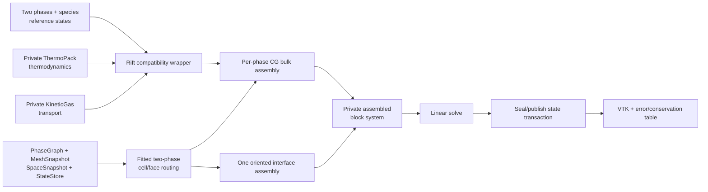

# Milestone 002: Demonstrate a coupled two-phase multicomponent PDE

| Field | Value |
|---|---|
| Status | Draft design; low-Mach CG diffusion scope approved, physical case open |
| Feature | `first-pde-demonstration` |
| Component | Fixed-interface low-Mach multicomponent diffusion operator and executable |
| Branch | `phasegraph` |
| Compatibility | Pre-release; keep demo-only seams private and update all repository callers for approved public changes |
| Target environments | C++23, deal.II 9.8.0, qualified pinned ThermoPack/KineticGas revisions through Rift wrappers, 2D CPU; one rank permitted only if approved |

## Problem and outcome

Rift's foundation can publish distributed spaces and immutable state, but it
does not yet assemble an equation or solve for an unknown. This milestone
delivers the shortest scientifically relevant vertical slice: two independently
represented multicomponent phases separated by one fixed fitted interface,
with a coupled steady diffusion solve, numerical error evidence, and
visualizable output.

The approved baseline is the multicomponent diffusion subsystem of the future
low-Mach model, discretized with the existing continuous-Galerkin `FE_Q` phase
spaces. It is not a claim that the full low-Mach equations have been solved;
flow is the next milestone.

### Non-goals

- Momentum, hydrodynamic pressure, a low-Mach divergence constraint, or time
  integration unless the user rejects the proposed baseline.
- Bulk reactions, state-dependent coefficients, phase change, surface state,
  capillarity, or interface motion.
- Embedded/cut geometry, junctions, contact lines, AMR, matrix-free execution,
  or scalable distributed sparse matrices.
- A general public multiphysics framework inferred from one demonstration.

## Scientific foundation

For phase \(\alpha\in\{-,+\}\), let \(N_\alpha\ge 2\). The proposed first
problem solves \(N_\alpha-1\) independent composition variables and reconstructs
the dependent component so the composition sums to one. At a frozen reference
thermodynamic state, the steady equations have the form

\[
  -\nabla\!\cdot \mathbf{j}_{\alpha,k}=s_{\alpha,k},
  \qquad k=1,\ldots,N_\alpha-1.
\]

The multicomponent flux map is frozen from the external closure at the chosen
reference temperature, pressure, and composition. The implementation must not
interpret KineticGas's raw interdiffusion coefficients as a Fick matrix without
deriving and testing the precise thermodynamic-force, composition-gradient,
and reference-velocity convention. The adapter combines the selected
KineticGas transport formulation with ThermoPack thermodynamic factors to build
a reduced gradient-to-mass-flux response and verifies that the summed species
mass flux vanishes.

For a shared species set, the first coupled manufactured interface may impose

\[
  \mathbf{j}_{-,k}\!\cdot\mathbf{n}
  =\mathbf{j}_{+,k}\!\cdot\mathbf{n},
  \qquad X_{+,k}=K_k X_{-,k},
\]

with boundary/source data manufactured from a piecewise analytic solution.
The exact interface law remains open because an impermeable interface, an
artificial partition law, and physical phase transfer make different claims.

ThermoPack supplies multicomponent, multiphase equations of state, phase
properties, chemical potentials, fugacities, equilibria, and selected
derivatives through a C++ wrapper over its Fortran library. KineticGas supplies
multicomponent diffusion, thermal diffusion, viscosity, and thermal
conductivity through a C++ library that already depends on ThermoPack. Separate
lightweight Rift compatibility capabilities expose only Rift-owned states,
fluxes, properties, species identities, and typed capability failures. All
third-party types remain private, and reaction rates remain Milestone 005
scope.

The native build, runtime data, threading behavior, derivative availability,
and compatible revision pair must first pass Task 07's bounded qualification.
The physical demonstration must then use species and parameter sets supported
by both packages in the intended phase and operating range.

## Proposed solution

The fitted routing and block-system code is deliberately bounded to this
demonstration. Physics assembly consumes semantic phase/species descriptors and
an oriented interface record so later replacement by general worksets does not
change the governing equations.

## API and object representation

| Concern | Proposed choice | Why | Open? |
|---|---|---|---|
| First PDE | Steady multicomponent diffusion subsystem of a low-Mach model | Earliest approved subsystem reusable by low-Mach flow | No |
| Phase/species scope | Exactly two phases; common catalog; at least two species per phase | Avoids premature cross-phase species mapping | Yes |
| Thermodynamics | ThermoPack behind a lightweight Rift thermodynamics capability | Supports the future nonideal multiphase path without leaking its Fortran/C++ model API | Wrapper shape only |
| Multicomponent transport | KineticGas behind a separate Rift transport capability | Delegates the more difficult dense-fluid transport closure while keeping its conventions private | Wrapper shape only |
| Spatial discretization | Continuous Galerkin using existing phase `FE_Q` spaces | Avoids DG face stabilization on every ordinary interior face and reuses Foundation 001 | No |
| Geometry | One planar mesh-aligned interface selected from the phase graph | Uses ordinary deal.II cells/faces and postpones cut quadrature | No for this draft |
| Algebra | Private serial assembled block system; copy solution through a state transaction | Fastest path with current per-field ownership | Yes |
| Error model | Rift configuration defects use typed `std::expected`; dependency exceptions propagate with phase/configuration context | Matches foundation convention | Yes |
| Precision/units | `double`, SI units, explicit mole/mass basis and diffusion reference frame in every adapter value | Prevents ambiguity between Rift and the two backend conventions | No for this draft |
| MPI boundary | Preserve collective foundation creation; permit a one-rank numerical solve only if approved | Avoids adding a distributed matrix backend solely for the first picture | Yes |
| Junctions | Explicitly deferred: exactly two phases makes them impossible | Satisfies Foundation 001 handoff without distracting from the demo | No for this draft |

## Milestone boundary

The milestone is complete when one documented command runs a two-phase,
multicomponent, interface-coupled PDE through Rift's public foundation,
publishes the numerical solution, writes visualizable output, and reports an
independently computed error and conservation table. The result must be labeled
as a fixed-interface frozen-transport demonstration rather than a complete
low-Mach solver.

### PR-ready evidence

- A piecewise manufactured solution converges at the expected spatial order on
  at least three uniform refinements.
- The discrete interface exchange has equal-and-opposite total species mass
  transfer to the declared tolerance.
- The reconstructed dependent species satisfies the composition-sum invariant.
- Adapter tests reproduce direct ThermoPack properties and direct KineticGas
  transport values at one reference state, while separate V&V compares the
  selected closure with independent published or analytic reference data.
- The executable writes deterministic configuration, error, conservation, and
  solution artifacts from a clean run.
- Focused tests cover public failure behavior and 100% line, function, and
  branch coverage for agreed in-scope first-party code, except separately
  approved demonstrably unreachable exclusions.

## Task index

| Task | Goal | Depends on | Owner | Status | Document |
|---|---|---|---|---|---|
| 01 | Freeze the demonstration equations and acceptance case | Foundation 001 review | Undecided | Planned | [task](milestone_002_task_01_freeze-demonstration-contract.md) |
| 02 | Integrate and verify the external mixture adapter | 01, 07 | Undecided | Planned | [task](milestone_002_task_02_integrate-external-mixture-adapter.md) |
| 03 | Route a fixed fitted two-phase domain | 01 | Undecided | Planned | [task](milestone_002_task_03_route-fixed-fitted-interface.md) |
| 04 | Assemble and verify each phase's bulk transport operator | 02, 03 | Undecided | Planned | [task](milestone_002_task_04_assemble-bulk-transport.md) |
| 05 | Couple the interface and solve the block system | 04 | Undecided | Planned | [task](milestone_002_task_05_couple-and-solve-interface.md) |
| 06 | Publish the supervisor-ready demonstration and V&V record | 05 | Undecided | Planned | [task](milestone_002_task_06_publish-demonstration.md) |
| 07 | Qualify the native ThermoPack/KineticGas backend pair | 01 | Undecided | Planned | [task](milestone_002_task_07_qualify-thermotools-backend.md) |

## Accepted decisions

| Decision | Choice | Rationale | Date/user note |
|---|---|---|---|
| Schedule priority | Prefer an early vertical PDE slice and explicitly record shortcuts for later refactoring | User needs a supervisor demonstration quickly | 2026-09-06; user request |
| Initial cardinality | Target exactly two multicomponent phases | User priority | 2026-09-06; user request |
| External delegation | Delegate thermodynamics and multicomponent transport to established packages; keep reaction kinetics backend-neutral with a bounded Rift-native first model | Avoids rebuilding the most specialized closures without requiring one package to own every physical capability | 2026-09-06; user request refined by explicit backend decision |
| Junction scope | Defer all junction concerns in this exactly-two-phase milestone and reconsider before supporting more phases | A junction requires three phases and cannot occur in the proposed target | 2026-09-06; Foundation 001 handoff review |
| PDE family and order | Implement a continuous-Galerkin low-Mach diffusion operator first, then add flow | Reuses the foundation and puts the earliest relevant PDE on the critical path | 2026-09-06; explicit user approval |
| Thermophysical backend boundary | Use ThermoPack for thermodynamics and KineticGas for transport behind separate lightweight Rift capabilities, conditional on Task 07 qualification | Aligns the first backend with future multicomponent liquid/gas phase-change physics without exposing backend types | 2026-09-06; explicit user approval |
| Reaction timing | Defer kinetics and its API decisions to Milestone 005; the current proposal is a backend-neutral capability with a Rift-native elementary mass-action Arrhenius implementation | Keeps the first diffusion solve narrow and avoids coupling chemistry to the thermophysical backend | 2026-09-06; sequence approved, API still provisional |
| Post-diffusion sequence | Add flow, then a movable phase-changing sharp interface, then reactions, and only afterward AMR/matrix-free/MPI scaling | Matches the user's demonstration priorities and physical dependencies | 2026-09-06; explicit user approval |

## Open decisions

1. Which physical phases, species, parameter range, and reference data define
   the demonstration within the qualified ThermoPack/KineticGas capability and
   parameter intersection?
2. Does the first operator include species diffusion alone or the accompanying
   heat-conduction/species-enthalpy flux?
3. Is a one-rank assembled first solve acceptable?
4. Which interface law and steady/transient form are scientifically meaningful
   enough for the demonstration?
5. What exact Rift-owned values should the separate thermodynamics and
   transport capabilities publish?

## Reproduction notes

- Configure/build/test commands: recorded in `AGENTS.md`; no readiness gap.
- Planning preflight: branch `phasegraph`, base revision `cb33578`.
- No configure, build, test, or audit was run for this documentation-only pass.
