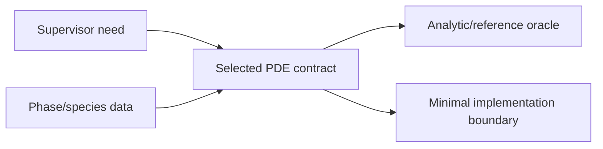

# Milestone 002 / Task 01: Freeze the demonstration contract

| Field | Value |
|---|---|
| Status | Planned; model/discretization fixed, physical case open |
| Owner | Undecided |
| Estimated user effort | About one working day |
| Depends on | Foundation 001 review |
| Allowed files/modules | This task record, Milestone 002 plan, one dedicated mathematical specification under this feature directory |
| Public behavior | No production API change |
| API/ABI | No impact |

## Goal

Write one unambiguous, executable scientific contract for the first PDE:
unknowns, equations, domains, interface and exterior conditions, coefficients,
units, exact/reference solution, quantities of interest, and pass/fail criteria.

## Context and interaction



## Provisional mathematical sketch

```text
two fixed subdomains; N-1 independent composition variables per phase
-div(j_alpha,k) = s_alpha,k
interface: conservative flux plus selected trace/partition law
exterior: manufactured Dirichlet or flux data
```

The diffusion-first low-Mach scope and continuous-Galerkin discretization are
approved. The physical phases, species, energy coupling, and interface law
remain to be fixed.

## Work contract

1. Record the approved low-Mach, CG, diffusion-first scope and the later flow,
   phase-change, reaction, and productionization sequence.
2. Name the physical phases and species and state whether reactions or phase
   transfer are active.
3. Fix mole/mass basis, dependent-species convention, units, and admissible
   state range.
4. Define an analytic manufactured solution or an independently reproducible
   reference calculation.
5. Specify required plots, tables, run time, rank count, and supervisor-facing
   claims.
6. Convert every shortcut into a dated deferred-work entry.

### Non-goals

- Production source, dependency, or test changes.
- Designing general moving-interface or arbitrary-species machinery.

## Focused tests

| Behavior/property | Independent oracle | Important cases |
|---|---|---|
| Contract is mathematically closed | Count unknowns, PDE rows, interface rows, and boundary conditions | Both phases and the dependent species |
| Manufactured data are consistent | Symbolic/manual substitution into bulk and interface equations | Unequal phase coefficients and nontrivial cross-interface flux |
| Claimed conservation is meaningful | Analytic integral balance | Species sum and oriented interface signs |

## Documentation

- The mathematical specification produced by this task is the acceptance
  authority for Tasks 02-06.

## Completion evidence

- [ ] Model and demonstration scope are approved
- [ ] Equations and units are complete
- [ ] Independent oracle is recorded
- [ ] Demo claims and shortcuts are explicit
- [ ] Commands and results are recorded below

## Evidence and handoff

- Commands/results: not run yet.
- Files changed: none for implementation.
- Risks/deferred work: implementation still waits on the physical case and
  exact diffusion/energy contract.
- Next stopping point: assign Task 02 and Task 03 only after this contract is approved.
