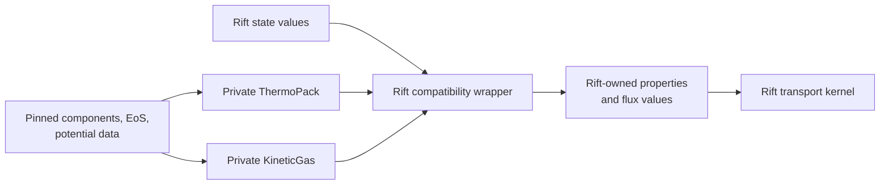

# Milestone 002 / Task 02: Integrate the external mixture adapter

| Field | Value |
|---|---|
| Status | Planned |
| Owner | Undecided |
| Estimated user effort | About one working day |
| Depends on | Tasks 01 and 07 |
| Allowed files/modules | Dependency scripts/CMake, a focused mixture-adapter module, adapter tests, pinned demonstration data |
| Public behavior | Load one phase model and expose immutable reference-state transport data |
| API/ABI | Pre-release new API only if separately approved; prefer private scope initially |

## Goal

Implement separate lightweight Rift compatibility capabilities over the pinned,
qualified ThermoPack and KineticGas revisions so thermodynamics and
multicomponent transport can later be replaced independently without leaking
third-party types, indexing, mutable state, diffusion conventions, data paths,
or exceptions into Rift physics code.

## Context and interaction



## Provisional API sketch

```cpp
struct MixtureReferenceState;
struct ThermodynamicsCapabilities;
struct TransportCapabilities;
struct FrozenMixtureTransport;

std::expected<FrozenMixtureTransport, MixtureModelErrors>
load_frozen_thermotools_transport(const MixtureModelSpecification&,
                                  const MixtureReferenceState&);
```

The names and public/private placement are not approved. Third-party types must
not appear in the stable Rift-facing value.

## Work contract

1. Consume the exact ThermoPack and KineticGas revisions accepted by Task 07.
2. Load one thermodynamic and transport model per phase and resolve species
   names to canonical local order.
3. Extract required SI thermodynamic values and combine the declared
   KineticGas transport definition with ThermoPack thermodynamic factors to
   build the reduced frozen gradient-to-mass-flux response.
4. Validate dimensions, mole/mass composition conversion, thermodynamic-force
   convention, reference velocity, summed mass flux, and units.
5. Report thermodynamics and transport capabilities separately; reject an
   unsupported phase, equation of state, potential, parameter set, derivative,
   or transport formulation.
6. Keep runtime fluid-data resolution and third-party mutable state private.
7. Preserve external exceptions or translate only recoverable input failures
   according to an approved boundary.

### Non-goals

- Reaction evaluation, phase-equilibrium algorithms in Rift, surface chemistry,
  SIMD, AD, or calls from parallel quadrature loops.
- A general plugin registry.

## Focused tests

| Behavior/property | Independent oracle | Important cases |
|---|---|---|
| Reference properties | Direct calls through ThermoPack's C++ wrapper | Every configured phase and requested derivative |
| Species ordering | Pinned input names and molecular weights | Permuted requested order and missing species |
| Flux response | Direct KineticGas coefficient calls plus an independently assembled convention conversion | Basis gradients, zero gradient, reference-frame choice, summed mass flux |
| Failure behavior | Malformed path/phase/species inputs | Useful phase-qualified diagnostics |
| Capabilities | Pinned ThermoPack/KineticGas model and parameter catalogs | Unsupported EoS/potential/species/phase combinations are rejected |

## Documentation

- Record both package revisions and licenses, input-data provenance, units,
  transport convention, runtime data requirements, and exact API subset Rift
  relies upon.

## Completion evidence

- [ ] Reproducible dependency path exists
- [ ] Focused tests pass
- [ ] Relevant regression tests pass
- [ ] Task-level coverage is complete
- [ ] Commands and results are recorded below

## Evidence and handoff

- Commands/results: not run yet.
- Files changed: none yet.
- Risks/deferred work: mutable/state-dependent and threaded evaluation,
  KineticGas internal-thread coordination, and hot-loop performance remain
  Milestone 003 or Milestone 006 scope.
- Next stopping point: return for API review if the adapter must become public.
