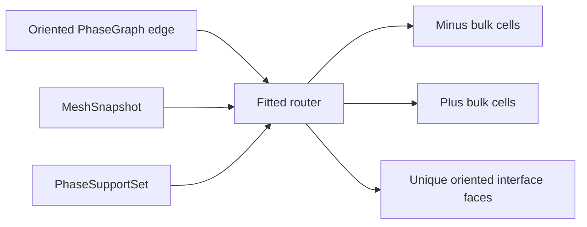

# Milestone 002 / Task 03: Route a fixed fitted two-phase interface

| Field | Value |
|---|---|
| Status | Planned |
| Owner | Undecided |
| Estimated user effort | About one working day |
| Depends on | Task 01 |
| Allowed files/modules | One fitted-routing module, RiftContext integration if approved, focused tests |
| Public behavior | Classify a fixed mesh-aligned interface for exactly two phases |
| API/ABI | Prefer milestone-private surface; any public factory needs approval |

## Goal

Produce deterministic phase-cell and oriented interface-face records from a
uniform mesh and one planar fitted interface, using the canonical phase graph
and existing phase supports.

## Context and interaction



## Provisional API sketch

```cpp
template<int dim>
struct FittedTwoPhaseWork;

template<int dim>
std::expected<FittedTwoPhaseWork<dim>, FittedRoutingErrors>
build_fitted_two_phase_work(const SpaceSnapshot<dim>&,
                            InterfaceId,
                            const FittedInterfaceSpecification<dim>&);
```

## Work contract

1. Accept exactly one canonical interface and a plane aligned with mesh faces.
2. Assign every locally owned active cell to exactly one phase.
3. Emit each interface face once in graph minus-to-plus orientation.
4. Validate that existing support contains every routed cell required by its
   phase space.
5. Attach mesh/space/graph provenance sufficient to reject stale use.

### Non-goals

- Level-set classification, cut cells, curved interfaces, moving geometry,
  hanging-interface faces, junctions, or general workset batching.

## Focused tests

| Behavior/property | Independent oracle | Important cases |
|---|---|---|
| Cell partition | Cell-center sign against the analytic plane | No missing or duplicate owned cells |
| Interface set | Direct neighbor scan | Each physical face exactly once |
| Orientation | Analytic plane normal plus phase names | Reversed graph declaration |
| Invalid inputs | Hand-constructed nonaligned/unsupported cases | Stale space and wrong interface |

## Documentation

- State prominently that this is a fitted demonstration seam, not Rift's
  planned embedded geometry service.

## Completion evidence

- [ ] Deterministic routing exists
- [ ] Focused and MPI-relevant tests pass
- [ ] Task-level coverage is complete
- [ ] Documentation is explicit about scope
- [ ] Commands and results are recorded below

## Evidence and handoff

- Commands/results: not run yet.
- Files changed: none yet.
- Risks/deferred work: this module is expected to be replaced by general geometry/worksets.
- Next stopping point: return before expanding the seam beyond one fitted interface.

