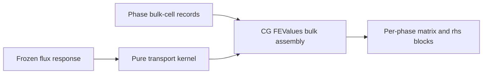

# Milestone 002 / Task 04: Assemble the bulk transport operator

| Field | Value |
|---|---|
| Status | Planned |
| Owner | Undecided |
| Estimated user effort | About one working day |
| Depends on | Tasks 02 and 03 |
| Allowed files/modules | Focused transport kernel/assembly module and tests |
| Public behavior | Assemble the frozen multicomponent diffusion form on each phase domain |
| API/ABI | Keep evaluator and assembled storage details private |

## Goal

Assemble each phase's continuous-Galerkin multicomponent bulk residual and
tangent from semantic composition views and wrapper-provided transport data,
before adding interface coupling.

## Context and interaction



## Provisional API sketch

```cpp
template<int dim>
void assemble_frozen_species_bulk(const BulkTransportContext<dim>&,
                                  PhaseBlockSystem&);
```

## Work contract

1. Implement one clear weak form for the Task 01 equations.
2. Assemble all independent composition components with cross-diffusion terms.
3. Apply manufactured exterior data through the simplest approved strong or
   weak treatment.
4. Keep the local kernel independent of deal.II iterators and global indices
   where this costs little; do not build the general execution backend.
5. Verify a single-phase reduction before enabling the interface blocks.
6. Add no DG numerical flux or interior-penalty machinery in this milestone.

### Non-goals

- State-dependent/nonlinear transport, reactions, advection, flow, matrix-free
  execution, or generic boundary-operator registries.

## Focused tests

| Behavior/property | Independent oracle | Important cases |
|---|---|---|
| Local cell matrix | Hand-integrated low-order cell or high-order quadrature reference | Diagonal and cross-diffusion |
| Constant solution | Zero bulk residual with compatible data | Each independent component |
| Single-phase convergence | Manufactured analytic solution | At least three refinements |
| Component constraint | Reconstructed dependent component | Sum equals one within tolerance |

## Documentation

- Document the exact weak form, sign convention, basis of composition, units,
  and frozen-coefficient limitation.

## Completion evidence

- [ ] Bulk assembly matches independent oracles
- [ ] Focused tests pass
- [ ] Task-level coverage is complete
- [ ] Mathematical documentation is complete
- [ ] Commands and results are recorded below

## Evidence and handoff

- Commands/results: not run yet.
- Files changed: none yet.
- Risks/deferred work: convergence of the coupled interface problem is not claimed yet.
- Next stopping point: hand the verified blocks to Task 05.
