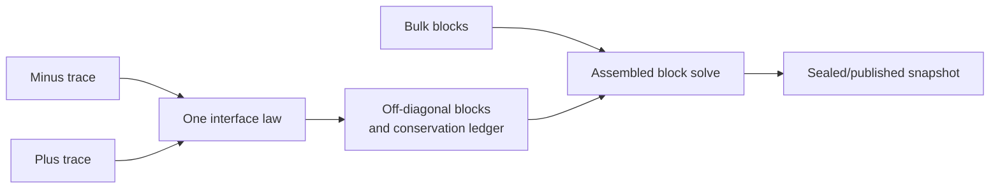

# Milestone 002 / Task 05: Couple and solve the interface problem

| Field | Value |
|---|---|
| Status | Planned |
| Owner | Undecided |
| Estimated user effort | About one working day |
| Depends on | Task 04 |
| Allowed files/modules | Fitted interface assembly, private block-system adapter, solver integration, focused tests |
| Public behavior | Solve the complete fixed two-phase composition system and publish its state |
| API/ABI | No general public solver API without a separate decision |

## Goal

Add the selected oriented interface law, solve the combined phase block system,
and commit the resulting phase fields through a `StateStore` transaction.

## Context and interaction



## Provisional API sketch

```cpp
template<int dim>
std::expected<std::shared_ptr<const StateSnapshot<dim>>, DemonstrationSolveErrors>
solve_fitted_multicomponent_diffusion(StateStore<dim>&,
                                     const FittedTransportProblem<dim>&);
```

The facade is provisional. deal.II solver failures may propagate unchanged if
the same dependency-exception convention is approved for this task.

## Work contract

1. Assemble interface terms once in canonical minus-to-plus orientation.
2. Couple the independent phase DoF numberings through one private block map.
3. Apply constraints, solve, and scatter only locally owned solution entries
   into a transaction.
4. Seal and publish through the existing collective state lifecycle.
5. Compute oriented interface and global species-balance ledgers.

### Non-goals

- A scalable distributed sparse backend, generic nonlinear solver, arbitrary
  interfaces, phase change, surface state, or production preconditioner.

## Focused tests

| Behavior/property | Independent oracle | Important cases |
|---|---|---|
| Interface matrix signs | Hand-derived two-cell system | Graph orientation reversal |
| Conservation | Sum of phase boundary/source/interface integrals | Unequal coefficients and nonzero transfer |
| Coupled solution | Piecewise manufactured exact solution | Nontrivial partition coefficient |
| Publication | Existing state-store invariants | Base unchanged; candidate then accepted |

## Documentation

- Explain the block-map lifetime and why it is intentionally private and
  replaceable.

## Completion evidence

- [ ] Coupled solve succeeds
- [ ] Conservation and error oracles pass
- [ ] Relevant regression tests pass
- [ ] Task-level coverage is complete
- [ ] Commands and results are recorded below

## Evidence and handoff

- Commands/results: not run yet.
- Files changed: none yet.
- Risks/deferred work: solver scalability and general operator ownership remain later milestones.
- Next stopping point: freeze the numerical path before presentation work.

