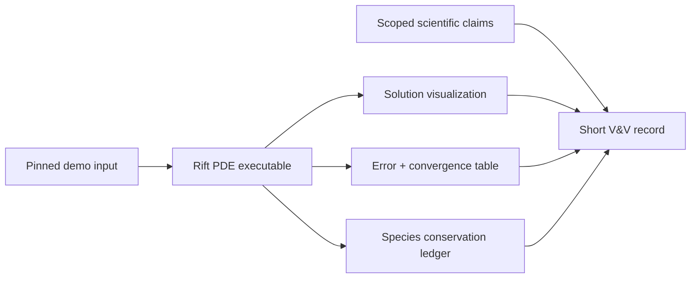

# Milestone 002 / Task 06: Publish the supervisor-ready demonstration

| Field | Value |
|---|---|
| Status | Planned |
| Owner | Undecided |
| Estimated user effort | About one working day |
| Depends on | Task 05 |
| Allowed files/modules | One tutorial/executable, example input, plotting or postprocessing script, user documentation, V&V record |
| Public behavior | One documented command produces the first PDE solution and evidence |
| API/ABI | No new general API required |

## Goal

Turn the verified solve into a reproducible demonstration that a supervisor can
run or inspect without reading implementation tests.

## Context and interaction



## Provisional executable contract

```console
<configured launcher> rift_<demo-name> <pinned-input>
```

The final name and CLI are chosen after Task 01 fixes the physical case.

## Work contract

1. Provide one checked-in, small, deterministic input.
2. Log phase/species/model versions and every shortcut affecting the claim.
3. Write `.vtu`/`.pvtu` solution output and a machine-readable error/balance
   table under a caller-selected output directory.
4. Run the refinement study and record observed convergence.
5. Create a short figure/table-oriented demonstration narrative.
6. Verify Debug and Release behavior and the milestone's focused quality gates.

### Non-goals

- A general CLI framework, restart, broad parameter schema, GUI, performance
  benchmark, or claims about moving interfaces or full low-Mach flow.

## Focused tests

| Behavior/property | Independent oracle | Important cases |
|---|---|---|
| Clean invocation | CTest execution from a fresh output directory | Deterministic filenames |
| Solution artifacts | Parse VTK/table headers and expected cardinality | Both phases and all species |
| Numerical claim | Offline norm/integral recomputation | Refinement sequence and conservation |
| Failure clarity | Invalid/missing input and unwritable output | Nonzero exit and useful log |

## Documentation

- Add a concise tutorial and a V&V report separating software correctness,
  calculation verification, and physical-model limitations.

## Completion evidence

- [ ] One-command demonstration exists
- [ ] Expected-order convergence is recorded
- [ ] Conservation ledger passes
- [ ] Debug/Release and relevant tests pass
- [ ] Coverage and documentation gates pass
- [ ] Commands, versions, and results are recorded below

## Evidence and handoff

- Commands/results: not run yet.
- Files changed: none yet.
- Risks/deferred work: physical validation requires a later experiment or accepted benchmark.
- Next stopping point: supervisor review, then plan Milestone 003 from feedback.

