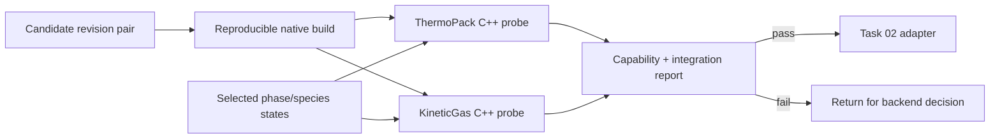

# Milestone 002 / Task 07: Qualify the ThermoTools backend pair

| Field | Value |
|---|---|
| Status | Planned |
| Owner | Undecided |
| Estimated user effort | About one working day |
| Depends on | Task 01 |
| Allowed files/modules | Dependency scripts/CMake, private throwaway probes or focused dependency tests, pinned demonstration data, and this planning record |
| Public behavior | Unchanged; this is a dependency and scientific-capability gate |
| API/ABI | No Rift public API is introduced |

## Goal

Demonstrate that one exact pair of
[ThermoPack](https://github.com/thermotools/thermopack) and
[KineticGas](https://github.com/thermotools/KineticGas) revisions can be
built, linked, deployed, and called safely enough through native C++ to support
the selected two-phase diffusion demonstration before Rift commits its adapter
implementation to that pair.

## Context and interaction

## Approved qualification boundary

The qualification uses the packages' native C++ paths. ThermoPack may retain
its Fortran implementation, but Python must not be present in Rift's runtime
call path. The probe may be disposable; dependency pinning, commands, and the
capability report are durable artifacts.

## Work contract

1. Select and record an exact compatible ThermoPack/KineticGas revision pair,
   licenses, transitive build requirements, and source/data provenance.
2. Build both libraries reproducibly without allowing either project to alter
   Rift's project-wide compiler settings.
3. Link a native C++ probe through imported targets and confirm runtime shared
   libraries and KineticGas fluid data can be located from a clean build tree.
4. For each proposed demonstration phase, evaluate ThermoPack density,
   enthalpy/heat capacity, chemical potential or fugacity, and every derivative
   required by the first frozen closure.
5. Evaluate KineticGas diffusion data, and any heat conductivity or viscosity
   needed by the approved Task 01 equation set, over representative states.
6. Record species ordering, units, mole/mass basis, transport-force definition,
   reference frame, parameter coverage, and validity range.
7. Exercise independent model instances on one and two MPI ranks. Probe
   concurrent calls only far enough to determine whether Rift must serialize
   access or own one backend instance per execution thread later.
8. Record per-call setup/evaluation cost and KineticGas internal-thread behavior
   qualitatively; detailed optimization is not part of this gate.
9. If any required capability fails, stop and return for a backend or
   demonstration-case decision rather than hiding the limitation in the Rift
   adapter.

### Non-goals

- A public Rift thermodynamics or transport API.
- Scientific validation of the chosen EoS or transport model for every future
  application.
- Reaction kinetics, quadrature-loop integration, SIMD/AD support, or
  production performance tuning.
- Vendoring or modifying third-party source code to force the gate to pass.

## Focused checks

| Behavior/property | Independent oracle | Important cases |
|---|---|---|
| Native build and link | Clean configure/build/run commands | Debug and Release linkage; runtime data discovery |
| Thermodynamic calls | Published ThermoPack example or independent direct wrapper call | Both phases; requested derivatives; invalid phase/model |
| Transport calls | Published KineticGas example and documented units/convention | Both phases; zero and dilute composition edges permitted by the model |
| Species identity | Explicit pinned catalog | Permuted inputs, unsupported species, molecular weights |
| MPI/process independence | Rank-qualified direct results | One and two ranks; independent model state |
| Threading risk | Repeated/concurrent-call comparison where supported | Determinism, crashes, oversubscription controls |

## Documentation

- Record exact revisions, licenses, build commands, compiler/Fortran/LAPACK
  requirements, imported targets, runtime paths, fluid-data paths, supported
  capabilities, and known restrictions.
- Cite the model references that justify using the selected EoS and transport
  potential for the actual demonstration mixture.

## Completion evidence

- [ ] Exact compatible revisions and data are pinned
- [ ] Native C++ build, link, and clean-tree execution pass
- [ ] Required properties and transport values are available for both phases
- [ ] Units, species ordering, transport convention, and validity range are recorded
- [ ] MPI/process behavior and known threading restrictions are recorded
- [ ] Pass/fail recommendation for Task 02 is explicit
- [ ] Commands and results are recorded below

## Evidence and handoff

- Commands/results: not run yet.
- Files changed: none yet.
- Risks/deferred work: exact package revisions, demonstration species, and
  thread-safety behavior remain to be established by this task.
- Next stopping point: on pass, proceed to Task 02; on failure, return to the
  user for a backend or physical-case decision.
