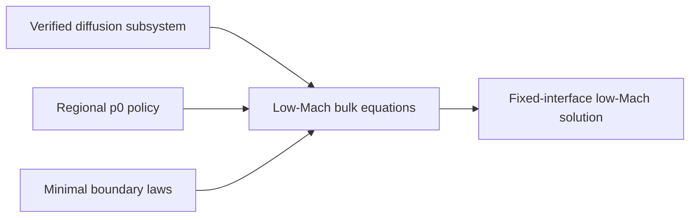

# Milestone 003: Add fixed-interface nonreacting low-Mach flow

| Field | Value |
|---|---|
| Status | Provisional roadmap milestone |
| Feature | `first-pde-demonstration` |
| Component | Coupled low-Mach velocity, pressure, energy, and species solve |
| Branch | To be recorded when work begins |
| Compatibility | Reuse Milestone 002 physics and replace private seams only when required |
| Target environments | 2D CPU, exactly two phases, fixed interface, MPI scope to be decided |

## Problem and outcome

Extend the verified CG species-transport slice to the first complete low-Mach flow
calculation. Each phase has phase-local multicomponent composition, velocity,
enthalpy/temperature, and hydrodynamic pressure. Open or closed-region
thermodynamic pressure uses the regional-state mechanism already present in the
foundation.

### Initial boundaries

- Exactly two phases; no junctions.
- Nonreacting and fixed fitted interface first.
- Reuse the lightweight external thermodynamics/transport wrapper, but decide whether
  state-dependent evaluation is direct, tabulated, or fitted into scalar-
  generic Rift kernels.
- Prefer a steady or simple first-order implicit solve before general IMEX
  infrastructure.

### Exit evidence

- Manufactured mass, momentum, energy, and species residual convergence.
- Pressure-gauge/thermodynamic-pressure constraints verified independently.
- Phase and interface conservation ledgers close.
- A recognizable low-Mach two-phase flow plot and reproducible run.

### Decisions deferred to milestone planning

1. Physical case and open/closed regional-pressure policy.
2. Steady versus transient first solve.
3. State-dependent external-closure and derivative strategy.
4. MPI and linear-solver scope.
5. Junctions must again be explicitly implemented or deferred.
