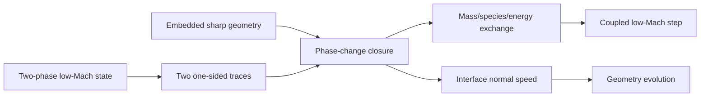

# Milestone 004: Move the sharp interface with phase change

| Field | Value |
|---|---|
| Status | Provisional roadmap milestone |
| Feature | `first-pde-demonstration` |
| Component | Embedded two-phase geometry, interface closure, and motion |
| Branch | To be recorded when work begins |
| Compatibility | Preserve the fixed-interface low-Mach problem as a regression limit |
| Target environments | 2D CPU, exactly two phases, no bulk reactions |

## Problem and outcome

Replace the fitted seam with Rift's first movable embedded sharp interface and
couple its normal speed to a two-sided phase-change model. This milestone adds
the minimum geometry, cut integration, interface exchange, and time evolution
needed to demonstrate phase change without also introducing bulk chemistry.

### Initial boundaries

- Exactly two phases; junctions and contact lines remain explicitly deferred.
- No bulk chemical reactions or surface species.
- Begin with one phase-change law supported by the selected thermodynamic
  wrapper capabilities.
- Preserve the fitted, zero-transfer, and stationary-interface limits as
  independent regression oracles.

### Exit evidence

- Manufactured stationary and translating-interface convergence.
- Equal common mass flux and consistent interface speed from both sides.
- Species and total-energy balance across the moving interface.
- Phase-volume change agrees with integrated interface motion.

### Decisions deferred to milestone planning

1. Physical phase-change law and required equilibrium/kinetic data.
2. Minimal cut-quadrature and stabilization approach.
3. Level-set transport and reinitialization scope.
4. Time integrator and nonlinear-coupling scope.
5. Explicit implement-or-defer decision for junctions and contact lines.

