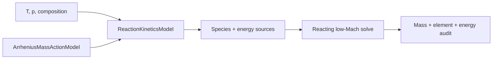

# Retained superseded draft: reactions before moving-interface phase change

| Field | Value |
|---|---|
| Status | Superseded by the user-approved milestone order; retained without deletion |
| Feature | `first-pde-demonstration` |
| Component | Backend-neutral reaction rates and reacting low-Mach coupling |
| Branch | To be recorded when work begins |
| Compatibility | Preserve the verified Milestone 003 nonreacting limit |
| Target environments | Small mechanism, exactly two phases, fixed interface initially |

The approved sequence now adds a movable phase-changing sharp interface in
Milestone 004 and bulk reactions in Milestone 005. See
[Milestone 004](milestone_004_plan_moving-phase-changing-interface.md) and
[Milestone 005](milestone_005_plan_bulk-chemical-reactions.md).

## Historical problem and outcome

Load a small pinned reaction specification through a backend-neutral
`ReactionKineticsModel`, use the Rift-native elementary mass-action Arrhenius
implementation, and add bulk production terms to the low-Mach species/energy
equations. The case must recover Milestone 003 exactly when reaction rates are
disabled.

### Initial boundaries

- No surface chemistry or junction chemistry.
- No phase change unless the selected demonstration requires it and its
  two-sided closure is planned separately.
- Reaction specifications are pinned data with units and provenance records.
- Stiff integration may use a simple robust implicit path before the general
  IMEX architecture.

### Exit evidence

- Reaction-source mass and elemental conservation.
- Independent analytic-oracle comparison at sampled thermochemical states.
- Reacting/nonreacting limiting behavior.
- A reproducible reacting two-phase low-Mach result with scoped claims.
