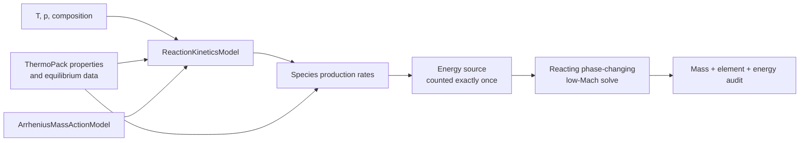

# Milestone 005: Add bulk chemical reactions

| Field | Value |
|---|---|
| Status | Provisional roadmap milestone |
| Feature | `first-pde-demonstration` |
| Component | Backend-neutral reaction-kinetics model, Rift-native Arrhenius implementation, and reacting source operator |
| Branch | To be recorded when work begins |
| Compatibility | Preserve diffusion, flow, and nonreacting phase-change limits |
| Target environments | Small pinned mechanism, exactly two phases initially |

## Problem and outcome

Add a backend-neutral reaction-kinetics capability, implement the first bounded
kinetics model in Rift, and couple bulk species and energy sources to the
already moving, phase-changing low-Mach calculation. Chemistry is intentionally
sequenced after phase change so the moving-interface conservation problem is
verified before stiff reaction sources are introduced.

### Initial boundaries

- One small, pinned bulk mechanism.
- Elementary mass-action reactions with
  \(k_r(T)=A_r T^{\beta_r}\exp[-E_{a,r}/(RT)]\) as the first implementation.
- No surface or junction chemistry.
- No third-body, falloff, pressure-dependent, or non-elementary rate laws in
  the first implementation.
- The production abstraction is `ReactionKineticsModel`; *oracle* names an
  independent verification implementation only.
- Reaction enthalpy is accounted for exactly once through the common
  thermodynamics convention.
- The concentration/activity convention and treatment of reversible reactions
  must be approved before implementation; a nonideal reversible model must use
  equilibrium information consistent with ThermoPack.
- Stiff integration may use a bounded implicit path before general production
  time integration.

### Exit evidence

- Reaction-source mass and elemental conservation.
- The Arrhenius implementation matches an independent analytic oracle at
  sampled states and preserves declared stoichiometric invariants.
- The zero-rate limit recovers Milestone 004.
- A reproducible reacting, phase-changing low-Mach result with scoped claims.

## Proposed direction

| Decision | Choice | Rationale | Date/user note |
|---|---|---|---|
| Production abstraction | Use a backend-neutral `ReactionKineticsModel`; reserve *oracle* for independent verification | Keeps scientific implementations substitutable and verification terminology precise | Open for Milestone 005 API review |
| First kinetics implementation | Implement elementary mass-action Arrhenius rates in Rift and add other rate-law families only when required | Reaction-rate algebra is bounded relative to dense-fluid thermodynamics and transport | User-proposed; final scope deferred to Milestone 005 |

## Open decisions

1. Should the production abstraction be named `ReactionKineticsModel`, with
   *oracle* reserved for verification, or should *oracle* be part of the public
   production vocabulary?
2. Does the first mass-action model permit only irreversible reactions, or also
   reversible reactions consistent with ThermoPack equilibrium properties?
3. Does the first model use concentrations only, or a declared activity basis
   suitable for the selected nonideal phases?
