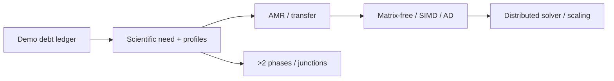

# Milestone 006: Add AMR, matrix-free execution, and MPI scaling

| Field | Value |
|---|---|
| Status | Provisional roadmap milestone |
| Feature | `first-pde-demonstration` |
| Component | Adaptive, scalable, matrix-free production execution |
| Branch | To be recorded when work begins |
| Compatibility | Preserve all verified scientific limits while replacing private seams |
| Target environments | Chosen from demonstrated scientific and scaling needs |

## Problem and outcome

Retire the principal execution shortcuts only after diffusion, flow, moving
phase change, and reactions are scientifically verified. Add AMR and transfer,
then establish the matrix-free operator needed for final MPI scaling work. The
detailed task split remains evidence-driven because these are individually
large capabilities.

Candidate work includes AMR and solution transfer, matrix-free execution,
scalar-generic closure fits or tables, scalable MPI linear algebra and
preconditioning, general species mappings, and the first explicit junction
implementation. Moving geometry and time integration are already established
by Milestone 004 and are inputs rather than new scope here.

Before approving this milestone, junction support must receive an affirmative
implement-or-defer decision tied to the next context of use.
