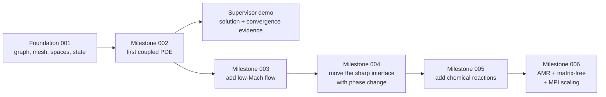

# Accelerated roadmap: first two-phase PDE demonstration

| Field | Value |
|---|---|
| Status | Draft; model sequence approved, physical demonstration case open |
| Feature | `first-pde-demonstration` |
| Starting point | Foundation Milestone 001 |
| Branch | `phasegraph` |
| Primary objective | Produce a supervisor-ready PDE solve before completing Rift's full general architecture |

## Why this path exists

The architecture roadmap is designed for a general moving, cut-cell,
multiphase solver. Completing every geometry, physics, execution, nonlinear,
and time-integration layer before running a PDE would delay the first visible
scientific result. This roadmap instead builds a narrow vertical slice, records
every shortcut, and preserves seams that can later be replaced by the general
architecture.

The first solve belongs to the low-Mach model family and begins with its
multicomponent diffusion operator on a fixed mesh-aligned interface. It is an
actual PDE with independent phase state and explicit interface coupling, but it
does not claim to be the complete low-Mach system until flow is added in the
next milestone.

## Proposed milestones

| Milestone | Observable outcome | Deliberate shortcuts | Demo value |
|---|---|---|---|
| 002 | Solve and verify the CG multicomponent-diffusion subsystem of a two-phase low-Mach model | 2D, one rank acceptable, fixed fitted interface, no flow or reactions, assembled algebra | First actual PDE as soon as possible |
| 003 | Add velocity, hydrodynamic pressure, energy, and the low-Mach constraint | Fixed fitted interface; minimal boundary and nonlinear-solver families | First complete low-Mach flow demonstration |
| 004 | Replace the fitted seam with a movable embedded sharp interface and phase-change closure | Exactly two phases; no bulk reactions; bounded time integrator | Demonstrates Rift's defining moving-interface capability |
| 005 | Add backend-neutral bulk chemical-reaction sources; proposed first implementation is Rift-native mass-action Arrhenius kinetics | Small pinned mechanism; no surface or junction chemistry | Reacting, phase-changing low-Mach showcase |
| 006 | Retire the remaining demo limitations through AMR, matrix-free execution, and MPI scaling | Detailed order chosen from dependencies and profiling | Production-oriented capability and scaling evidence |

Milestone 002 is detailed in
[its plan](milestone_002_plan_two-phase-multicomponent-diffusion.md). The later
plans cover [flow](milestone_003_plan_nonreacting-low-mach-flow.md),
[moving phase-changing geometry](milestone_004_plan_moving-phase-changing-interface.md),
[chemical reactions](milestone_005_plan_bulk-chemical-reactions.md), and
[productionization](milestone_006_plan_generalize-and-optimize.md). They remain
provisional until the preceding demonstration exposes their real API and
numerical requirements.

## Selected model path

The first PDE operator is continuous Galerkin and implements multicomponent
diffusion for a future low-Mach phase system. Geometry fields remain continuous
`FE_Q`, and the first phase fields reuse the existing continuous `FE_Q` spaces.
DG remains a valid later discretization but is not on the critical path to the
first result.

Fully compressible flow removes the low-Mach regional thermodynamic-pressure
equation, but it does not remove the need for thermodynamics, species transport,
boundary conditions, coupled algebra, or interface laws. It also introduces
the hyperbolic stabilization and acoustic-step constraints that the current
CG-first foundation does not provide.

## External-physics boundary

The selected first thermophysical stack is
[ThermoPack](https://github.com/thermotools/thermopack) for multicomponent,
multiphase thermodynamics and
[KineticGas](https://github.com/thermotools/KineticGas) for multicomponent
transport. KineticGas already depends on ThermoPack and uses thermodynamic
factors supplied by an equation of state, so the pair provides a coherent path
from gas mixtures into dense-fluid and future phase-equilibrium calculations.
The exact compatible revisions remain subject to a mandatory native-C++
qualification task before the full adapter is implemented.

Rift code interacts only with lightweight, capability-specific compatibility
wrappers and Rift-owned input/output values. ThermoPack and KineticGas types,
species indexing, mutable model state, exceptions, diffusion conventions, and
data-file locations remain private. Thermodynamics and multicomponent transport
are separate capabilities even though KineticGas depends on ThermoPack; a later
backend may replace either capability independently.

For Milestone 002, the wrappers may run outside the quadrature hot loop and
produce immutable frozen reference-state properties and a verified
gradient-to-mass-flux action. This is a conscious demo shortcut: it proves the
dependency stack without locking Rift's eventual SIMD/AD policy boundary to
scalar third-party APIs. State-dependent evaluation, backend concurrency, and
thread oversubscription are reconsidered when flow and later matrix-free
execution require them.

Bulk reaction kinetics are not delegated to this stack. The current Milestone
005 proposal introduces a backend-neutral reaction-kinetics capability and a
first Rift-native elementary mass-action Arrhenius implementation. Its exact
production API and the use of the term *oracle* remain Milestone 005 decisions.

The commitment remains capability- and parameter-aware. ThermoPack supports
many equations of state, while KineticGas supports a more specific family of
kinetic-gas models and fluid parameter sets. The demonstration mixture must be
selected from the intersection of supported, scientifically appropriate
ThermoPack and KineticGas data, and unsupported phase/model combinations must
fail explicitly.

## Demo-now / refactor-later boundary

### Keep now

- Existing `RiftContext`, canonical two-node `PhaseGraph`, mesh, phase supports,
  finalized field spaces, immutable state, transactions, and logger.
- One common species catalog and at least two species in each phase.
- One explicit interface orientation and conservation ledger.
- Independent manufactured-solution verification and a reproducible executable.

### Streamline now

- Fixed, planar, mesh-aligned interface on a uniform 2D mesh.
- Continuous-Galerkin phase fields using the existing `FE_Q` field spaces.
- Steady assembled operator and a bounded one-rank solve.
- Frozen reference-state material/transport data.
- No bulk reactions in Milestone 002.
- A private demonstration block-system adapter between Rift's per-field vectors
  and deal.II's assembled matrix/vector types.

### Do not pretend is solved

- Cut-cell quadrature, moving level sets, topology change, AMR transfer, or GCL.
- Matrix-free execution, SIMD/AD external closures, scalable preconditioning,
  or large-rank performance.
- General phase counts, differing species catalogs, junction or contact-line
  physics, phase change, surface chemistry, or surface state.

## Junction decision required by the foundation handoff

Milestone 002 explicitly **defers junction configuration, identity,
classification, state, and physics**. The selected target has exactly two
phases and one interface, so a three-phase junction cannot exist. The deferral
is intentional rather than silent. Junctions must be reconsidered when
planning the first milestone that permits more than two phases; Milestones
003 and 004 may continue to defer them only with the same explicit statement.

## Ordered open decisions

1. What physical phases, species, and operating range should the demonstration
   represent within the verified ThermoPack/KineticGas parameter intersection?
2. Should the first diffusion operator include species diffusion only, or also
   heat conduction and species-enthalpy transport?
3. Must the first visible solve run on multiple MPI ranks, or is one rank
   acceptable while the library foundations remain MPI-capable?
4. Should the first interface be impermeable, prescribe a manufactured
   partition/flux law, or model actual phase transfer?
5. Is a steady solve acceptable, or must the demonstration show time evolution?

## Reproduction notes

- Planning preflight: branch `phasegraph`, base revision `cb33578`.
- Authoritative build, test, coverage, formatting, and documentation commands
  are recorded in `AGENTS.md`.
- This planning pass ran no build or quality gate and changed no production or
  test source.

## Accepted decisions

| Decision | Choice | Rationale | Date/user note |
|---|---|---|---|
| PDE family and discretization | Low-Mach model family, continuous Galerkin; implement diffusion before flow | Reuses the foundation and reaches a scientifically relevant PDE quickly | 2026-09-06; explicit user decision |
| Thermophysical backend | Use ThermoPack for thermodynamics and KineticGas for transport behind separate lightweight Rift compatibility capabilities, conditional on a native-C++ qualification gate | Better matches future multicomponent liquid/gas phase-change physics while retaining backend substitutability | 2026-09-06; explicit user decision |
| Scientific sequence | Diffusion, flow, movable phase-changing sharp interface, chemical reactions, then AMR/matrix-free/MPI scaling | Prioritizes a visible solve and adds dependencies in physical order | 2026-09-06; explicit user decision |
