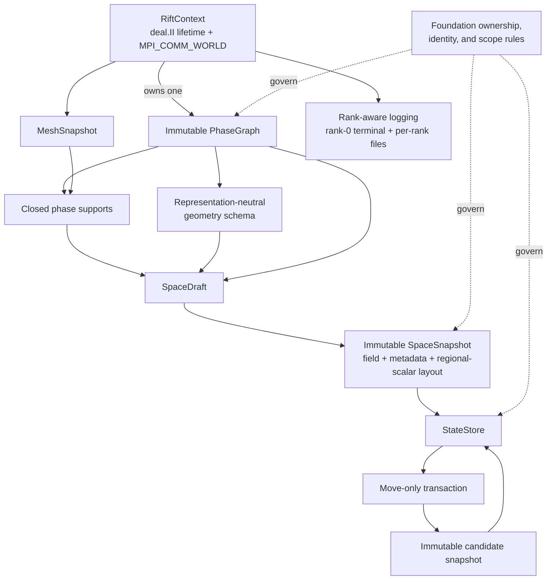

# Milestone 001: Establish Rift's runtime and discrete-state foundations

| Field | Value |
|---|---|
| Status | Implementation complete; final coverage exclusions awaiting reviewer approval |
| Feature | `foundations` |
| Component | Runtime lifetime, phase identity, distributed spaces, transactional state, and rank-aware logging |
| Source records | [`01-foundations`](../../architecture/implementation/01-foundations/) and implementation-guide sections `00`–`02` |
| Branch | `phasegraph` |
| Compatibility | Pre-release: source and ABI are not gates; update all repository callers, tests, and documents together |
| Target environments | C++23, deal.II 9.8.0, MPI world model, CPU, continuous Galerkin first implementation |

## Problem and outcome

Rift needs one small, coherent foundation beneath geometry and physics: a
process-wide deal.II/MPI lifetime, a deterministic description of configured
phases, a distributed mesh and finite-element layout, and immutable state that
can be changed only through explicit transactions. The milestone delivers that
complete spine while keeping physical occupancy, sharp-geometry reconstruction,
operators, solvers, and time integration outside the boundary.

The user-requested milestone is intentionally broader than a typical PR. Its
tasks are therefore narrow stopping points of about one working day, and no task
advances automatically to the next.

### Non-goals

- Arbitrary or duplicated communicators, subcommunicator support,
  `RunConfigurationId`, restart-stable run identity, or typed MPI lifecycle
  configuration machinery.
- Geometry reconstruction, phase-occupancy classification, geometry evolution,
  physical models, operators, nonlinear solvers, or checkpoint input.
- DG, full `hp`, GPU, junction representation or physics, contact-line,
  surface-PDE, PETSc, or Trilinos extensions in the first implementation.
- Recreating historical test registries, subject-runner modes, coverage mergers,
  or MPI wrappers.

## Scientific foundation

This milestone does not select a physical model, but it establishes exact
scientific-software invariants that later models rely upon:

- **Phase graph:** canonical phase/interface identity is independent of input
  order; the declared minus-to-plus orientation is never inferred or reversed.
- **Topology terminology:** a physical interface is where exactly two phases
  meet, and a physical junction is where exactly three phases meet. A cell with
  exactly three candidate phases is only a junction candidate until later
  geometry code verifies the meeting; more than three candidates denotes a
  possible higher-order meeting, not a verified junction.
- **Support closure:** requested cells grow monotonically to the least fixed
  point required by hanging-face conformity. Closure determines where a field
  may be represented, not where a phase is physically present.
- **Space ownership:** each phase-support field group owns a separate DoF
  space; ordinary elements exist inside its closed support and component-
  compatible non-dominating `FE_Nothing` exists outside it. Primitive continuous geometry
  fields cover the full background mesh. Their number, component-to-phase
  mapping, and any discrete geometry metadata are described by a
  representation-neutral schema rather than fixed by this milestone.
- **State isolation:** immutable snapshots never change in place. A move-only
  transaction owns candidate storage; failure or abandonment leaves its base
  exactly unchanged.
- **Geometry-state boundary:** primitive continuous geometry fields and optional
  discrete metadata belong to immutable state. Pairwise functions, physical
  occupancy, cell candidate sets, and bulk/interface/junction classification
  are derived later and are not stored as independently mutable foundation
  state.
- **Exact revision:** a geometry revision changes only when primitive owned
  geometry state differs exactly: binary64 fields are compared bit-for-bit and
  discrete metadata by exact value. This is an identity decision, not a
  finiteness, tolerance, convergence, or physical-equivalence test.

No literature search is required for this planning pass: the directly governing
contracts are repository architecture decisions and deal.II/MPI ownership
semantics rather than a numerical-method selection.

## Proposed solution

`RiftContext` is the single lifetime anchor and borrows `MPI_COMM_WORLD`; it does
not duplicate or free the communicator. All later objects must be destroyed
before it. Phase, space, and state identities are introduced only where
multiple simultaneously meaningful objects or stale references require them.

## API and object representation

| Concern | Proposed choice | Why | Open? |
|---|---|---|---|
| Runtime lifetime | One non-copyable `RiftContext` containing `dealii::Utilities::MPI::MPI_InitFinalize` | Matches the accepted world-only single-run scope | No |
| Runtime communicator | Borrow `MPI_COMM_WORLD`; never duplicate or free it | deal.II initializes through the world communicator | No |
| Runtime accessors | Instance methods for communicator, rank, and size | Makes the live-lifetime precondition visible | No |
| Phase graph cardinality | Each `RiftContext` owns exactly one canonical immutable graph; a different simulation requires a new executable run | Prevents cross-graph ambiguity, stabilizes borrowed graph references, and removes graph/run provenance machinery | No |
| Phase graph construction | Deterministic local candidate plus required exact world-rank agreement before publication | Prevents locally valid but globally inconsistent graph identity or orientation | No |
| Mesh ownership | `MeshSnapshot<dim>` owns triangulation and immutable mapping | Keeps mesh lifetime and structural state together | No |
| Space publication | Mutable/single-use `SpaceDraft`, then immutable `SpaceSnapshot` | Prevents partial layouts from escaping | No |
| Geometry representation | Schema for one or more primitive continuous fields plus optional distributed discrete metadata; no occupancy algorithm selected | Accommodates phase-ranked potentials and a single field with phase metadata without hard-coding either | No |
| State publication | Immutable snapshots and move-only transaction-owned mutation | Makes rollback and isolation structural | No |
| Error model | Collected typed configuration errors; MPI/deal.II failures follow their fatal/exception contracts | Separates recoverable input defects from infrastructure failure | No |
| Precision/units | `double` storage; exact binary64 comparison only for revision identity | Does not confuse revision with numerical equivalence | No |
| MPI boundary | `MPI_COMM_WORLD`; automatically register each `tests/mpi/*.cpp` executable at one, two, and three ranks | Preserves real distributed evidence without a custom MPI test framework | No |
| Collective scaling | Classify communication by lifecycle frequency, batch each high-level operation, prefer topology-local exchanges, and prohibit collectives inside cell/phase/field loops | Bounds latency-sensitive synchronization without adding a speculative MPI-manager abstraction | No |
| Logging | `RiftContext`-owned synchronous spdlog; optional rank-zero terminal and per-rank files | Centralizes process-wide rank routing without making scientific operations print implicitly | No |

## Milestone boundary

The milestone is complete when a program can create `RiftContext`, construct one
canonical phase graph, own a distributed mesh, derive closed phase supports,
publish a finite-element layout, allocate immutable state, create/seal/publish
or abandon transactions, enforce bounded retention and lineage, and track
regional scalar values and geometry revisions exactly. Geometry and physics can
then consume these foundations without owning or mutating them. A final rank-
aware logging task provides optional terminal and per-rank file output without
changing the side-effect-free diagnostic APIs.

### Milestone 002 planning handoff

Milestone 002 planning must explicitly review junction support before its scope
is approved. The review must decide whether to introduce junction
configuration/identity, dynamic junction classification, junction-owned state,
and junction physics in that milestone or to defer each concern again with a
recorded rationale. Silence is not an acceptable deferral.

### PR-ready evidence

- `RiftContext` anchors deal.II/MPI lifetime and exposes the approved borrowed
  world-communicator API without run-identity machinery.
- Phase-graph input permutations produce identical descriptors, IDs, and
  compatibility-call order; invalid inputs produce the approved collected
  diagnostics.
- Independent fixed-point and DoF-cardinality oracles verify phase support and
  finite-element layout on representative adaptive meshes.
- Multi-rank tests verify collective graph agreement, distributed support,
  ghost active-FE consistency, state sealing/publication, regional replication,
  and exact revision agreement once the MPI test seam is approved.
- Reference state-machine tests verify isolation, abandonment, accepted-root
  lineage, previous/accepted transitions, pinning, eviction, and stale-sibling
  rejection.
- Exact-state tests include unchanged values, one-rank changes, `+0.0/-0.0`,
  infinities, the approved NaN-payload policy, and exact discrete geometry
  metadata when the approved schema contains it.
- No physical-model validation claim is made. Calculation verification covers
  the exact graph, closure, layout, and state-transition algorithms.
- Rank-aware logging tests verify rank-zero terminal selection and deterministic
  per-rank files without shared-file writes or collective log aggregation.
- In-scope first-party code reaches 100% line, function, and branch coverage,
  subject only to approved demonstrably unreachable exclusions.

## Task index

| Task | Goal | Depends on | Owner | Status | Document |
|---|---|---|---|---|---|
| 01 | Establish the world-only runtime configuration | — | Codex | Complete | [task](milestone_001_task_01_establish-world-runtime-configuration.md) |
| 02 | Define phase-graph values and the approved provenance scope | 01 | Codex | Complete | [task](milestone_001_task_02_define-phase-graph-values-and-provenance.md) |
| 03 | Build the local canonical phase graph | 02 | Pair | Complete | [task](milestone_001_task_03_build-local-canonical-phase-graph.md) |
| 04 | Agree on the canonical graph across world ranks | 03 | Pair | Complete | [task](milestone_001_task_04_agree-on-canonical-phase-graph.md) |
| 05 | Publish immutable phase-graph descriptors and lookup | 04 | Pair | Complete | [task](milestone_001_task_05_publish-immutable-phase-graph.md) |
| 06 | Own the distributed mesh snapshot | 01, 05 | Pair | Complete | [task](milestone_001_task_06_own-mesh-snapshot.md) |
| 07 | Close distributed phase supports | 05, 06; MPI-test seam | Pair | Complete | [task](milestone_001_task_07_close-distributed-phase-support.md) |
| 08 | Define field schemas and a single-use space draft | 05, 07 | Codex | Complete | [task](milestone_001_task_08_define-field-schema-and-space-draft.md) |
| 09 | Build per-field finite-element spaces | 08 | Pair | Complete | [task](milestone_001_task_09_build-per-field-spaces.md) |
| 10 | Finalize the immutable space and regional layout | 09 | Pair | Complete | [task](milestone_001_task_10_finalize-space-and-regional-layout.md) |
| 11 | Allocate state and publish immutable snapshots | 10 | Codex | Implementation complete; coverage review pending | [task](milestone_001_task_11_allocate-immutable-state.md) |
| 12 | Implement move-only state transactions | 11 | Codex | Implementation complete; coverage review pending | [task](milestone_001_task_12_implement-state-transactions.md) |
| 13 | Enforce retention and accepted-root lineage | 12 | Codex | Complete | [task](milestone_001_task_13_enforce-retention-and-lineage.md) |
| 14 | Synchronize exact regional values | 12, 13 | Codex | Complete | [task](milestone_001_task_14_synchronize-regional-values.md) |
| 15 | Track exact geometry revisions | 12, 13 | Codex | Implementation complete; coverage review pending | [task](milestone_001_task_15_track-geometry-revisions.md) |
| 16 | Reconcile foundation architecture governance | 05, 10, 13, 14, 15 | Codex | Complete | [task](milestone_001_task_16_reconcile-foundation-governance.md) |
| 17 | Configure rank-aware logging | 01, 04, 16 | Codex | Implementation complete; GCC coverage review pending | [task](milestone_001_task_17_configure-rank-aware-logging.md) |

## Accepted decisions

| Decision | Choice | Rationale | Date/user note |
|---|---|---|---|
| Planning boundary | Combine every `01-foundations` source record into one development milestone | Explicit user request | 2026-08-28 |
| Runtime ownership | Composition with `dealii::Utilities::MPI::MPI_InitFinalize` | Keeps initialization/finalization behind one RAII member | 2026-08-28 |
| Initial communicator | `MPI_COMM_WORLD` only, borrowed by Rift | Matches current deal.II usage and avoids speculative communicator machinery | 2026-08-28 |
| Logical run count | One Rift run per MPI execution | Removes the need for `RunConfigurationId` | 2026-08-28 |
| Removed proposal | Communicator duplication, origin/sequence allocation, and typed communicator validation are deferred | No current use case justifies them | 2026-08-28 |
| Task ownership | Every task begins as `Undecided` | Required collaborative handoff | 2026-08-28 |
| Runtime accessors | Communicator, rank, and size are queried through a live `RiftContext` instance | Makes the MPI-lifetime precondition visible at each call site | 2026-09-01; user approved after first-pass implementation |
| Runtime version access | Keep `current_version()` as the sole version API; do not add a `RiftContext` forwarding accessor | Version metadata does not depend on a live MPI runtime | 2026-09-01; user approved and updated the mock |
| Runtime initialization failures | `RiftContext` does not catch or translate deal.II initialization exceptions; fatal deal.II/MPI behavior remains fatal | Preserves the dependency contract without introducing typed MPI lifecycle errors | 2026-09-01; user approved unchanged exception propagation |
| Phase graph cardinality | Each `RiftContext` permits exactly one canonical `PhaseGraph`; another simulation with a different setup reruns the executable | One graph per process-wide runtime makes graph-local IDs unambiguous without run or graph-instance provenance | 2026-09-01; explicit user decision before Task 02 |
| Cross-rank graph agreement | Every world rank must agree exactly on canonical graph content and compatibility outcomes before any rank publishes a `PhaseGraph` | Prevents silent distributed disagreement in IDs, orientation, registry selection, or construction success | 2026-09-01; explicit user decision after two-rank orientation example |
| Collective graph construction | The public construction boundary is `RiftContext::create_phase_graph(...)`; local candidates remain private | Lets the context that owns the graph enforce collective agreement and the one-graph invariant directly | 2026-09-02; user replaced the earlier free-factory decision during Task 04 |
| Task 03 ownership | Pair | The user and Codex will settle the local graph API and implementation in bounded handoffs | 2026-09-01; explicit user selection |
| Phase-graph specification ownership | `PhaseGraphSpecification`, containing the phase and interface vectors, is passed to `RiftContext::create_phase_graph` by value | Gives the one-shot member stable owned input that callers may copy or move and that private construction may canonicalize safely | 2026-09-01; explicit user decision during Task 03; member spelling approved 2026-09-02 |
| Interface compatibility callable ownership | Name the alias `InterfaceCompatibilityTest`; implement it as `std::function` and pass it to `RiftContext::create_phase_graph` by value | Keeps the public member non-templated, supports capturing registry tests, and bounds callable lifetime to cold graph construction | 2026-09-01; explicit user decision during Task 03; member spelling approved 2026-09-02 |
| Built-in interface compatibility policy | Provide explicit `rift::interface_compatibility::accept_all`; do not make it the member default, and diagnose an omitted test whenever interfaces exist | Supports intentionally unrestricted graphs without silently bypassing registry validation | 2026-09-01; explicit user decision during Task 03 |
| Interface compatibility test inputs | Pass three borrowed specification references: resolved minus phase, resolved plus phase, and canonical interface | Exposes exact names and registry keys in declared physical orientation without publishing Task 05 descriptors early | 2026-09-01; explicit user decision during Task 03 |
| Interface compatibility decision | Return `std::expected<void, std::string>`; Rift formats a rejection reason together with the interface name/operator and resolved minus/plus phase names/physics keys using `std::format` | Separates acceptance from reason-bearing rejection and guarantees useful configuration context in the final diagnostic | 2026-09-01; explicit user decision during Task 03 |
| Private local-builder testing | Do not create an internal header or types solely for tests; exercise the private Task 03 builder through Task 04's public member | Keeps implementation details private at the cost of deferring Task 03 unit-test and coverage evidence until Task 04 | 2026-09-01; explicit user decision during Task 03 |
| Phase-graph diagnostic order | Sort phase and interface specifications first, then return atomic errors in fixed validation traversal order | Makes equivalent input permutations and ranks produce the same diagnostic sequence without a second error-sorting pass | 2026-09-02; user-approved simplification during Task 03 |
| UTF-8 validation | Use pinned simdutf 9.0.0 instead of maintaining a local UTF-8 parser | Delegates Unicode conformance to a focused dependency and keeps the local builder simple | 2026-09-02; explicit user proposal during Task 03 |
| Phase-graph diagnostic presentation | Retain one `PhaseGraphErrorCode` per `PhaseGraphError`; Task 05 groups related errors for human-readable output | Preserves atomic machine-readable errors while allowing one printed diagnostic block per phase or interface | 2026-09-02; explicit user decision during Task 03 |
| Task 04 ownership | Pair | The user and Codex will design and implement the first collective construction member through bounded handoffs | 2026-09-02; explicit user selection |
| MPI test registration | Non-recursively discover `tests/mpi/*.cpp`; build one executable per source and register one-, two-, and three-rank CTests through CMake's `MPIEXEC_*` variables | Exercises real MPI behavior while allowing the configured MPI implementation to supply its launcher | 2026-09-02; explicit user decision before Task 04 implementation |
| Compatibility callback exceptions | Catch them locally as `compatibility_test_exception`, collectively compare the outcome, and return a coherent failure | Prevents one throwing rank from unwinding while peers remain blocked in a collective | 2026-09-02; explicit user decision during Task 04 |
| Phase-graph input agreement transport | Use `dealii::Utilities::MPI::all_gather` to exchange an exact private structured record containing sorted input and the local structural result | Graph configurations are small; every rank receives the same comparison evidence and can name the first rank that differs from rank zero without a hash or root-only diagnostic path | 2026-09-02; explicit user decision during Task 04 |
| Interface-compatibility agreement | Invoke every callback locally in canonical interface order, collect exact acceptance, rejection, or caught-exception outcomes, then exchange the complete outcome record in one `all_gather` | Preserves complete deterministic diagnostics while requiring only one compatibility collective and ensuring exceptions cannot strand peer ranks | 2026-09-02; explicit user decision during Task 04 |
| Phase-graph ownership | Store the one canonical graph inside the process-wide runtime/context object and expose only borrowed const access | Makes the one-graph invariant structural and gives graph references the stable lifetime of the non-movable runtime/context | 2026-09-02; explicit user decision during Task 04 |
| Runtime root name | Rename `RiftConfig` to `RiftContext` and expose graph construction as `RiftContext::create_phase_graph(...)` | `Context` accurately signals an object aggregating process-wide simulation services, and the member operation makes ownership and one-time installation explicit | 2026-09-02; explicit user decision during Task 04 |
| Phase-graph creation attempts | The first call to `RiftContext::create_phase_graph(...)` consumes the context's only attempt whether construction succeeds or fails | Enforces one configured setup per executable and prevents an in-process correction/reconfiguration loop | 2026-09-02; explicit user decision during Task 04 |
| Task 04 coverage exclusion | Exclude only the defensive prior-attempt-state mismatch block in `RiftContext::create_phase_graph(...)` with gcovr source markers | Different prior-attempt states cannot be produced while one context per rank obeys the same-order collective contract; adjacent tests cover ordinary input mismatch and sealing after success and failure | 2026-09-02; explicit user approval after focused Task 04 coverage |
| Rank-aware logging boundary | Schedule dedicated Task 17 at the milestone's end; `RiftContext` owns synchronous spdlog with optional rank-zero terminal and per-rank file sinks, while Tasks 04 and 05 remain output-side-effect free | Supplies configurable destinations without coupling scientific operations or structured diagnostics to printing | 2026-09-02; explicit user decision during Task 04 |
| Task 05 ownership | Pair | The user and Codex will settle and implement the immutable phase-graph view and diagnostic APIs through bounded handoffs | 2026-09-02; explicit user selection |
| Task 06 ownership | Pair | The user and Codex will settle and implement distributed mesh ownership through bounded handoffs | 2026-09-03; explicit user selection |
| Mesh creation and ownership | `RiftContext` is the public creation boundary; the returned `MeshSnapshot<dim>` owns its triangulation and mapping rather than storing them in the dimension-independent context | Keeps MPI-world construction tied to a live context while isolating dimension-dependent resources and allowing future mesh generations to have independent lifetimes | 2026-09-03; explicit user approval during Task 06 |
| Mesh resource adoption | `RiftContext::create_mesh_snapshot<dim>(...)` adopts non-null, fully constructed `std::unique_ptr` resources for a `parallel::distributed::Triangulation<dim>` on `MPI_COMM_WORLD` and a polymorphic `Mapping<dim>`; callers must retain no mutable aliases | Supports deal.II mesh generators and mapping implementations while making the snapshot the sole mutable-resource owner behind const public views | 2026-09-03; explicit user approval during Task 06 |
| Mesh snapshot handle | Publish successful mesh creation as `std::shared_ptr<const MeshSnapshot<dim>>`; dependent spaces and states may retain it, but every handle must still be destroyed before `RiftContext` | Keeps the exact mesh generation alive as long as attached deal.II objects require it and supports future coexistence of pre- and post-adaptation snapshots without moving mesh ownership into the context | 2026-09-03; explicit user approval during Task 06 |
| Mesh dimensional scope | Support `MeshSnapshot<2>` and `MeshSnapshot<3>` volume meshes with `spacedim == dim`; reject other dimensions at compile time | Covers Rift's intended two- and three-dimensional simulations without propagating unused 1D or codimension template combinations through the foundation APIs and test matrix | 2026-09-03; explicit user approval during Task 06 |
| Mesh creation collectivity | `RiftContext::create_mesh_snapshot<dim>(...)` is a same-order `MPI_COMM_WORLD` collective that returns coherent, deterministically ordered validation errors and publishes no snapshot when any rank has invalid resources | Prevents one rank from publishing a usable-looking distributed mesh while a peer rejects its local inputs; the factory checks resource presence and the world communicator without claiming to compare partition-local mesh storage or arbitrary mapping semantics | 2026-09-03; explicit user approval during Task 06 |
| Mesh creation result | Return `std::expected<std::shared_ptr<const MeshSnapshot<dim>>, MeshSnapshotErrors>` with one typed code, offending world rank, and message per detected condition, ordered by rank then code; moved input resources are consumed on every result | Gives every rank the same complete machine-readable and human-readable configuration diagnostics while preserving the approved immutable shared ownership model | 2026-09-03; explicit user approval during Task 06 |
| Mesh snapshot identity | Assign each successfully published snapshot a context-local 64-bit `MeshSnapshotId` in collective creation order; failed validation consumes no ID, values agree across ranks, and identities are neither reused within the execution nor meaningful across restarts | Gives Task 07 and later retained objects a deterministic way to reject support or state associated with another coexisting mesh generation without restoring run identity machinery | 2026-09-03; explicit user approval during Task 06 |
| Mesh dimension agreement | Include the supported `dim` value in collective mesh validation and report `dimension_mismatch` for ranks whose template dimension differs from rank zero | Prevents a locally valid 2D call on one rank and 3D call on another from publishing dimensionally inconsistent distributed snapshots | 2026-09-03; explicit user approval during Task 06 |
| Task 06 coverage policy | Exclude the returned-error branch of `MPI_Comm_compare` only when both inputs are validated live communicators, exclude GCC-only cleanup edges on direct `shared_ptr` construction, and extend the Clang gate only with the exact reviewed source locations | Preserves defensive dependency-error propagation and the private creation boundary without manufacturing corrupt MPI state or treating compiler cleanup as application behavior; any other uncovered location still fails | 2026-09-03; explicit user approval after cross-compiler Task 06 coverage |
| Task 07 ownership | Pair | The user and Codex will settle and implement distributed phase-support closure through bounded design and implementation handoffs | 2026-09-03; explicit user selection |
| Phase-support cell representation | Accept owner-local requested cells as `std::vector<dealii::CellId>` values and publish immutable owner-local requested, closure-added, and closed views | `CellId` is sparse, globally meaningful across a distributed triangulation, and suitable for provenance, MPI exchange, validation, and diagnostics; later space construction converts it to active-FE choices so assembly does not use it as a hot-loop lookup structure | 2026-09-03; explicit user approval during Task 07 |
| Phase-support mesh lifetime | Publish all per-phase records in one `PhaseSupportSet<dim>` that retains a single `std::shared_ptr<const MeshSnapshot<dim>>` | Keeps the exact mesh alive between closure and finite-element space construction without duplicating a shared handle in every phase record | 2026-09-03; explicit user approval during Task 07 |
| Phase-support creation boundary | Use reusable `RiftContext::create_phase_supports(...)` calls that consume a shared mesh handle and rank-local specifications, use the context-owned canonical graph, and return but do not retain a `PhaseSupportSet<dim>` | Keeps the graph and live world-collective authority at the established context boundary while leaving dimension-specific support ownership with downstream space construction | 2026-09-03; explicit user approval during Task 07 |
| Phase-support request cardinality | Require exactly one `PhaseSupportSpecification` per canonical phase on every rank, permit explicit empty owner-local requests, canonicalize input by `PhaseId`, and publish one support per phase | Distinguishes an intentional empty request from accidental omission, diagnoses duplicates, and gives later space construction a complete constant-indexed phase table without rechecking the already-agreed graph | 2026-09-03; explicit user approval during Task 07 |
| MPI scalability policy | Give every collective API a documented fixed communication schedule; never place a global collective in a cell, phase, field, regional-value, or solver-iteration loop; batch all logical entities, use owner/ghost or sparse-rank traffic for mesh-local data, reserve reductions for truly global decisions, and avoid explicit barriers | At thousands of ranks, synchronization latency can dominate small foundation operations; coarse-grained schedules make collective order auditable while avoiding a speculative general MPI manager | 2026-09-03; explicit user approval during Task 07 |
| Phase-support collective budget | After bounded metadata validation, locally saturate all phases, perform one packed owner-to-ghost support publication, then use one global changed reduction per fixed-point round; never all-gather requested `CellId` values | deal.II partitions p4est for one-level coarsening, so every fine-side sibling group has one owner that can compute its complete closure locally; MPI oracle tests confirmed that a reverse activation exchange was redundant, reducing latency without changing the least fixed point | 2026-09-03; user-approved budget refined by Task 07 implementation and coverage evidence |
| Hanging-face support relation | For each phase and active coarse-cell face, require the fine cells touching its subfaces to be either all supported or all unsupported; if any is supported, add the entire fine-side group, but never add the coarse cell solely because of this relation | This is the least monotone closure that excludes deal.II's invalid mixed real/`FE_Nothing` fine side while retaining the admissible coarse-real/fine-nothing and coarse-nothing/fine-real cases | 2026-09-03; explicit user approval during Task 07 |
| Phase-support result and errors | Return `std::expected<PhaseSupportSet<dim>, PhaseSupportErrors>` by value; each typed atomic error carries its code, offending world rank, optional phase and cell subjects, and message, and every rank receives the same ordered errors | Matches the established recoverable graph/mesh construction model, keeps successful support ownership direct, and provides machine-readable context without parsing diagnostics; detailed error exchange occurs only after collective failure is known | 2026-09-03; explicit user approval during Task 07 |
| Phase-support error vocabulary | Use granular codes for unavailable graph; null mesh; dimension or snapshot disagreement; unknown, missing, or duplicate phase specifications; duplicate requested cells; and cells that are not locally present, not active, or not locally owned; order errors by rank, code, phase, and cell | Reports each violated public invariant without global cell discovery: on a distributed triangulation, absence from one rank cannot cheaply distinguish a globally remote cell from a nonexistent ID, while locally present cells permit precise activity and ownership checks | 2026-09-03; explicit user approval during Task 07 |
| Phase-support cell storage | Store each phase's closed owner-local cells exactly once in one vector partitioned by a split index into a sorted requested prefix and sorted closure-added suffix; expose the full deterministic concatenation as closed support without promising global `CellId` order | Retains requested-versus-added provenance and three allocation-free views while avoiding the exact twofold `CellId` storage cost of separate requested, added, and closed vectors | 2026-09-03; explicit user approval during Task 07 |
| Phase-support aggregate semantics | Make `PhaseSupportSet<dim>` move-constructible and move-assignable but non-copyable; callers that truly need shared ownership may explicitly create a shared owner | Keeps extraction from `std::expected` and transfer into the later `SpaceDraft` cheap while preventing implicit deep copies of every phase's potentially large owner-local `CellId` storage | 2026-09-03; explicit user approval during Task 07 |
| Per-phase support semantics | Make `PhaseSupport` move-constructible and move-assignable but non-copyable; public lookup returns only a borrowed const reference | Prevents `auto support = set.support(id)` from silently deep-copying one phase's potentially large partitioned `CellId` vector while retaining efficient internal vector construction | 2026-09-03; explicit user approval during Task 07 |
| Phase-support mesh query | Expose the retained snapshot as a borrowed `const MeshSnapshot<dim>&` from `PhaseSupportSet`; do not expose or copy its internal `shared_ptr` | Keeps shared ownership as an aggregate implementation/lifetime mechanism, avoids reference-count traffic for ordinary inspection, and makes callers retain their original mesh handle when they intend to build another support set | 2026-09-03; explicit user approval during Task 07 |
| Phase-support lookup | Expose each `PhaseSupport`'s phase ID and allocation-free requested, closure-added, and closed spans; expose all supports in canonical order and provide constant-time `PhaseSupportSet::support(PhaseId)` that throws `std::out_of_range` for an invalid ID | Every canonical phase is necessarily present even when its local support is empty, so checked direct lookup matches `PhaseGraph` and an optional result would falsely imply valid-phase absence is ordinary | 2026-09-03; explicit user approval during Task 07 |
| Phase-support module placement | Put public values, diagnostics, and immutable views in `include/rift/phase_support.hpp`; put validation, closure, MPI implementation, and template definitions in `src/phase_support.cpp` with explicit 2D/3D instantiation; declare the factory on `RiftContext` | Follows the established mesh-snapshot organization, keeps MPI-heavy implementation out of public headers, and avoids conflating derived phase support with mesh ownership | 2026-09-03; explicit user approval during Task 07 |
| Phase-support validation schedule | Perform one field-wise minimum and one field-wise maximum reduction over a fixed metadata record; on failure only, all-gather full rank-local typed diagnostics and records | Keeps the normal lifecycle path constant-size and independent of rank-local cell counts while still returning one coherent detailed error set on every rank | 2026-09-03; explicit user approval during Task 07 |
| Periodic phase-support closure | Limit Task 07 closure to ordinary nonperiodic hanging faces; defer closure across periodic face pairs and design it together with a future periodic-constraint feature | Avoids giving periodic support propagation semantics independently of the periodic DoF constraints that require them | 2026-09-03; explicit user decision during Task 07 |
| Phase-graph lookup failures | Return immutable descriptor references from numeric lookup and throw `std::out_of_range` for invalid IDs; return `std::optional` IDs from missing-name lookup | Keeps valid numeric lookup direct and constant-time while making both invalid numeric IDs and ordinary absent-name queries checked without adding graph-specific error vocabulary | 2026-09-02; explicit user approval during Task 05 |
| Phase-pair interface lookup | Provide an unordered `find_interface(PhaseId, PhaseId)` query returning `std::optional<InterfaceId>`; preserve orientation only in the resolved descriptor | Directly supports graph adjacency while retaining the invariant that at most one interface joins an unordered phase pair | 2026-09-02; explicit user approval during Task 05 |
| Published phase-graph descriptors | Use small owning public structs containing canonical IDs, names, registry keys, and resolved oriented endpoints; expose only const graph-owned views | Keeps descriptors safe to copy and inspect without adding accessor ceremony or `string_view` lifetime coupling; modifying a detached copy cannot mutate the graph | 2026-09-02; explicit user approval during Task 05 |
| Canonical phase-graph JSON | Remove serialization from Task 05 and reconsider it only when a concrete logger, checkpoint, or external-tooling consumer defines the required format | Published descriptors already expose the complete canonical graph; deferral avoids committing prematurely to a public schema and escaping contract | 2026-09-02; explicit user decision during Task 05 |
| Phase-graph error presentation | Attach an optional typed phase/interface subject containing the sorted position and full configured specification, then provide a pure formatter that groups atomic errors into `Configured`/`Expected` tables and safely escapes unsafe bytes | Makes diagnostics recognizable from user-entered fields without parsing messages or coupling formatting to Task 17 logging; registry choice lists remain deferred until registries can enumerate them | 2026-09-02; explicit user approval during Task 05 |
| Task 05 coverage policy | Preserve raw GCC and Clang metrics; gate policy-adjusted coverage at 100% after gcovr's generated-code filters, four exact GCC initializer-cleanup suppressions, and an exact Clang allowlist for the already-approved Task 04 unreachable block | Keeps compiler artifacts visible without treating them as product decisions, while exact source locations ensure any new uncovered behavior fails the gate | 2026-09-02; explicit user approval after focused Task 05 coverage |
| Geometry-representation boundary | Keep Milestone 001 neutral between phase-ranked potentials and a single system field with phase metadata; schema, layout, state, transactions, and revision tracking describe primitive continuous fields plus optional discrete metadata without implementing occupancy | Both shortlisted approaches fit the same foundation, while their classification and transport algorithms remain later geometry work | 2026-09-02; user approved after reviewing `multiphase_representation_shortlist.md` |
| First concrete geometry configuration | Use a phase-ranked set of scalar potentials, each explicitly bound to one canonical phase, as the first concrete configuration while retaining a public schema capable of expressing one continuous field plus distributed phase metadata | Follows the preferred small-phase-count approach without embedding its ranking, reconstruction, transport, or occupancy algorithm into the representation-neutral foundation | 2026-09-03; explicit user approval during Task 08 |
| Geometry phase-binding granularity | Bind canonical phases to individual continuous geometry-field components rather than whole field groups | Allows one multicomponent field and later one DoF space to contain all phase-ranked scalar potentials while retaining unbound components for representation-neutral geometry fields | 2026-09-03; explicit user approval during Task 08 |
| Field-group DoF ownership | Create one `DoFHandler` and one constraint set per continuous field group, with one `FESystem(FE_Q, component_count)` representing all components; do not create one handler per phase potential | Keeps phase-ranked potentials with common degree and full-mesh support in one natural multicomponent space while preserving separate handlers for groups whose support, degree, or semantics differ | 2026-09-04; explicit user approval during Task 09 |
| Field-space construction boundary | Use `RiftContext::build_field_spaces(SpaceDraft<dim>&)` as an explicit collective, single-success operation; build into temporary storage, commit all spaces to the draft only on success, and leave the draft unchanged on failure | Keeps MPI/runtime orchestration at the established context boundary, preserves Task 08's inspectable draft stage, and prevents partially constructed field spaces from escaping | 2026-09-04; explicit user approval during Task 09 |
| Field-space public types | Publish distinct `PhaseSupportFieldGroupSpace<dim>` and `GeometryFieldGroupSpace<dim>` types, with shared implementation helpers allowed only behind the public API | Preserves the categories' strong ID and metadata differences without optional phase/support members, runtime category checks, or premature category-traits abstraction | 2026-09-04; explicit user approval during Task 09 |
| Field-space ownership and stability | Make both field-space types move-only sole owners backed by a private `std::unique_ptr` implementation; expose borrowed const references and transfer sole ownership from draft to snapshot | deal.II 9.8's `DoFHandler` is non-copyable and effectively non-movable, so a stable allocation permits transactional construction and later ownership transfer without relocating observed finite-element or mesh state | 2026-09-04; explicit user approval during Task 09 |
| Geometry finite-element storage | Give every geometry field group a plain `FESystem(FE_Q, component_count)` and distribute its `DoFHandler` directly from that element; do not wrap the globally uniform geometry space in a one-entry `hp::FECollection` | Accurately represents the absence of per-cell finite-element selection and avoids implying hp adaptivity where none exists | 2026-09-04; explicit user direction during Task 09 |
| Phase-support inactive element | Use component-compatible, non-dominating `FE_Nothing(component_count, false)` outside each phase support | The support boundary means that Rift does not represent the field beyond that face; domination would silently force the active trace to zero and introduce an unapproved homogeneous boundary condition | 2026-09-04; explicit user approval during Task 09 |
| Active-FE synchronization | Set phase-support active FE indices only on locally owned cells and rely on `DoFHandler::distribute_dofs(...)` for deal.II's owner-to-ghost synchronization; add no redundant Rift exchange and verify ghost agreement with an independent MPI-test oracle | deal.II 9.8 requires owner-only assignment and synchronizes ghost indices during distributed enumeration, so another production exchange would add latency without strengthening the implementation contract | 2026-09-04; explicit user approval during Task 09 |
| Field-space error boundary | Return `std::expected<void, FieldSpaceBuildErrors>` with typed collective preflight errors for inactive, already-built, epoch-mismatched, or state-mismatched drafts; after successful preflight, propagate deal.II exceptions unchanged | Continues Rift's recoverable-error convention for public state validation while preserving deal.II's informative diagnostics and avoiding unsafe per-rank exception translation during distributed enumeration | 2026-09-04; explicit user approval during Task 09 |
| Draft field-space lookup | Expose `field_spaces_built()`, canonical const spans for both field-space categories, and checked lookup by their strong IDs; spans are empty before construction, pre-build lookup throws `std::logic_error`, and invalid post-build IDs throw `std::out_of_range` | Makes build state explicit, supports efficient canonical iteration, and mirrors existing checked numeric lookup without representing a valid canonical field as optionally absent | 2026-09-04; explicit user approval during Task 09 |
| Field-space module placement | Define the two public owning types in `include/rift/field_group_space.hpp` and their deal.II-heavy implementation in `src/field_group_space.cpp`; keep Task 08 schema/draft declarations in `space_draft.hpp`, using forward declarations and private incomplete storage rather than extracting another schema header | Keeps field-space ownership separate from draft validation, avoids circular public includes and a growing monolithic header, and does not force an unrelated Task 08 schema refactor | 2026-09-04; explicit user approval during Task 09 |
| Phase-support space linkage | Store `PhaseSupportSetId` and `PhaseId` in each phase-support field space and resolve the actual support through the owning draft or snapshot; do not copy its cells or retain a pointer into the movable support aggregate | Preserves exact provenance while avoiding potentially large duplicated `CellId` storage and cross-member pointer invalidation during draft-to-snapshot ownership transfer | 2026-09-04; explicit user approval during Task 09 |
| Phase-support FE indices | Fix index zero as the ordinary `FESystem` and index one as the outside-support `FE_Nothing`, and expose named constants on `PhaseSupportFieldGroupSpace` | Makes active-element selection deterministic and inspectable without spreading magic numbers; geometry spaces remain plain non-hp `FESystem`s and have no corresponding index contract | 2026-09-04; explicit user approval during Task 09 |
| DoF numbering policy | Accept `DofNumbering::{native, component_wise}` in `FieldSpaceBuildOptions`, default to native, apply one collectively agreed policy to all groups immediately after distribution and before relevant-index/constraint construction, and retain it as space provenance | Gives applications convenient access to both useful deal.II orderings without exposing a post-build mutator that would invalidate constraints, vectors, sparsity data, or `MatrixFree`; the component-wise operation is an identity for scalar groups | 2026-09-04; explicit user approval during Task 09 |
| Field-space distributed index views | Expose borrowed const views of both locally owned and locally relevant DoF `IndexSet`s on each field-space type; retain the relevant set once and delegate the owned set to the `DoFHandler` | Constraints already require local relevance, and later layout/vector construction needs both sets, so publishing them avoids repeated distributed graph traversal without duplicating authoritative ownership data | 2026-09-04; explicit user approval during Task 09 |
| Field-space descriptor ownership | Store one immutable copy of the canonical category descriptor plus `SpaceEpoch` and `DofNumbering` in each field space and expose them by const access; continue linking large phase supports only by identity | Makes spaces self-describing and move-safe without cross-member schema pointers, while limiting duplication to small names and component metadata rather than cell storage | 2026-09-04; explicit user approval during Task 09 |
| Field-space preflight schedule | Broadcast rank zero's fixed `{active, built, epoch, numbering}` record, compare exactly on each rank, perform one fixed-size all-reduce for global validity/agreement, and all-gather complete typed diagnostics only on failure; add no post-construction Rift reduction | Reuses the Task 08 exact-agreement pattern with constant normal-path memory, avoids an all-rank record on success, and introduces no redundant synchronization around deal.II's required per-handler distributed enumeration | 2026-09-04; explicit user approval during Task 09 |
| Initial continuous finite-element family | Use `dealii::FE_Q` for every continuous field group in Milestone 001; store only polynomial degree in the schema and add no public basis-family selector or template parameter | Keeps the first space API small and fully compatible with the AMR-dependent direction; additional bases require a concrete need plus verified hanging-node and adaptive solution-transfer support | 2026-09-03; explicit user decision during Task 08 after reviewing `FE_Bernstein` limitations |
| Geometry component-binding representation | Represent a geometry field group's components as a variant of a positive unbound component count or a phase-bound list containing every canonical phase exactly once; canonical phase order defines bound component order | Makes partially bound groups unrepresentable, directly expresses both approved geometry shapes, and gives phase-ranked potential components deterministic identity independent of input order | 2026-09-03; explicit user approval during Task 08 |
| Matrix-free degree boundary | Keep polynomial degree as runtime field-schema data and later dispatch common degrees and component counts locally to compile-time-specialized `FEEvaluation` kernels, with deal.II's runtime-degree evaluator as a fallback; coupled evaluators share one `MatrixFree` object | Preserves mixed runtime configuration and canonical identity without sacrificing a future optimized path or allowing independently ordered distributed cell loops | 2026-09-03; explicit user approval of approach 3 during Task 08 |
| Discrete geometry-metadata association | Associate each discrete geometry-metadata block with one continuous geometry-field component and later reuse that scalar component's distributed DoF ownership and ghost layout | Lets regional phase labels distinguish multiple support points inside one cut cell without introducing a second DoF space or a speculative generic mesh-entity metadata system | 2026-09-03; explicit user approval during Task 08 |
| Discrete geometry-metadata value | Support only typed phase-label metadata in Milestone 001, with a logical optional `PhaseId` that includes an explicit unassigned state; defer generic discrete types and the compact distributed encoding | Meets the deferred regional representation's actual need, preserves phase validation, and avoids silently treating zero-initialized storage as phase zero before physical geometry initialization | 2026-09-03; explicit user approval during Task 08 |
| Field-group naming and identity | Name the support-restricted category `PhaseSupportFieldGroup`; require its names to be unique per phase and order it by `(PhaseId, name)`, while geometry-field and metadata names are independently unique and name-ordered; assign separate strong ID types to all three categories | Avoids the diffuse-interface meaning of “phase field,” permits conventional names to repeat across phases or categories, and makes cross-category identifier misuse a compile-time error | 2026-09-03; explicit user approval during Task 08 |
| Space-draft creation boundary | Use reusable collective `RiftContext::create_space_draft(...)` calls; the context owns the monotone `SpaceEpoch` counter but retains no draft, and each successful move-only draft owns its supplied `PhaseSupportSet`; add no separate `SpaceRegistry` type | Continues the established context factory style, prevents competing epoch allocators, and leaves dimension-specific scientific storage outside the runtime context | 2026-09-03; explicit user approval during Task 08 |
| Phase-support set identity | Amend support creation to assign every successful `PhaseSupportSet` a context-local 64-bit `PhaseSupportSetId` in collective creation order; failed calls consume no ID and values are never reused during the execution | Lets draft construction reject different reusable support results from the same mesh using constant-size exact provenance rather than comparing partition-local cell sets globally | 2026-09-03; explicit user approval during Task 08 |
| Space-draft collective agreement | Sort and validate locally, broadcast rank zero's exact deterministic schema and provenance, perform one fixed-size all-reduce of local-validity/agreement, and all-gather complete typed diagnostics only on failure; reserve no epoch before success | Gives exact agreement with normal-path memory independent of rank count, avoids hash collisions and all-rank schema replication, and preserves coherent failure details | 2026-09-03; explicit user approval during Task 08 |
| Space input aggregate | Use owning aggregate specifications for phase-support fields, continuous geometry fields, and phase-label metadata; require positive component counts and degrees, complete unique canonical-phase bindings, and metadata targets that are unbound geometry components | Keeps the public input explicit and serializable for collective agreement, makes the approved geometry shapes constructible without algorithm assumptions, and rejects ambiguous or redundant bindings before DoF allocation | 2026-09-03; explicit user approval during Task 08 |
| Task 08 ownership | Codex, including the focused retrospective Task 07 support-set identity amendment | Lets implementation, tests, coverage, and documentation proceed to a reviewable stopping point without additional pair-mode handoffs | 2026-09-03; explicit user direction |
| Space-draft diagnostics | Return deterministic typed errors containing the complete offending specification and validate exact rank-zero schema/provenance agreement; retain `space_epoch_mismatch` as a defensive collective-contract diagnostic | Preserves machine-readable failure handling and enough configured input for useful later formatting while keeping normal-path communication fixed-size | 2026-09-03; user approved the diagnostic approach and vocabulary during Task 08 |
| Task 08 coverage policy | Exclude only the defensive `space_epoch_mismatch` decision at `src/space_draft.cpp:687` and its body at lines 689--692, with matching gcovr markers and an exact Clang allowlist | Same-order collective calls advance every rank after the same successful calls and advance none after failures, so the branch can be reached only after an earlier collective-contract violation; retaining it still gives a specific diagnostic for defensive validation | 2026-09-04; explicit user approval after GCC and Clang coverage review |
| Discrete metadata target uniqueness | Permit at most one discrete metadata block to target one continuous geometry-field component | Avoids competing logical values sharing the same future distributed storage and makes canonical metadata association unambiguous | 2026-09-03; user approved during Task 08 |
| Candidate/support distinction | `PhaseSupport` remains the conforming representation envelope for phase-support field groups; dynamic cell phase candidates and bulk/interface/junction classification are separate derived geometry concepts | Prevents a numerical support mask from being mistaken for physical occupancy | 2026-09-02; user approved representation-neutral milestone revision |
| Junction deferral | Do not add junction specifications, descriptors, classification, or physics in Milestone 001; Task 16 must place an explicit junction decision gate in the Milestone 002 planning handoff, even if the decision is to defer again | Preserves the current pairwise phase graph without allowing junction support to disappear from the roadmap | 2026-09-02; explicit user direction |
| Interface/junction terminology | An interface is the verified meeting of exactly two phases; a junction is the verified meeting of exactly three phases; candidate-set cardinality alone does not prove either physical topology | Keeps conservative cell routing distinct from verified geometric entities | 2026-09-02; explicit user direction following shortlist review |
| Regional-entry semantic key | Represent each Milestone 001 regional scalar specification by `(PhaseId, name)`, require names to be unique per phase, and treat the name as an opaque semantic key without inventing `RegionId` before a geometry service can author one | Preserves phase-aware diagnostics and deterministic lookup while deferring connected-region identity to the later regional-constraint and topology design | 2026-09-04; explicit user approval during Task 10 |
| Space-finalization boundary | Use collective `RiftContext::finalize_space(SpaceDraft<dim>&, std::vector<RegionalEntrySpecification>)`; leave the draft active after recoverable failure and deactivate it only after complete publication | Keeps MPI orchestration at the established context boundary and permits corrected retries without allowing a partial layout to escape | 2026-09-04; explicit user approval during Task 10 |
| Space-snapshot ownership | Return successful finalization as `std::shared_ptr<const SpaceSnapshot<dim>>` inside the expected-style result | Gives state, geometry, and operator services safe shared access to the exact immutable space and matches the established immutable `MeshSnapshot` ownership model | 2026-09-04; explicit user approval during Task 10 |
| Draft creator provenance | Retain a private non-owning creator stamp in each `SpaceDraft`, transfer it on move, and require `RiftContext::finalize_space(...)` to match that stamp; do not add a public context identity | Detects foreign drafts within the process while preserving the previously approved one-run model and avoiding public run/context provenance machinery | 2026-09-04; explicit user approval during Task 10 |
| Space-finalization error boundary | Return dedicated collected `SpaceFinalizationErrors` for inactive, foreign, unbuilt, invalid-regional, cross-rank agreement, layout-overflow, and layout-mismatch defects; keep one atomic error per defect and gather complete diagnostics only on failure | Keeps publication failures distinct from draft creation and field-space construction while continuing Rift's typed `std::expected` convention and failure-only diagnostic communication | 2026-09-04; explicit user approval during Task 10 |
| Space-finalization diagnostic subjects | Follow the existing subject-metadata pattern: retain the full sorted regional specification for input errors, a typed category/index/name/optional-phase subject for layout errors, and `std::monostate` for lifecycle or whole-rank agreement errors; every error also carries rank and message | Keeps diagnostics human-readable and machine-actionable without parsing messages or depending on an unpublished snapshot | 2026-09-04; explicit user approval during Task 10 |
| Complete state-layout ordering | Assign checked flat semantic offsets in category order—canonical phase-support fields, geometry fields, discrete geometry metadata, then regional scalars—while retaining physically separate vectors and each field's native deal.II indices; metadata cardinality counts only its referenced scalar component | Gives the complete layout a deterministic order and total cardinality without pretending independently numbered distributed spaces are one allocated vector | 2026-09-04; explicit user approval during Task 10 |
| Regional-scalar applicability and ownership | Treat regional entries as optional model-provided nonspatial unknowns—ordinary fully compressible phases need none—and assign each entry's authoritative world rank by `RegionalEntryId::value() % n_mpi_processes()` | Avoids imposing low-Mach-style global ODE state on every model while giving required entries deterministic, balanced ownership independent of repartitioning and deferred connected-region geometry | 2026-09-04; user approved round-robin ownership after clarifying the fully compressible case |
| State-layout entry categories | Publish distinct immutable `PhaseSupportFieldLayoutEntry`, `GeometryFieldLayoutEntry`, `DiscreteGeometryMetadataLayoutEntry`, and `RegionalEntry` types rather than one generic variant-bearing block | Preserves category-specific strong identities and exposes only meaningful metadata for each kind of state storage | 2026-09-04; explicit user approval during Task 10 |
| State-layout descriptor linkage | Store only the category strong ID, checked offset, and cardinality in field and metadata layout entries, resolving descriptors through the owning snapshot; let `RegionalEntry` own its ID, phase, name, owner rank, offset, and fixed-one cardinality | Avoids a third descriptor copy and cross-member pointers while keeping every layout reference strongly typed and region entries self-describing | 2026-09-04; explicit user approval during Task 10 |
| Space-layout lookup | Put phase-qualified and name-only semantic discovery on `SpaceSnapshot`, returning `std::optional` IDs; expose canonical spans and checked ID lookup on `StateLayout`, with invalid IDs throwing `std::out_of_range` and no redundant phase parameter after discovery | Matches the established discovery-versus-identity pattern, makes wrong-phase queries fail cleanly, and preserves efficient category-local ID access | 2026-09-04; explicit user approval during Task 10 |
| Space-snapshot resource ownership | Transfer the successful draft's phase supports, canonical schema, and field-space owners into a stable non-copyable/non-movable `SpaceSnapshot` allocation alongside `StateLayout`; expose const views and use only the shared const handle for value movement | Preserves deal.II and mesh lifetimes, prevents partial or mutable ownership from escaping, and avoids duplicating the mesh already retained through phase supports | 2026-09-04; explicit user approval during Task 10 |
| Space-finalization agreement schedule | Build a complete local candidate packet, broadcast rank zero's packet, compare exact bytes, and use one fixed-size all-reduce for global validity/agreement; all-gather full errors only on failure and add no post-publication collective | Proves exact regional schema and layout agreement in one normal-path communication round, avoiding separate latency-bearing preflight and layout rounds | 2026-09-04; explicit user approval during Task 10 |
| Discrete-metadata layout boundary | In Task 10 record only the target scalar component and its logical cardinality, computed exactly as geometry-space global DoFs divided by the identical `FE_Q` component count; defer compact owner/ghost storage and sparse-DoF mapping to Task 11 | Avoids both a new per-field MPI reduction and full field-sized unused metadata storage while keeping allocation-specific maps out of the immutable semantic layout | 2026-09-04; explicit user approval during Task 10 after inspecting deal.II 9.8's contiguous owned-range requirement |
| Finalized-space module placement | Put regional entries, `StateLayout`, finalization diagnostics/results, and `SpaceSnapshot` in `include/rift/space_snapshot.hpp` and `src/space_snapshot.cpp`; share the opaque field-space container through private `src/field_space_storage.hpp` while leaving draft schema/lifecycle in `space_draft.*` | Makes provisional versus published ownership explicit without leaking storage details or recreating the historical monolithic `discrete_state.hpp` | 2026-09-04; explicit user approval during Task 10 |
| Task 10 completion ownership | Retain Pair ownership for the collaboratively designed task and assign the complete bounded implementation, tests, coverage, clang-tidy, and documentation slice to Codex, pausing only if another API decision emerges | Lets the approved API proceed to a verified stopping point without further routine handoffs while preserving the user as final reviewer | 2026-09-04; explicit user direction |
| State-store ownership and creation | Use collective `RiftContext::create_state_store(std::shared_ptr<const SpaceSnapshot<dim>>)` returning an expected-style result containing `std::unique_ptr<StateStore<dim>>`; the context creates but does not retain the dimension-dependent mutable store | Establishes one unmistakable publication authority without making the process-wide context own simulation state | 2026-09-04; explicit user approval of Option A during Task 11 design |
| State snapshot and transaction lifetime | Let the store and callers share immutable snapshots through `std::shared_ptr<const StateSnapshot<dim>>`; later transactions retain their base snapshot and refer weakly to a private store control block | Keeps immutable values alive independently while making operations that require a destroyed store fail safely instead of dereferencing a dangling owner | 2026-09-04; explicit user approval of Option A during Task 11 design |
| State identity and immutable stamp | Allocate `StateStoreId` context-locally and allocate `StateSnapshotId` plus `GeometryRevision` store-locally, all as 64-bit strong values; stamp snapshots with `{SpaceEpoch, StateStoreId, StateSnapshotId, optional base StateSnapshotId, GeometryRevision}`, using zero snapshot/revision and no base for the root | Composite provenance is unambiguous without routing every state transition through `RiftContext`, and the retained space already provides mesh and graph provenance | 2026-09-04; explicit user approval of composite lineage Option A during Task 11 design |
| State publication status | Keep accepted, previous, transient, and pinned roles exclusively in `StateStore`; add no publication epoch or mutable status to `StateSnapshotStamp` | Preserves the sealed candidate's immutable identity when it later becomes accepted | 2026-09-04; explicit user approval during Task 11 design |
| Continuous state-vector representation | Allocate one ghost-capable `dealii::LinearAlgebra::distributed::Vector<double>` per independently numbered continuous field group from its owned and relevant DoF sets; snapshots retain synchronized ghosts in the typical deal.II `locally_relevant_solution` form | Makes immutable state directly usable in cell-local evaluation without inventing a global block numbering or duplicating all owned values in a separate read cache | 2026-09-04; explicit user approval of Option A during Task 11 design |
| Continuous state-vector authority | Permit transactions to modify only locally owned entries, synchronize ghost entries before immutable sealing, and exclude ghosts from independent validation and geometry-revision votes | Retains exactly one authoritative value per distributed DoF while providing complete local reads | 2026-09-04; explicit user approval during Task 11 design |
| Space-bound state references | Represent every state-access key as `{SpaceEpoch, category-specific ID}` using distinct phase-support-field, geometry-field, discrete-metadata, and regional reference types; let `SpaceSnapshot` create checked references while retaining ID-returning `find_*()` discovery | Preserves canonical category-local indexing while allowing `StateSnapshot` and transactions to reject references originating from another finalized space | 2026-09-04; explicit user approval of Option A during Task 11 design |
| Local state-reference failures | Throw `std::invalid_argument` for a reference from another space and `std::out_of_range` for an invalid ID within the correct space | Matches the existing local checked-access convention without turning programming misuse into a collective error result | 2026-09-04; explicit user approval during Task 11 design |
| Compact phase-label metadata | Store only referenced scalar-component entries in a public `PhaseLabelMetadata` owner with separate compact owned/ghost 32-bit-code arrays, native-DoF `IndexSet` lookup, and deal.II `NoncontiguousPartitioner` exchange; hide one reserved unassigned code behind optional-`PhaseId` accessors | Avoids padding every component or introducing a second global numbering while supporting exact ghosted cell-local reads and owner-only transaction writes | 2026-09-04; explicit user approval of Option A during Task 11 design |
| Phase-label encoding capacity | Return a typed state-allocation error if a metadata-bearing graph requires the single 32-bit code reserved for `unassigned` | Keeps the compact representation exact rather than silently aliasing one valid phase with the unassigned state | 2026-09-04; explicit user approval during Task 11 design |
| Initial state-root values | Initialize continuous fields and regional scalars to exact `+0.0`, initialize phase-label metadata to `unassigned`, and defer model-specific physical initialization to a transaction; rely on deal.II/value initialization for numeric zeroing and explicitly fill only the metadata sentinel | Provides deterministic bits without coupling state allocation to physics callbacks or performing redundant zero writes | 2026-09-04; explicit user approval and deal.II-specific refinement during Task 11 design |
| State-operation error boundary | Return typed `std::expected` failures for caller-actionable collective preflight or lifecycle defects, throw `std::invalid_argument`/`std::out_of_range` for local checked misuse, and let deal.II, MPI, and allocation failures follow their dependency exception/fatal contracts; do not publish codes for impossible internally constructed missing blocks or partitioners | Continues the established error split without presenting Rift invariant violations as recoverable configuration input | 2026-09-04; explicit user approval of narrow Option A during Task 11 design |
| State-store creation diagnostics | Limit initial store errors to null, foreign, or collectively mismatched spaces plus phase-label encoding and store-ID exhaustion; add only a private nonowning creator-context stamp to `SpaceSnapshot` | Captures every caller-actionable factory defect without introducing public context identity or revalidating finalized layout internals | 2026-09-04; explicit user approval during Task 11 design |
| Regional state representation | Store one complete canonically ordered `std::vector<double>` in every immutable snapshot on every rank; use `RegionalEntry::owner_rank` as transactional update authority rather than separate owner-only physical storage, and expose local `regional(RegionalEntryReference) -> double` reads | Supports owner-independent cell assembly, avoids a divergent owner-backend/replica pair, and keeps regional scalars outside FE vector indexing | 2026-09-04; explicit user approval of replicated-array Option A during Task 11 design |
| Regional synchronization granularity | At sealing, batch all owner-supplied regional values into one bit-preserving exchange that reconstructs the complete identical array on every rank | Avoids per-entry collectives and preserves signed zero, infinities, and later-approved NaN payload semantics | 2026-09-04; explicit user approval during Task 11 design |
| Public state module layout | Define space-bound references in `space_snapshot.hpp`, immutable state identities/stamps/views in `state_snapshot.hpp`, the mutable publication authority and factory result in `state_store.hpp`, and the later move-only lifecycle in `state_transaction.hpp`; add no monolithic state header or generic variant storage bundle | Matches the established focused-module organization and keeps semantic state categories explicit | 2026-09-04; explicit user approval of modular Option A during Task 11 design |
| State snapshot and initial-store access | Give `StateSnapshot` category-specific checked const accessors plus `stamp()`/`space()`, and give `StateStore` `id()`/`space()` plus shared `accepted()`/`previous()`/`transient()` handles, with accepted initially nonnull and the other roles empty | Publishes the complete Task 11 immutable surface without exposing storage internals and leaves stable signatures for later retention | 2026-09-04; explicit user approval during Task 11 design |
| State transaction creation | Use collective `StateStore::begin_transaction()` with no base argument; clone the then-current accepted snapshot, assign a store-local 64-bit `StateTransactionId`, and allow multiple isolated active sibling transactions | Makes the only supported base structural, avoids redundant stale/foreign arguments, and preserves the sibling-lineage case required by Task 13 | 2026-09-04; explicit user approval of Option A during Task 12 design |
| State transaction movement and abandonment | Permit move construction but delete move assignment; make local `abandon()` idempotent and `noexcept`, have destruction perform the same cleanup without MPI, and reject mutable access on inactive objects with `std::logic_error` | Preserves sole mutable authority without silently discarding a destination candidate or introducing collectives into destruction/unwinding | 2026-09-04; explicit user approval of Option A during Task 12 design |
| State transaction sealing | Use collective `seal()` returning an expected-style shared immutable candidate; successful sealing deactivates the transaction, while recoverable failure returns coherent errors, reserves no snapshot ID, and leaves the candidate active for correction and retry | Matches immutable snapshot ownership, preserves expensive edits, and keeps sealing distinct from Task 13 acceptance | 2026-09-04; explicit user approval of Option A during Task 12 design |
| State transaction mutable access | Expose raw category-specific mutable deal.II vectors for continuous fields, with locally owned entries authoritative and ghosts refreshed from owners at seal; expose compact phase labels through an owned-only `MutablePhaseLabelMetadataView`, and defer regional mutation to Task 14's authority-aware setter | Keeps deal.II solver and matrix-free interoperability practical while structurally enforcing the metadata boundary and avoiding unsafe raw regional mutation | 2026-09-04; explicit user approval of Option A during Task 12 design |
| State retention defaults and replacement | Default to zero pinned snapshots unless the application supplies a positive `RetentionPolicy` capacity; replace the one unpinned transient on seal or unpin and replace `previous` on publication, but never auto-evict pinned identities; external shared handles remain alive after store de-indexing but lose eligibility for store operations | Keeps authority-owned memory deterministically bounded, makes archival cost explicit, and separates immutable object lifetime from store retention | 2026-09-04; explicit user approval during Task 13 design |
| State pin lifecycle and roles | Use explicit collective expected-style `pin(...)` and `unpin(...)` operations with no RAII pin object; make pinning orthogonal to accepted, previous, and transient roles, so any indexed snapshot may be protected and unpinning retains snapshots that still occupy a mandatory role | Avoids MPI communication in destructors and permits bounded preservation of selected published history as well as trial candidates | 2026-09-04; explicit user approval during Task 13 design |
| State snapshot operation identity | Identify publish, pin, unpin, discard, and lookup targets with `StateSnapshotReference{StateStoreId, StateSnapshotId}` obtained from the snapshot; use collective `StateErrors` for transitions, return the accepted shared handle from publish, and use a local single-error expected result for lookup | Detects cross-store misuse, keeps operation eligibility distinct from `shared_ptr` lifetime, and follows the established collective/local error split | 2026-09-04; explicit user approval during Task 13 design |
| Regional transaction writes | Allow only the canonical owner rank to stage a regional value through local expected-style `set_regional(...)`; make repeated owner writes last-write-wins, preserve unwritten base values, and batch exact 64-bit replication at seal without canonicalizing signed zero, infinities, or NaN sign/payload bits | Preserves owner authority and all binary64 state while avoiding communication per scalar update or imposing model-specific admissibility rules | 2026-09-04; explicit user approval during Task 14 design |
| Geometry-revision voting and reservation | At seal compare the candidate exactly with its transaction base over locally owned continuous geometry fields and compact phase-label metadata only; fold the change vote into seal agreement, inherit the revision when unchanged, and otherwise atomically reserve one never-reused revision after validation, advancing neither revision nor snapshot identity on exhaustion | Gives primitive geometry states exact stable identities without extra MPI latency, derived-state votes, or partial counter advancement | 2026-09-04; explicit user approval during Task 15 design |
| Foundation documentation authority | Keep numbered architecture pages `00`-`24` normative, reconcile foundation claims primarily in pages `00`, `01`, `02`, and `24` from the approved and verified `docs/development/foundations/` records, keep implementation plans as linked roadmap material, and delete no documentation files | Preserves the repository's established authority hierarchy and historical context while making all retained records consistent with the re-foundation implementation | 2026-09-04; explicit user approval and preservation direction during Task 16 design |
| Public logging facade | Let `RiftContext` own one noncopyable `rift::Logger` exposing Rift `LogLevel`, message, `std::format` convenience, and flush operations; keep spdlog private and do not replace its global/default logger | Provides explicit application-controlled logging without leaking the backend or introducing global integration side effects | 2026-09-04; explicit user approval during Task 17 design |
| Logging configuration and file routing | Default to an `info` rank-zero terminal and no files; offer independent Rift levels, optional `std::filesystem::path` file base, `debug` file threshold, and append-by-default mode; derive naturally sorted per-rank filenames, and have rank zero create parent directories before distributing the outcome through the required collective configuration agreement | Provides convenient non-destructive rank-aware output without shared MPI file sinks or an extra standalone synchronization barrier | 2026-09-04; user approved defaults and explicitly requested synchronized rank-zero directory creation |
| Logging initialization failure | Complete option validation, rank-zero directory creation, rank-local sink opening, and collective failure gathering before `RiftContext` construction succeeds; otherwise throw the same `LoggingInitializationError` with ordered typed issues on every rank, while retaining fatal behavior for MPI or unrecoverable allocation failure | Prevents partially configured ranks and makes requested-destination failures explicit even though a constructor cannot return `std::expected` | 2026-09-04; explicit user approval during Task 17 design |
| deal.II conditional terminal stream | Expose a const `RiftContext::pcout()` wrapping `std::cout`, active only on world rank zero when terminal output is enabled; keep it independent of logger severity and file sinks | Provides conventional deal.II stream-style parallel output without creating a second logging backend or allowing callers to alter rank routing | 2026-09-04; explicit user approval during Task 17 design |

## Open decisions

No milestone-wide API decisions remain open; task-local decisions are recorded
in their task plans before implementation.

## Pending coverage review

The first implementation pass and both coverage suites are complete, but the
following exact adjustments remain proposals until the user reviews them. No
new source suppression or Clang allowlist entry has been applied.

| Scope | Exact locations | Why no public test reaches the outcome |
|---|---|---|
| Task 11 cross-file GCC attribution | `src/space_snapshot.cpp:936` | Adding Task 11's private creator-context provenance shifted a multiline `make_shared` expression onto a GCC zero-count line record; Clang and the surrounding GCC lines show both 2D and 3D successful publication. |
| Task 11 construction guards | `src/state_store.cpp:527-543` | Another simultaneously live `RiftContext`, more than `UINT32_MAX` materialized phases in a metadata-bearing space, and more than `UINT64_MAX` successful store allocations cannot be produced through supported public execution. |
| Task 11 GCC cleanup edges | `src/state_store.cpp:291`, `521`, `527-540`, and `569` | GCC expands short-circuit/format/allocation exception cleanup at the guarded construction boundary; Clang covers every executable semantic branch except the exact guards above. |
| Tasks 12 and 15 state counters/agreement | `src/state_transaction.cpp:110-112`, `331-338`, and `421-442` | Reaching the terminal counter values needs more than `UINT64_MAX` successful operations; the descriptor mismatch requires prior same-order collective-state divergence that public successful/failing transitions prevent. |
| Tasks 12 and 15 GCC cleanup edges | `src/state_transaction.cpp:110`, `331-336`, `381`, and `421-441` | GCC expands boolean, error-construction, and ownership-transfer cleanup edges around the retained guards; Clang isolates only the semantic guard outcomes. |
| Task 17 GCC-only edges | `src/logging.cpp:153`, `161`, `164`, `251`, `265`, `292`, `329`, and `334` | Clang reports complete logging source-branch coverage, while GCC emits standard-library, catch, and exception-cleanup edges on lines whose semantic outcomes all have focused tests. |

If approved, GCC will receive only adjacent exact gcovr markers and Clang's
existing exact manifest will be extended only with the 29 state lines and 13
state branch outcomes reported above. Raw metrics remain published unchanged.

## Reproduction notes

- Repository preflight: branch `phasegraph`, base revision
  `fdb303b9f66b1efb39fabd743016277b0874f892`.
- Preserved user work: deleted `include/.gitkeep` and untracked, composition-based
  `include/rift/rift_context.hpp`.
- The implemented surface now spans the complete Milestone 001 pipeline:
  version/context, graph, mesh, support closure, schema/draft, finite-element
  spaces, immutable layout, transactional state, retention, exact regional
  replication and geometry revisions, plus rank-aware logging. Tutorial 01
  exercises the public pipeline at one and two ranks.
- The numbered architecture set `00-index.md` through
  `24-decision-status.md` was restored from `02cf4ec^` on 2026-09-01 at the
  user's request, then reconciled in Task 16. Pages `00`–`02` and `24` now
  describe the implemented foundation; implementation records retain the
  historical decomposition with explicit supersession notes and evidence
  links.
- Historical commit `0ee07a5` was inspected only for component and test seams;
  its run-identity, monolithic headers, custom runners, and MPI wrappers are not
  adopted by this plan.
- `docs/level_set/multiphase_representation_shortlist.md` is advisory design
  input rather than an accepted method selection. It requires the foundation
  to accommodate both shortlisted primitive-state shapes and requires
  Milestone 002 planning to make an explicit implement-or-defer junction
  decision.
- Final evidence uses GCC 13.3.0, Clang 22.1.8, CMake 3.28.3, gcovr 8.6,
  deal.II 9.8.0, and the configured MPICH/OpenMPI stacks. Debug and Release
  each pass 64/64 tests; both compiler coverage suites pass 62/62 tests and
  cover every function. Exact new exclusions remain proposed until reviewer
  approval, so the milestone coverage gate is deliberately not marked closed.
- Verified configure/build/test/coverage/documentation commands are recorded in
  `AGENTS.md`; repository bootstrapping is not required.
