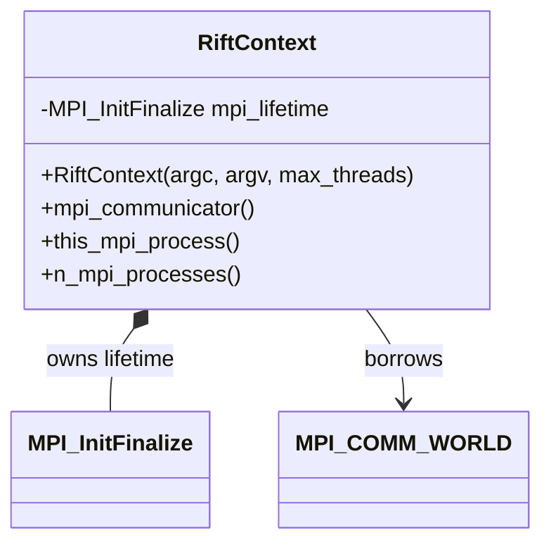

# Milestone 001 / Task 01: Establish the world-only runtime configuration

| Field | Value |
|---|---|
| Status | Complete |
| Owner | Codex |
| Estimated user effort | About one working day |
| Depends on | None |
| Allowed files/modules | `include/rift/rift_context.hpp`, `tests/rift_context_test.cpp`; no other production module |
| Public behavior | New process-lifetime configuration for one logical run on `MPI_COMM_WORLD` |
| API/ABI | Pre-release new header; no compatibility gate |

## Goal

Finish the small `RiftContext` object that anchors deal.II, p4est, and MPI
initialization/finalization through composition and exposes the world
communicator, rank, and size without introducing run identity or communicator
ownership machinery.

## Context and interaction



## Approved API sketch

```cpp
class RiftContext {
public:
    RiftContext(int &argc, char **&argv, unsigned int max_threads = 1);

    RiftContext(const RiftContext &) = delete;
    RiftContext &operator=(const RiftContext &) = delete;
    RiftContext(RiftContext &&) = delete;
    RiftContext &operator=(RiftContext &&) = delete;

    [[nodiscard]] MPI_Comm mpi_communicator() const noexcept;
    [[nodiscard]] unsigned int this_mpi_process() const;
    [[nodiscard]] unsigned int n_mpi_processes() const;

private:
    dealii::Utilities::MPI::MPI_InitFinalize mpi_lifetime_;
};
```

Composition, one logical run, borrowed `MPI_COMM_WORLD`, and instance-bound
communicator, rank, and size accessors are approved. Version reporting remains
the independent `current_version()` API because it does not depend on a live
MPI runtime. Construction does not catch or translate exceptions from
`dealii::Utilities::MPI::MPI_InitFinalize`; fatal deal.II or MPI behavior
retains its underlying non-returning contract.

## Work contract

1. Preserve the user's composition-based mock and the `unsigned int` thread
   limit accepted by deal.II.
2. Apply the approved accessor shape and explicit return types.
3. Make the lifetime anchor explicitly non-copyable and non-movable.
4. Add one self-contained Boost.UT test whose `main` constructs exactly one
   configuration before querying MPI.
5. Add public Doxygen after behavior and wording are accepted.
6. Run the focused Debug test and formatting, record results, and stop.

### Non-goals

- Communicator duplication/free, subcommunicators, `RunConfigurationId`,
  origin/sequence allocation, typed MPI lifecycle errors, or restart identity.
- A multi-rank test harness; Task 04 is the first task that may need one.
- Constructing more than one active `RiftContext` in a process.

## Focused tests

| Behavior/property | Independent oracle | Important cases |
|---|---|---|
| Borrowed communicator | Direct equality with `MPI_COMM_WORLD` | Query only while configuration is alive |
| Rank and size | Compare with raw `MPI_Comm_rank` and `MPI_Comm_size` results | `rank >= 0`, `rank < size`, `size >= 1` |
| Lifetime traits | `std::is_*_constructible/assignable_v` | Copy and move are disabled |
| Thread parameter type | Compile-time construction check | Default and explicit positive limit |

## Documentation

- Document that all ranks create one instance near the top of `main` and that
  every MPI-dependent object is destroyed before it.
- State that the returned communicator is borrowed and must never be freed.

## Completion evidence

- [x] Requested artifact or behavior exists
- [x] Focused tests pass
- [x] Relevant regression tests pass
- [x] Task-level coverage was measured when useful
- [x] Documentation requested for this task is complete
- [x] Commands and results are recorded below

## Evidence and handoff

- Commands/results:
  - `cmake --preset debug` — passed with deal.II 9.8.0 and Clang 22.1.8.
  - `cmake --build --preset debug --parallel 6` — passed; `rift`,
    `rift_context_test`, and `version_test` built.
  - `ctest --preset debug -R '^rift_context_test$' --output-on-failure` —
    passed, 1/1, when run with permission for MPICH to create its local socket.
    The sandboxed run failed during `MPI_Init_thread` with socket error
    `EPERM`, before any test assertion.
  - `ctest --preset debug --output-on-failure` — passed, 2/2.
  - `./format.sh` — passed.
  - `cmake -E make_directory build/doxygen && doxygen Doxyfile` — passed
    without diagnostics after documenting the private lifetime member.
  - Coverage configure/build and `ctest --test-dir build/coverage
    --output-on-failure` — passed, 2/2. The coverage build used the installed
    deal.II compiler, Clang 22.1.8.
  - `gcovr --gcov-executable '/usr/bin/llvm-cov-22 gcov' --root . --filter
    'include/rift/' --filter 'src/' --print-summary --fail-under-line 100
    --fail-under-function 100 --fail-under-branch 100 --cobertura-pretty
    --output coverage.xml build/coverage` — passed. Raw results: lines 100%
    (7/7), functions 100% (6/6), branches 0/0. Policy result: line and function
    gates are 100%; branch coverage is not applicable because in-scope code has
    no instrumented branches. No exclusions were used.
  - `git diff --check` — passed.
- Files changed:
  - `include/rift/rift_context.hpp` — finalized the non-transferable lifetime
    owner, instance-bound world queries, unchanged failure propagation, and
    public Doxygen.
  - `tests/rift_context_test.cpp` — added independent MPI and type-trait oracles.
  - This task record and the milestone plan — recorded accepted decisions,
    ownership, completion, and reproducible evidence.
- Risks/deferred work:
  - The error representation for later recoverable configuration-input defects
    remains a milestone decision; Task 01 introduces no such errors and adds no
    runtime-failure translation layer.
  - The repository documents GCC/gcov as the supported coverage path, but both
    installed deal.II variants pin Clang. Task-level evidence therefore used
    Clang 22.1.8 with `llvm-cov-22 gcov`; the official GCC coverage path remains
    a milestone/CI tooling check.
  - Multi-rank launch and collective evidence remain explicitly deferred to
    Task 04.
- Next stopping point: Task 01 is complete. Stop before Task 02 phase-graph
  work.
