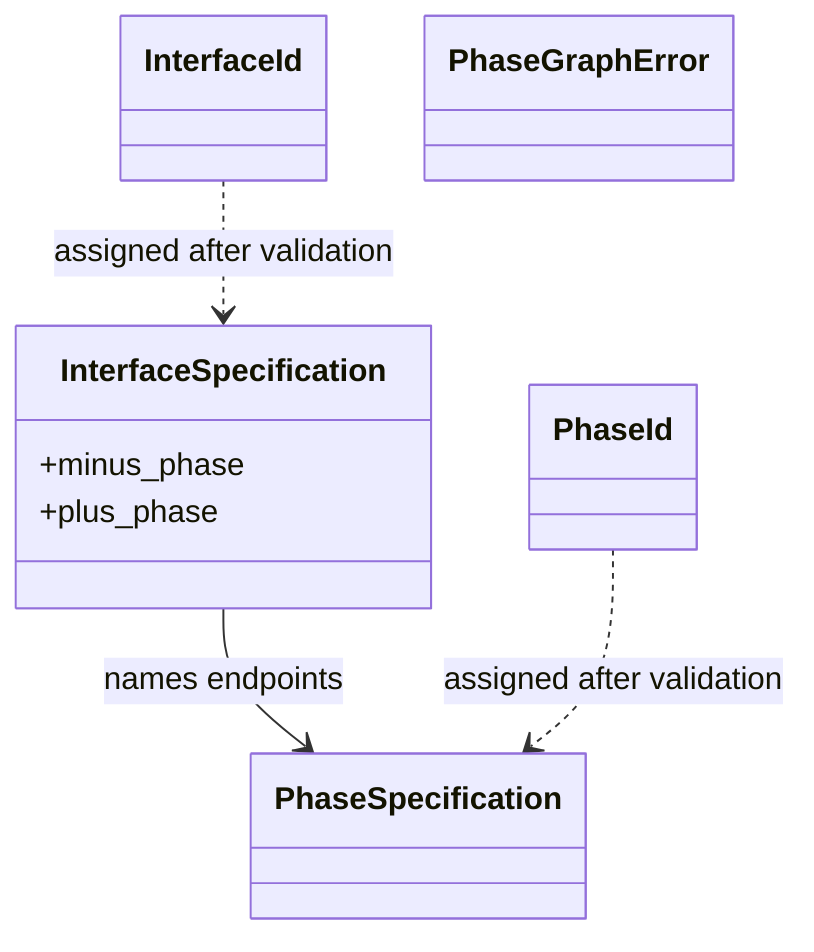

# Milestone 001 / Task 02: Define phase-graph values and provenance

| Field | Value |
|---|---|
| Status | Complete |
| Owner | Codex |
| Estimated user effort | About one working day |
| Depends on | Task 01; graph cardinality/provenance approved |
| Allowed files/modules | `include/rift/strong_id.hpp`, `include/rift/phase_graph.hpp`, focused `tests/phase_graph_values_test.cpp` |
| Public behavior | New phase/interface IDs, registry keys, input specifications, and diagnostic values |
| API/ABI | Pre-release new API; graph-local IDs need no provenance wrapper because one runtime permits one graph |

## Goal

Define the exact value vocabulary used by the phase graph before implementing
construction: distinct phase/interface IDs, phase and interface specifications,
registry keys, declared orientation, diagnostics, and only the provenance needed
by the approved graph cardinality.

## Context and interaction



## Approved API sketch

```cpp
using PhaseId = StrongId<PhaseIdTag>;
using InterfaceId = StrongId<InterfaceIdTag>;

using PhysicsKey = /* owning phase-registry key */;
using InterfaceOperatorKey = /* owning interface-registry key */;

struct PhaseSpecification;
struct InterfaceSpecification;
enum class PhaseGraphErrorCode : std::uint8_t {
    // Local validation and compatibility codes omitted here.
    collective_input_mismatch,
    collective_compatibility_mismatch,
};
struct PhaseGraphError;
```

Each `RiftContext` permits exactly one canonical `PhaseGraph`, and a different
simulation setup requires rerunning the executable. `PhaseId` and `InterfaceId`
are therefore unambiguous within the process-wide runtime; Task 02 adds no
`RunConfigurationId`, graph-instance ID, `PhaseReference`, or provenance
wrapper.

The collective `RiftContext::create_phase_graph(...)` member is the approved
public construction boundary. Its local candidate and collective implementation
belong to Tasks 03 and 04; Task 02 defines only the values exchanged at that
boundary.

## Work contract

1. Add the smallest strong-ID facility needed to prevent phase/interface mixing.
2. Define owning specification and runtime-key values that preserve exact input
   spelling and minus-to-plus orientation.
3. Define collected, machine-readable diagnostics without performing validation.
4. Encode the approved reference/provenance boundary without run identity.
5. Test value semantics, type separation, orientation, ownership, and public
   comparison behavior; add Doxygen and stop.

### Non-goals

- Validating, sorting, querying compatibility, assigning IDs, or communicating
  through MPI.
- Generic ID/key abstractions beyond concrete foundation needs.
- `RunConfigurationId` or cross-restart identity.

## Focused tests

| Behavior/property | Independent oracle | Important cases |
|---|---|---|
| ID type separation | Compile-time invocability/type checks | Phase ID cannot substitute for interface ID |
| Specification ownership | Mutate/destroy constructor inputs and inspect stored values | Empty and non-empty values remain representable for later validation |
| Orientation | Direct field comparison | Minus/plus order is preserved exactly |
| Provenance policy | Compile-time type checks and documented scope | IDs are distinct but carry no graph/run wrapper because one runtime permits one graph |

## Documentation

- Define local ID scope, orientation semantics, registry-key meaning, and which
  defects remain representable until graph construction.

## Completion evidence

- [x] Requested value types and diagnostic vocabulary exist
- [x] Focused tests pass
- [x] Relevant regression tests pass
- [x] Task-level coverage reaches the project gate
- [x] Doxygen is complete
- [x] Commands and results are recorded below

## Evidence and handoff

- Commands/results:
  - Preflight: branch `phasegraph`, revision
    `584eced34f4637dc791386a4088d85d85f983286`, milestone base
    `fdb303b9f66b1efb39fabd743016277b0874f892`.
  - The first focused build failed as expected because the requested
    `collective_input_mismatch` and `collective_compatibility_mismatch` codes
    were absent; adding those values made the same test compile and pass.
  - `clang-format -i include/rift/strong_id.hpp
    include/rift/phase_graph.hpp tests/phase_graph_values_test.cpp` and
    `clang-format --dry-run --Werror` on those files — passed. Formatting was
    deliberately limited to Task 02 files so the user's Task 01 edits remained
    untouched.
  - `cmake --build --preset debug --parallel 6` — passed.
  - `ctest --preset debug -R '^phase_graph_values_test$'
    --output-on-failure` — passed, 1/1 focused test.
  - `ctest --preset debug --output-on-failure` — passed, 3/3 tests. The tests
    were run outside the filesystem sandbox because deal.II/MPI initialization
    requires local sockets; an earlier sandboxed run failed only at
    LeakSanitizer's `ptrace` restriction after its assertions passed.
  - `cmake -E make_directory build/doxygen && doxygen Doxyfile` — passed with
    no diagnostics.
  - `cmake --build build/coverage --parallel 6` and `ctest --test-dir
    build/coverage --output-on-failure` — passed, 3/3 tests.
  - `gcovr --gcov-executable '/usr/bin/llvm-cov-22 gcov' --root . --filter
    'include/rift/' --filter 'src/' --print-summary --fail-under-line 100
    --fail-under-function 100 --fail-under-branch 100 --cobertura-pretty
    --output coverage.xml build/coverage` — passed with raw and
    policy-adjusted coverage of 100% lines (14/14), 100% functions (18/18), and
    100% branches (2/2), with no exclusions.
- Files changed: `include/rift/strong_id.hpp` defines the minimal strong-ID
  facility; `include/rift/phase_graph.hpp` defines graph IDs, owning keys and
  specifications, and local/collective diagnostic values;
  `tests/phase_graph_values_test.cpp` verifies their public behavior. This task
  record and the milestone plan capture the approved one-graph scope and future
  collective member-construction boundary.
- Risks/deferred work: Validation, canonicalization, compatibility invocation,
  the one-graph guard, and `RiftContext::create_phase_graph(...)` implementation
  remain in Tasks 03 and 04. The minimal multi-rank CTest seam and the handling
  of a compatibility callback exception on only one rank remain Task 04
  decisions. The installed deal.II configuration selects Clang 22, so the local
  coverage run used `llvm-cov gcov` rather than the repository's CI GCC/gcov
  path.
- Next stopping point: Task 02 is complete. Return control without beginning
  Task 03 validation or graph construction.
