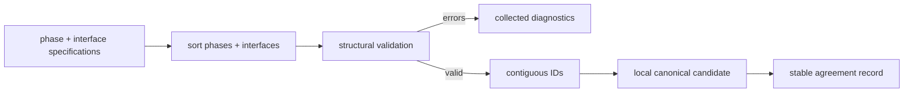

# Milestone 001 / Task 03: Build the local canonical phase graph

| Field | Value |
|---|---|
| Status | Complete; Pair implementation accepted; direct verification deferred to Task 04 |
| Owner | Pair |
| Estimated user effort | About one working day |
| Depends on | Task 02 |
| Allowed files/modules | `include/rift/phase_graph.hpp`, `src/phase_graph.cpp`, root `CMakeLists.txt`, dependency installer and dependency-list documentation |
| Public behavior | Deterministic local validation, canonicalization, and compatibility checking |
| API/ABI | Pre-release new member-construction/result API |

## Goal

Build a graph candidate as a pure deterministic operation on one rank: collect
all structural input errors, sort valid specifications, assign contiguous IDs,
preserve orientation, and produce the stable internal representation that Task
04 can compare exactly before any rank publishes a graph.

## Context and interaction



## Approved API sketch

```cpp
struct PhaseGraphSpecification {
    std::vector<PhaseSpecification> phases;
    std::vector<InterfaceSpecification> interfaces;
};

using InterfaceCompatibilityDecision = std::expected<void, std::string>;

using InterfaceCompatibilityTest = std::function<InterfaceCompatibilityDecision(
    const PhaseSpecification& minus_phase,
    const PhaseSpecification& plus_phase,
    const InterfaceSpecification& interface)>;

using LocalPhaseGraphCandidate = /* private canonical record */;
using LocalPhaseGraphResult =
    std::expected<LocalPhaseGraphCandidate, PhaseGraphErrors>;
```

The local candidate is an implementation seam and must not escape as a public
`PhaseGraph`. The approved public boundary is the collective
`RiftContext::create_phase_graph(PhaseGraphSpecification, ...)` member
implemented in Task 04. The specification aggregate is passed by value so the
one-shot member owns stable storage and may canonicalize it without changing
caller-owned values. `InterfaceCompatibilityTest` is a `std::function` passed
by value and owned only for the duration of graph construction; its exact
three-reference argument list and `std::expected<void, std::string>` decision
result are approved.

`rift::interface_compatibility::accept_all` is the one initial built-in policy.
It must be passed explicitly: omitting the compatibility test while any
interface specification exists remains a `missing_compatibility_check` error.
No other application-independent built-in policy is currently justified.

Each compatibility test receives references to the resolved minus-phase
specification, resolved plus-phase specification, and canonical interface
specification. The first two arguments always preserve the interface's declared
minus-to-plus orientation. The references borrow member-owned storage and are
valid only for the duration of the call; public graph descriptors remain
deferred to Task 05.

An `InterfaceCompatibilityDecision` value accepts the interface; an
`std::unexpected<std::string>` rejects it with a reason. Rift owns the complete
human-readable diagnostic and uses `std::format` to combine that reason with
the interface name and operator key plus the resolved minus/plus phase names
and physics keys. This preserves useful input context even when a registry's
reason is terse. Compatibility invocation and cross-rank exception handling
remain deferred to Task 04.

Rift retains one machine-readable code in each `PhaseGraphError`. Task 05 owns
grouping related errors into one printed diagnostic per phase or interface.
The builder returns errors in a fixed validation traversal order after sorting
the phase and interface specifications, so equivalent input permutations
produce the same local result without a separate error-sorting pass.

UTF-8 validation is delegated to pinned simdutf 9.0.0. The dependency is
private to the implementation and does not appear in Rift's public headers.

## Work contract

1. Sort phases and interfaces by their complete specification fields.
2. Validate UTF-8 names with simdutf, empty names/keys, duplicate phase/interface names,
   missing endpoints, self-edges, and duplicate unordered phase pairs.
3. Return all atomic validation errors in deterministic traversal order.
4. Assign zero-based contiguous IDs and preserve declared orientation
   independently of lexical order and IDs.
5. Produce an exact, stable internal record of local success/error status and
   canonical content for Task 04 agreement.
6. Specify the deterministic compatibility-query order without publishing a
   graph or entering MPI collectives.
7. Keep the candidate and builder private to `src/phase_graph.cpp`; record the
   explicit tables and permutation oracles that Task 04 must exercise through
   the public member, then stop before MPI agreement or public views.

### Non-goals

- Cross-rank input agreement, public graph lookup, references, or JSON.
- Physical compatibility decisions inside the graph; the query owns them.
- Exception-to-diagnostic conversion unless explicitly approved.

## Deferred construction tests

The user explicitly chose not to create internal types or headers solely for
testing. Task 04 must exercise this private implementation through
`RiftContext::create_phase_graph`; until then, Task 03 cannot independently satisfy the unit
test or coverage gates.

| Behavior/property | Independent oracle | Important cases |
|---|---|---|
| Structural validation | Hand-authored expected diagnostic multiset | All listed defects; several simultaneous errors |
| Canonical identity | Enumerate input permutations and compare descriptor tuples | Phase and interface permutations |
| Orientation | Expected endpoint table independent of lexical order | Reversed names and cycles |
| Agreement record | Exact expected candidate/status representation | Equivalent permutations; orientation/key/name changes |

## Documentation

- Doxygen must distinguish unresolved specifications, structural validity,
  canonical ordering, physical orientation, and compatibility selection.

## Completion evidence

- [x] Requested private local-builder artifact exists
- [ ] Focused tests pass
- [x] Relevant regression tests pass
- [ ] Task-level coverage was measured when useful
- [x] Public vocabulary and private implementation have documentation
- [x] Commands and results for this Pair step are recorded below

## Evidence and handoff

- Commands/results:
  - `clang-format -i include/rift/phase_graph.hpp` — passed.
  - `cmake --build --preset debug --parallel 6` — passed.
  - `ctest --preset debug --output-on-failure` — passed, 3/3 tests. The suite
    ran outside the filesystem sandbox because deal.II/MPI initialization
    requires local sockets.
  - `cmake -E make_directory build/doxygen && doxygen Doxyfile` — passed with
    no diagnostics.
  - Added the private builder, then `cmake --build --preset debug --parallel 6`
    — passed after CMake regenerated and compiled `src/phase_graph.cpp`.
  - `ctest --preset debug --output-on-failure` — passed, 3/3 existing tests;
    this remains regression evidence rather than direct builder verification.
  - `cmake --preset debug-tidy` — could not configure because CMake searches
    only for unversioned `clang-tidy`, which is absent. The installed
    `/usr/bin/clang-tidy-22 -p build/debug src/phase_graph.cpp` was run directly
    and passed with no first-party warnings; 11,943 dependency warnings were
    suppressed by the configured header filters.
  - `bash -n scripts/install_dependencies.sh &&
    ./scripts/install_dependencies.sh --check --science-only` — passed.
  - `./scripts/install_dependencies.sh --science-only --variant debug --jobs 6`
    — installed pinned simdutf 9.0.0 and reused the existing debug scientific
    dependency installation.
  - `cmake --preset debug` — passed and found the installed simdutf 9.0.0 CMake
    package.
  - `cmake --build --preset debug --parallel 6` — passed after the simplified
    local builder was compiled and linked against simdutf.
  - `ctest --preset debug --output-on-failure` — passed, 3/3 existing tests.
  - `/usr/bin/clang-tidy-22 -p build/debug src/phase_graph.cpp` — passed with no
    unsuppressed first-party warnings; two include-cleaner false positives for
    simdutf's public umbrella header are narrowly suppressed in place.
- Files changed: `include/rift/phase_graph.hpp` declares the approved owning
  graph specification, compatibility decision/test aliases, and explicit
  accept-all policy. `src/phase_graph.cpp` sorts complete specifications with
  standard string ordering, validates UTF-8 through simdutf and collects
  structural errors in fixed traversal order, then constructs contiguous IDs
  with an unordered name lookup while retaining declared orientation. The
  build and dependency files pin and link simdutf 9.0.0. This task record and
  the milestone plan capture every Task 03 decision accepted so far.
- Risks/deferred work: The local candidate is deliberately unpublished. Task 04
  must establish world agreement and compatible outcomes before constructing
  any public `PhaseGraph`, and its public-member tests must supply all deferred
  Task 03 validation, canonicalization, orientation, permutation, and coverage
  evidence.
- Stopping point: Task 03 is accepted and complete. Do not add the Task 04
  member, MPI agreement, public graph views, or deferred tests until Task 04's
  ownership and MPI-test seam are approved.
- User review: Accepted on 2026-09-02 after confirming that phase-name
  uniqueness must inspect the stored occurrence vector rather than the
  `unordered_map` key count.
