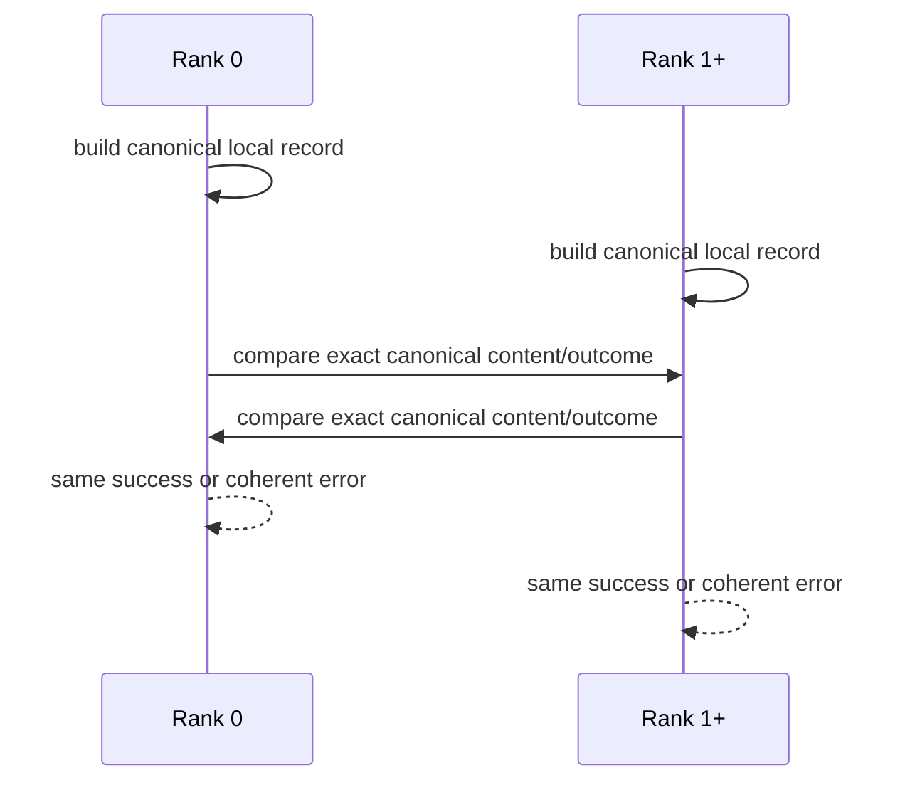

# Milestone 001 / Task 04: Agree on the canonical phase graph

| Field | Value |
|---|---|
| Status | Complete |
| Owner | Pair |
| Estimated user effort | About one working day |
| Depends on | Task 03 |
| Allowed files/modules | `include/rift/phase_graph.hpp`, `include/rift/rift_context.hpp`, narrow collective portion of `src/phase_graph.cpp`, the matching runtime/context implementation if required, `tests/CMakeLists.txt`, explicit `tests/mpi/phase_graph_agreement_test.cpp`, authoritative test guidance if approved |
| Public behavior | World ranks either accept one identical canonical record or report a coherent configuration failure |
| API/ABI | Public construction is the collective `RiftContext::create_phase_graph(...)` member |

## Goal

Require the first genuinely collective foundation behavior and the minimal test
seam needed to prove it: equivalent permuted inputs agree, while divergent graph
content or compatibility outcomes prevent every rank from publishing a graph.

## Context and interaction



## Approved API sketch

```cpp
using PhaseGraphResult =
    std::expected<std::reference_wrapper<const PhaseGraph>, PhaseGraphErrors>;

class RiftContext {
public:
    [[nodiscard]] PhaseGraphResult
    create_phase_graph(PhaseGraphSpecification specification,
                       InterfaceCompatibilityTest compatibility_test);
};
```

The member owns the entire collective protocol and uses its live context's
borrowed `MPI_COMM_WORLD`. Local candidates remain private, so
callers cannot bypass agreement. Successful publication also consumes the one
canonical graph permitted by that `RiftContext`. The specification aggregate is
passed by value, as is the `std::function`-based
`InterfaceCompatibilityTest`; the test is not retained by the published graph.
The library supplies an explicit `interface_compatibility::accept_all` policy,
but it is not a default member argument; an omitted test remains an error for
interface-bearing input. The first member call consumes the context's single
creation attempt regardless of success or failure; every later call returns
`phase_graph_creation_already_attempted`.

Exact input agreement uses `dealii::Utilities::MPI::all_gather` on a private
structured record. The record contains every sorted specification field and
the complete local structural result: either its errors or its derived IDs and
interface endpoints. Every rank compares the gathered records against rank
zero and, on disagreement, returns the same `collective_input_mismatch` naming
the first differing rank. Identical invalid inputs retain their ordinary local
validation errors.

Compatibility agreement invokes every interface callback locally in canonical
interface order and catches both standard and non-standard exceptions. It
records each acceptance, rejection reason, or exception detail, then performs
one `all_gather` for the complete outcome vector. Exact agreement preserves all
local incompatibility or exception errors; any differing vector instead
returns the same `collective_compatibility_mismatch` naming the first rank that
differs from rank zero.

The process-wide runtime/context owns the successfully published `PhaseGraph`.
Consumers receive borrowed const access, so the non-movable runtime/context
stabilizes the graph's address and makes the one-graph invariant structural.
The runtime root is named `RiftContext`, and graph installation is exposed as
its `create_phase_graph(...)` member. This keeps ownership and the collective
one-graph guard inside the same non-movable object.

## Work contract

1. Discover self-contained `tests/mpi/*.cpp` Boost.UT executables with a
   non-recursive CMake glob. Register each executable as separate one-, two-,
   and three-rank CTests through CMake's `MPIEXEC_*` launcher variables; do not
   change ordinary `tests/*.cpp` discovery.
2. Compare exact local success/error status and canonical candidate content
   across all world ranks before invoking compatibility callbacks.
3. Invoke compatibility in canonical interface order only after inputs agree,
   then compare exact acceptance, rejection, or caught-exception outcomes
   across ranks. Represent a thrown callback as
   `compatibility_test_exception` so every rank can finish the protocol.
4. Add machine-readable input- and compatibility-mismatch diagnostics and
   ensure no rank publishes a graph when any mismatch occurs. Format each local
   incompatibility message with the callback's reason, interface name/operator
   key, and resolved minus/plus phase names/physics keys using `std::format`.
5. Store an agreed graph immovably inside `RiftContext`; the first creation call
   seals the context on success or failure, and success returns a borrowed const
   reference.
6. Test equivalent permutations, one-rank content mismatch, and at least three
   ranks when practical. Exercise all Task 03 validation, canonicalization,
   orientation, and permutation cases through the public member; no private
   builder test seam is introduced.
7. Record rank count, timeout, exact launcher command, and test outcome; update
   authoritative test guidance only if approved, then stop.

### Non-goals

- A general MPI wrapper, test registry, custom runner, failure-recovery layer,
  or communicator abstraction.
- Fault tolerance after an MPI collective failure.
- Distributed phase-graph storage; every rank keeps the small immutable graph.
- Printing or logging returned diagnostics; Task 17 owns rank-aware output.

## Focused tests

| Behavior/property | Independent oracle | Important cases |
|---|---|---|
| Equivalent input agreement | Compare exact canonical records after different permutations | One, two, and three ranks |
| Divergent input rejection | Modify one name/key/orientation on one rank | No rank publishes success |
| Compatibility agreement | Rank-tagged spy/query outcome | Same outcome; one-rank mismatch |
| CTest launch metadata | Inspect CTest properties | Explicit ranks, `PROCESSORS`, label, timeout |

## Documentation

- Record that construction is collective on `MPI_COMM_WORLD` and all ranks call
  it in identical order.
- Document the minimal MPI test command in repository guidance if approved.

## Completion evidence

- [x] Requested artifact or behavior exists
- [x] Focused tests pass
- [x] Relevant regression tests pass
- [x] Task-level coverage was measured when useful
- [x] Documentation requested for this task is complete
- [x] Commands and results are recorded below

## Evidence and handoff

- Commands/results:
  - `cmake --preset debug` — passed; CMake found the configured MPI C++
    implementation and generated the updated test build.
  - `cmake -LAH -N build/debug | rg
    '^MPIEXEC_(EXECUTABLE|NUMPROC_FLAG|PREFLAGS|POSTFLAGS)'` — confirmed the
    launcher `/home/dannylong/programming/install/petsc/bin/mpiexec`, `-n`
    process-count flag, and empty pre/post flags.
  - `cmake --build --preset debug --parallel 6` — passed.
  - `ctest --preset debug --output-on-failure` — passed, 3/3 existing tests.
    No `tests/mpi/*.cpp` source exists yet, so the new rank variants have not
    been launched.
  - `clang-format -i src/phase_graph.cpp` — passed after adding the private
    input-agreement seam.
  - `cmake --build --preset debug --parallel 6` — passed; the structured
    agreement record and `dealii::Utilities::MPI::all_gather` instantiation
    compiled and linked.
  - `ctest --preset debug --output-on-failure` — passed, 3/3 existing unit
    tests; direct MPI agreement coverage remains deferred until the public
    member makes this private seam reachable.
  - `/usr/bin/clang-tidy-22 -p build/debug src/phase_graph.cpp` — passed after
    correcting three local modernization warnings and adding the direct MPI
    type include; 35,258 dependency warnings and two existing simdutf umbrella
    include suppressions were not reported as first-party findings.
  - `clang-format -i src/phase_graph.cpp` — passed after adding batched
    compatibility evaluation and agreement.
  - `cmake --build --preset debug --parallel 6` — passed; rejection and caught
    exception diagnostics plus the compatibility `all_gather` compiled and
    linked.
  - `/usr/bin/clang-tidy-22 -p build/debug src/phase_graph.cpp` — passed with no
    first-party findings; 35,258 dependency warnings and two existing simdutf
    umbrella include suppressions were not reported.
  - `ctest --preset debug --output-on-failure` — passed, 3/3 existing unit
    tests; the new private compatibility protocol remains unreachable until
    the public member is added.
  - `clang-format -i include/rift/rift_context.hpp
    tests/rift_context_test.cpp` — passed after the approved runtime-root
    rename.
  - `cmake --build --preset debug --parallel 6` — passed after CMake detected
    the renamed test source; `rift_context_test` compiled and linked.
  - `ctest --preset debug --output-on-failure` — passed, 3/3, with the renamed
    context test selected in place of `rift_config_test`.
  - `ctest --preset debug -R '^rift_context_test$' --output-on-failure` —
    passed, 1/1 focused renamed-context test.
  - The first `doxygen Doxyfile` run exposed undocumented members in the
    existing private phase-graph records. After adding their minimal member
    comments and formatting `src/phase_graph.cpp`, the second run passed with
    no diagnostics.
  - `git diff --check` — passed.
  - `clang-format -i include/rift/phase_graph.hpp
    include/rift/rift_context.hpp src/phase_graph.cpp` — passed after adding
    the context-owned graph and public creation member.
  - `cmake --build --preset debug --parallel 6` — passed; the public member,
    opaque immutable graph storage, borrowed-reference result, and one-attempt
    state compiled and linked.
  - `ctest --preset debug --output-on-failure` — passed, 3/3 existing tests;
    direct creation behavior remains the next test slice.
  - `doxygen Doxyfile` — passed with no diagnostics.
  - `/usr/bin/clang-tidy-22 -p build/debug src/phase_graph.cpp` — passed with no
    first-party findings; 35,258 dependency warnings and three intentional
    include/member-accessor suppressions were not reported.
  - `cmake --preset debug && cmake --build --preset debug --parallel 6` —
    passed after adding the auto-discovered MPI executable and its scenario
    registrations.
  - `ctest --preset debug --output-on-failure` — passed, 15/15 tests. The 12
    MPI registrations include default one-, two-, and three-rank agreement plus
    focused one-, two-, or three-rank failure scenarios.
  - `ctest --test-dir build/debug --show-only=json-v1` — confirmed that every
    MPI registration uses CMake's selected
    `/home/dannylong/programming/install/petsc/bin/mpiexec`, the requested rank
    count, the `mpi;unit` labels, matching `PROCESSORS` metadata (with one rank
    represented by CTest's default), and a 60-second timeout.
  - `/usr/bin/clang-tidy-22 -p build/debug
    tests/mpi/phase_graph_agreement_test.cpp` — passed with no first-party
    findings; 32,273 dependency warnings and three intentional suppressions
    were not reported.
  - The documented GCC coverage command could not produce a policy report in
    this checkout: `build/coverage` is cached for Clang 22 while system `gcov`
    is GCC 13, and a fresh GCC build cannot consume the installed deal.II
    package's Clang-only flags. Using `/usr/bin/llvm-cov-22 gcov` directly on
    the current phase-graph object data measured 329/334 lines (98 percent) in
    `src/phase_graph.cpp`; only the defensive collective branch for different
    prior-attempt state across ranks was unexecuted. That state cannot be
    created through the public API while obeying its single-context and
    same-order collective preconditions, so excluding or otherwise treating it
    requires explicit reviewer approval.
  - The user approved that defensive block as demonstrably unreachable on
    2026-09-02. `src/phase_graph.cpp` now brackets only its unreachable body
    with `GCOVR_EXCL_START`/`GCOVR_EXCL_STOP` and marks the associated branch
    metric with `GCOVR_EXCL_BR_LINE`; adjacent public tests cover ordinary
    cross-rank input mismatch and sealing after successful and failed first
    attempts.
  - `ctest --test-dir build/coverage --output-on-failure` — passed, 15/15
    instrumented tests after the approved marker placement.
  - `/usr/bin/llvm-cov-22 gcov` through gcovr on the current
    `phase_graph.cpp.gcda` measured raw source coverage of 329/334 lines (98.5
    percent) and 42/42 functions. With the approved gcovr markers applied, it
    measured 329/329 lines and 42/42 functions (both 100 percent). Its Clang
    compatibility-format branch result is not the repository's authoritative
    GCC coverage result and remains unsuitable for enforcing the branch gate.
  - `cmake --build --preset debug --parallel 6` — passed after the final marker
    placement.
  - `ctest --preset debug --output-on-failure` — passed, 15/15 final Debug
    regression tests.
  - `/usr/bin/clang-tidy-22 -p build/debug src/phase_graph.cpp` — passed with no
    first-party findings; 35,258 dependency warnings and three intentional
    suppressions were not reported.
  - `git diff --check` — passed after the test changes.
- Files changed: `tests/CMakeLists.txt` now discovers each `tests/mpi/*.cpp`
  source as one executable and registers one-, two-, and three-rank CTests via
  CMake's MPI launcher variables. `AGENTS.md` and `README.md` document the new
  automatic MPI-test convention; `include/rift/phase_graph.hpp` adds the
  approved `compatibility_test_exception` code. `src/phase_graph.cpp` now
  constructs an exact structured record for sorted input plus its structural
  result and identifies the first record that differs from rank zero through
  `all_gather`. It also invokes every compatibility callback in canonical
  order, retains full specification context in rejection/exception errors, and
  collectively compares the batched outcomes before returning.
  `include/rift/rift_context.hpp` and `tests/rift_context_test.cpp` replace the
  former config-named header, type, and test, while the development records use
  `RiftContext` and the approved `create_phase_graph(...)` member spelling. The
  public member now seals the context on its first call, runs both private
  agreement stages, installs opaque immutable storage only on success, and
  returns a borrowed const graph reference. `tests/mpi/phase_graph_agreement_test.cpp`
  uses one Boost.UT executable and fresh-process scenarios to cover canonical
  permutations, orientation and callback order, collected validation,
  compatibility policies/failures, rank mismatches, and one-attempt sealing.
  `tests/CMakeLists.txt` retains glob discovery and reuses a small MPI
  registration helper for the default rank matrix and focused scenario runs.
  The milestone records the approved seams and Pair ownership.
- Risks/deferred work: Historical architecture pages under
  `docs/architecture/` retain their protected terminology until Task 16
  reconciles them. The local coverage toolchain mismatch remains a repository
  readiness issue, but the approved source-level exclusion is compatible with
  the authoritative gcovr path used by CI.
- Next stopping point: Task 04 is complete. Return control before Task 05 graph
  views and select its ownership separately.
