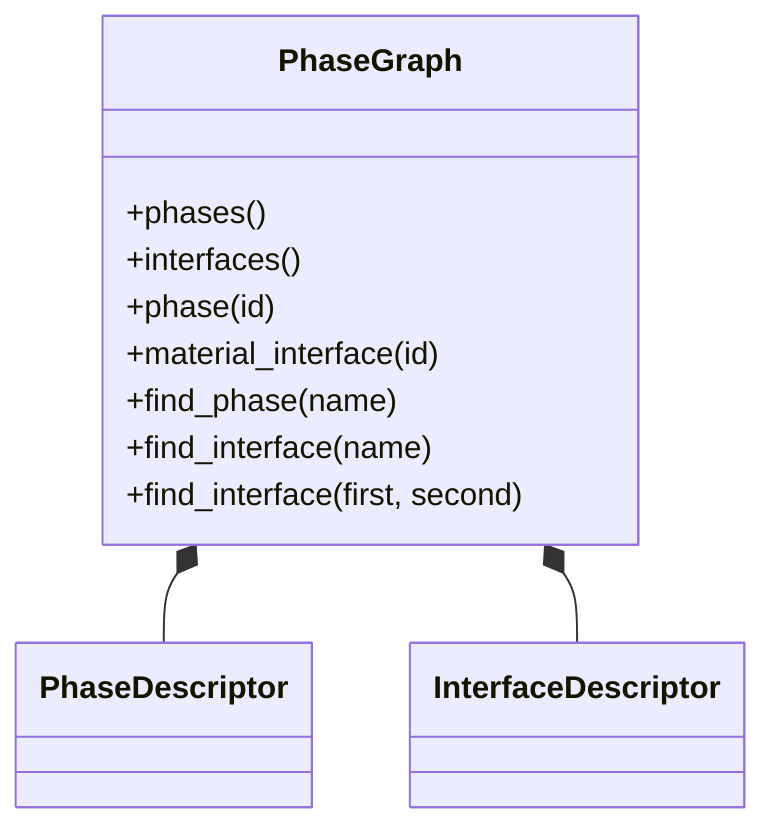

# Milestone 001 / Task 05: Publish the immutable phase graph

| Field | Value |
|---|---|
| Status | Complete |
| Owner | Pair |
| Estimated user effort | About one working day |
| Depends on | Task 04 |
| Allowed files/modules | `include/rift/phase_graph.hpp`, `src/phase_graph.cpp`, focused `tests/phase_graph_*_test.cpp` and `tests/mpi/phase_graph_*_test.cpp`, approved coverage policy in `scripts/run_coverage.sh`, `.github/workflows/ci.yml`, and `AGENTS.md` |
| Public behavior | Immutable descriptors, checked lookup operations, graph-local component-boundary IDs, and grouped human-readable errors |
| API/ABI | Pre-release graph-view API; `RiftContext` ownership and non-copyable/non-movable graph identity are approved |

## Goal

Publish the collectively agreed graph as immutable phase and interface
descriptors with cheap numeric lookup, checked name lookup, the approved
graph-local component-boundary IDs, unordered adjacency lookup, and pure
human-readable formatting of collected errors.

## Context and interaction



## Approved API sketch

Task 04 establishes that `RiftContext` owns one immovable graph and consumers
borrow it through const access. Task 02 establishes that `PhaseId` and
`InterfaceId` are the component-boundary identities: the one-context,
one-graph model does not add a reference or provenance wrapper.

```cpp
struct PhaseDescriptor {
    PhaseId id;
    std::string name;
    PhysicsKey physics_key;
};

struct InterfaceDescriptor {
    InterfaceId id;
    std::string name;
    PhaseId minus_phase;
    PhaseId plus_phase;
    InterfaceOperatorKey operator_key;
};

[[nodiscard]] std::span<const PhaseDescriptor> phases() const noexcept;
[[nodiscard]] std::span<const InterfaceDescriptor> interfaces() const noexcept;

[[nodiscard]] const PhaseDescriptor& phase(PhaseId id) const;
[[nodiscard]] const InterfaceDescriptor& material_interface(InterfaceId id) const;

[[nodiscard]] std::optional<PhaseId> find_phase(std::string_view name) const noexcept;
[[nodiscard]] std::optional<InterfaceId> find_interface(std::string_view name) const noexcept;
[[nodiscard]] std::optional<InterfaceId>
find_interface(PhaseId first, PhaseId second) const noexcept;

struct PhaseErrorSubject {
    std::size_t sorted_index;
    PhaseSpecification specification;
};

struct InterfaceErrorSubject {
    std::size_t sorted_index;
    InterfaceSpecification specification;
};

using PhaseGraphErrorSubject =
    std::variant<PhaseErrorSubject, InterfaceErrorSubject>;

[[nodiscard]] std::string
format_phase_graph_errors(std::span<const PhaseGraphError> errors);
```

Numeric lookup is constant-time and throws `std::out_of_range` for an invalid
ID. Name lookup returns `std::nullopt` when the name is absent. Phase-pair
lookup is unordered and returns `std::nullopt` for a nonadjacent, identical, or
out-of-range pair; a found descriptor retains its declared minus-to-plus
orientation. Descriptors own their names and registry keys. The graph exposes
only const descriptor references and spans; a caller may safely modify a
detached descriptor copy without mutating the graph. Each atomic error may own
the exact sorted phase or interface specification that caused it. The pure
formatter groups matching subjects, shows their `Configured` and `Expected`
fields, safely escapes invalid UTF-8 and terminal control bytes, and performs
no printing or logging. Until registries can enumerate their choices, expected
physics and operator values describe the structural key contract rather than a
list of valid registered names.

## Work contract

1. Store phase/interface descriptors and lookup tables behind an immutable
   public interface.
2. Provide in-range numeric access and checked missing-name/invalid-ID behavior.
3. Export graph-local `PhaseId` and `InterfaceId` values at component boundaries;
   do not add a reference or provenance wrapper.
4. Preserve the approved non-copyable, non-movable graph identity so borrowed
   views cannot be invalidated by graph transfer or assignment.
5. Attach full configured specifications as typed subjects to phase- and
   interface-specific atomic errors, and format one human-readable table per
   subject without performing output.
6. Test descriptor content, lookup, bounds, immutability traits, ID type scope,
   subject grouping, unscoped errors, and safe display escaping; document and
   stop.

### Non-goals

- Geometry, physics registry ownership, checkpoint input, or graph mutation.
- Junction specifications, descriptors, lookup, classification, or line
  physics. Milestone 002 planning must explicitly decide whether to add them or
  record a further deferral.
- Graph serialization or a JSON schema; reconsider it only when a logger,
  checkpoint, or external-tooling consumer defines concrete requirements.
- Configuring terminal/file logging; this task returns formatted diagnostics,
  while Task 17 owns their optional submission to the Rift logger.
- Run identity unless the graph-cardinality decision explicitly requires it.

## Focused tests

| Behavior/property | Independent oracle | Important cases |
|---|---|---|
| Descriptor content | Hand-authored sorted descriptor table | Empty interfaces; several phases/interfaces |
| Checked lookup | Independent expected name/ID and adjacency maps | First/last/out-of-range ID; missing name; reversed, identical, invalid, and nonadjacent phase pairs |
| ID boundary and type scope | Compile-time type checks and hand-authored descriptor IDs | Phase/interface type separation; first/last valid ID |
| Error presentation | Exact hand-authored text and independent subject grouping | Multiple errors on one phase/interface; unscoped errors; empty names; quotes, controls, and invalid UTF-8 |

## Documentation

- Doxygen must define descriptor and error-subject ownership, lookup failure
  behavior, graph copy/move policy, formatting, and safe display escaping.

## Approved coverage adjustments

Raw compiler metrics remain visible and are stored separately from the
policy-adjusted reports. The policy gate removes only the following reviewed
compiler artifacts and demonstrably unreachable behavior:

| Tool/source location | Adjustment and justification | Adjacent evidence |
|---|---|---|
| GCC/gcovr generated branches | Use gcovr 8.6's `--exclude-throw-branches`, `--exclude-unreachable-branches`, and `--exclude-noncode-lines` filters for compiler-generated exception and non-code edges | Clang source-based coverage independently reports every reachable Rift decision covered |
| `src/phase_graph.cpp:251` and `:272` | `GCOVR_EXCL_BR_LINE` removes GCC cleanup edges attached to the closing braces of the two `DiagnosticField` initializer lists | `phase_graph_error_format_test` constructs and checks every phase and interface diagnostic field |
| `src/phase_graph.cpp:659` | `GCOVR_EXCL_BR_LINE` removes a GCC cleanup edge attached to initial `AgreementRecord` construction | MPI agreement tests exercise successful, structurally invalid, and rank-mismatched input records |
| `src/phase_graph.cpp:892` | `GCOVR_EXCL_BR_LINE` removes a GCC cleanup edge attached to context-state record construction; the preceding ternary is deliberately evaluated on its own line and remains covered in both directions | MPI tests exercise the first creation attempt and a sealed context after both successful and failed attempts |
| `src/phase_graph.cpp:898` and `:900-904` | The Clang gate permits exactly the previously approved unreachable prior-attempt-state mismatch branch and body; any additional uncovered file/line fails the gate | Same-order collective tests cover ordinary input mismatch, while sealing tests cover repeat attempts without violating the collective contract |

The user approved the four GCC-only exclusions and the exact Clang allowlist on
2026-09-02. The prior-attempt-state exclusion itself was already approved with
Task 04.

## Completion evidence

- [x] Requested artifact or behavior exists
- [x] Focused tests pass
- [x] Relevant regression tests pass
- [x] Task-level coverage was measured when useful
- [x] Documentation requested for this task is complete
- [x] Commands and results are recorded below

## Evidence and handoff

- Commands/results:
  - User reviewed and accepted the descriptor/lookup implementation on
    2026-09-02.
  - `clang-format -i include/rift/phase_graph.hpp src/phase_graph.cpp` — passed.
  - `cmake --build --preset debug --parallel 6` — passed.
  - `ctest --preset debug --output-on-failure` — all 15 tests passed.
  - `/usr/bin/clang-tidy-22 -p build/debug src/phase_graph.cpp` — no
    first-party findings; dependency warnings and four intentional
    suppressions were suppressed.
  - `cmake --build --preset debug --parallel 6` after adding the focused tests
    — passed.
  - Focused formatter, publication, and subject tests — all 6 selected tests
    passed, including publication at one, two, and three MPI ranks.
  - `ctest --preset debug --output-on-failure` after adding the focused tests —
    all 19 tests passed.
  - `/usr/bin/clang-tidy-22 -p build/debug` over the three changed test sources
    — no first-party findings; dependency warnings and eight documented
    suppressions were suppressed.
  - A project-local Python environment contains gcovr 8.6. An isolated
    GCC/OpenMPI/deal.II dependency stack was built under `.dependencies-gcc/`;
    compiler-specific `gcc-coverage` and `clang-coverage` presets and
    `scripts/run_coverage.sh` now run all serial and MPI tests without shared
    counter files.
  - Focused gap tests added independent checks for lookup beyond the sorted
    range, one-sided invalid UTF-8, duplicate phase names used as endpoints,
    unknown error codes, generic terminal controls, and every diagnostic
    subject-grouping transition. The focused debug selection passed.
  - `ctest --preset debug --output-on-failure` after the coverage-policy edit —
    all 19 tests passed. The first sandboxed attempt was invalid because MPI
    sockets and LeakSanitizer were blocked; the unrestricted rerun passed.
  - `./scripts/run_coverage.sh clang` — all 19 tests passed; raw LLVM coverage
    was 99.21% lines (631/636), 100% functions (67/67), and 99.55% branches
    (222/223). Exact-location adjustment of the approved unreachable Task 04
    block produced 100% lines (631/631), functions (67/67), and branches
    (222/222); the policy gate passed.
  - `./scripts/run_coverage.sh gcc` — all 19 tests passed; raw gcovr coverage
    was 99.0% lines (482/487), 100% functions (75/75), and 64.2% branches
    (462/720). The approved policy adjustment produced 100% lines (482/482),
    functions (75/75), and branches (439/439); the policy gate passed.
  - A disposable example was built with Clang 22 and run successfully. It
    created one invalid graph, formatted its collected errors, and printed only
    on rank zero through `dealii::ConditionalOStream`. The user reviewed and
    accepted the concrete terminal output on 2026-09-02; the temporary example
    directory was then removed at the user's request.
  - `git diff --check` — passed.
- Files changed:
  - `include/rift/phase_graph.hpp` — added the approved owning descriptors and
    immutable view/lookup declarations.
  - `src/phase_graph.cpp` — published descriptor storage and implemented
    numeric, name, and unordered phase-pair lookup; attached typed subjects to
    subject-specific errors and implemented pure grouped formatting.
  - `tests/phase_graph_error_format_test.cpp` — added exact formatting,
    grouping, fallback-heading, unscoped-error, and safe-escaping tests.
  - `tests/mpi/phase_graph_publication_test.cpp` — added independent descriptor,
    lookup, adjacency, bounds, and detached-copy tests at one, two, and three
    ranks with rank-dependent input order.
  - `tests/mpi/phase_graph_agreement_test.cpp` — verified that real builder and
    compatibility errors carry their complete typed subjects.
  - This task record and the milestone plan — recorded approved Task 05 API
    decisions and deferred canonical JSON.
  - `.gitignore`, `CMakeLists.txt`, `CMakePresets.json`,
    `scripts/install_dependencies.sh`, `scripts/run_coverage.sh`,
    `.github/workflows/ci.yml`, and `AGENTS.md` — added reproducible GCC/gcovr
    and Clang/LLVM raw and policy-adjusted coverage paths.
- Risks/deferred work: Graph serialization is deferred until a concrete
  consumer defines its format. Actual valid physics/operator choice lists are
  deferred until their registries can enumerate them. Junction configuration is
  deliberately deferred, with a required reconsideration when Milestone 002 is
  planned. Rank-aware terminal and file output is deliberately deferred to Task
  17. LLVM reports 17 mismatched-function warnings when combining the same
  statically linked library across the separate test executables; this does not
  change the source-level coverage counts or exact-location gate.
- Next stopping point: Task 05 is complete. Return control before assigning or
  beginning Task 06 mesh work.
