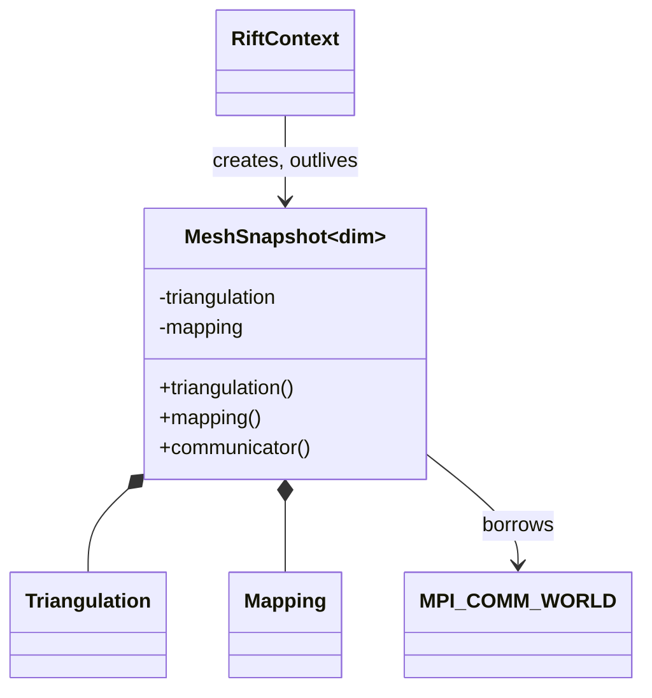

# Milestone 001 / Task 06: Own the mesh snapshot

| Field | Value |
|---|---|
| Status | Complete |
| Owner | Pair |
| Estimated user effort | About one working day |
| Depends on | Tasks 01 and 05; mesh ownership/API approval |
| Allowed files/modules | `include/rift/mesh_snapshot.hpp`, `include/rift/rift_context.hpp`, `src/mesh_snapshot.cpp`, focused `tests/mesh_snapshot_test.cpp` and `tests/mpi/mesh_snapshot_agreement_test.cpp`, root `CMakeLists.txt` source list, `scripts/run_coverage.sh`, and milestone records |
| Public behavior | Immutable access to one owned distributed triangulation and mapping on `MPI_COMM_WORLD` |
| API/ABI | Pre-release new template API; `dim` exposure and ownership types require approval |

## Goal

Create the structural mesh owner used by spaces and later geometry without
duplicating the communicator: one snapshot owns the distributed triangulation
and immutable mapping, exposes only const views, and follows `RiftContext`'s MPI
lifetime.

## Context and interaction



## Approved API sketch

```cpp
template<int dim>
class MeshSnapshot {
public:
    [[nodiscard]] MeshSnapshotId id() const noexcept;
    [[nodiscard]] const auto &triangulation() const noexcept;
    [[nodiscard]] const dealii::Mapping<dim> &mapping() const noexcept;
    [[nodiscard]] MPI_Comm communicator() const noexcept;
};
```

Only `dim=2` and `dim=3` volume meshes are supported; `spacedim` equals `dim`.
Other dimensions are rejected at compile time.

The creation member adopts a fully constructed distributed triangulation and
mapping through `std::unique_ptr` parameters. Both inputs must be non-null and
the triangulation must use `MPI_COMM_WORLD`.

`RiftContext` is the public creation boundary, but it does not retain the
dimension-dependent mesh resources. `MeshSnapshot<dim>` owns its triangulation
and mapping so that their lifetime and immutable public views stay together.
The successful creation value is a
`std::shared_ptr<const MeshSnapshot<dim>>`. Later spaces and retained states may
share that handle to keep their exact mesh generation alive, but the handle
does not extend `RiftContext`'s MPI lifetime.

Creation is a same-order collective operation on `MPI_COMM_WORLD`. Every rank
receives the same success or deterministically ordered validation errors. The
factory collectively validates non-null resources and the triangulation's
world communicator, including cross-rank dimension agreement; consistent
collective mesh construction and semantically equivalent polymorphic mappings
remain caller preconditions.

The result is `std::expected<std::shared_ptr<const MeshSnapshot<dim>>,
MeshSnapshotErrors>`. Each error contains a typed code, the offending world
rank, and a human-readable message. Independent failures are retained in world-
rank then error-code order. Because creation adopts both `unique_ptr` inputs,
it consumes them on success and validation failure.

Each successfully published snapshot receives a context-local
`MeshSnapshotId`, represented by a 64-bit `StrongId`. IDs are assigned in
successful collective-creation order, agree across ranks, and are not reused
within the one `RiftContext` execution. Failed validation publishes no ID and
does not advance the sequence. The ID has no meaning across program restarts.

## Work contract

1. Adopt the caller's completed triangulation and mapping and support only
   `dim=2,3` volume meshes.
2. Own those resources in one non-assignable object with const public views.
3. Borrow `MPI_COMM_WORLD`; do not duplicate or free it.
4. Collectively validate creation inputs and publish no snapshot on any rank
   when one or more ranks supply invalid inputs.
5. Assign a context-local mesh identity suitable for rejecting support from a
   different snapshot.
6. Test ownership traits, cell counts, mapping queries, communicator equality,
   and destruction before `RiftContext`; add Doxygen and stop.

### Non-goals

- Phase support, field spaces, geometry classification, mesh adaptation, or
  transfer.
- Arbitrary communicators or a second MPI lifetime owner.
- Premature snapshot identity without a stale-reference use case.

## Focused tests

| Behavior/property | Independent oracle | Important cases |
|---|---|---|
| Mesh ownership | Construct a small mesh and compare independent cell counts | Empty/coarse representative mesh |
| Mapping view | Evaluate a known unit-cell point with deal.II's mapping oracle | Corners and interior point |
| Communicator | Direct equality with `MPI_COMM_WORLD` | Valid only inside live `RiftContext` |
| Collective validation | Gather per-rank expected validity independently | One rank with a null resource or non-world communicator; coherent errors on all ranks |
| Mesh identity | Independent successful-creation count | Multiple snapshots, failed creation, cross-rank equality |
| Object traits | Compile-time copy/move/assignment checks | Approved ownership policy |

## Documentation

- Document ownership, const-view lifetimes, dimension support, communicator
  borrowing, and destruction order.

## Approved coverage adjustments

Raw compiler metrics remain visible, and the policy-adjusted reports remove
only reviewed compiler artifacts and demonstrably unreachable behavior. The
user approved these Task 06 adjustments on 2026-09-03:

| Tool/source location | Adjustment and justification | Adjacent evidence |
|---|---|---|
| `src/mesh_snapshot.cpp:53-55` | `GCOVR_EXCL_BR_LINE` and `GCOVR_EXCL_LINE` remove the MPI operational-failure branch and throw from GCC; the Clang gate permits exactly the corresponding uncovered branch and lines. Both arguments to `MPI_Comm_compare` are live communicators obtained from the supplied deal.II triangulation and `MPI_COMM_WORLD`; exercising a returned error would require corrupting dependency state or inducing an external MPI failure. | Serial and one-, two-, and three-rank tests cover null triangulations, exact world communicators, and valid non-world communicators without manufacturing an invalid MPI handle. |
| `src/mesh_snapshot.cpp:135` | `GCOVR_EXCL_BR_LINE` removes GCC-only exception-cleanup edges generated for direct `shared_ptr` construction after `new`; these are allocation/control-block cleanup mechanics rather than Rift decisions. Clang reports the line covered. | Successful 2D and 3D creation tests verify ownership, immutable access, and destruction of the published handle. |

The Clang allowlist and expected uncovered counts remain exact, so an uncovered
location introduced elsewhere fails the coverage script.

## Completion evidence

- [x] Requested artifact or behavior exists
- [x] Focused tests pass
- [x] Relevant regression tests pass
- [x] Task-level coverage was measured when useful
- [x] Documentation requested for this task is complete
- [x] Commands and results are recorded below

## Evidence and handoff

- Commands/results:
  - `./format.sh` and `git diff --check` passed.
  - `cmake --build --preset debug --parallel 6` passed.
  - `ctest --preset debug -R '^mesh_snapshot_test$' --output-on-failure`
    passed.
  - `ctest --preset debug -R
    '^mesh_snapshot_agreement_test_[123]_ranks?$' --output-on-failure` passed
    all three registered process counts.
  - `ctest --preset debug --output-on-failure` passed all 23 tests after the
    final Task 06 edits.
  - `/usr/bin/clang-tidy-22 -p build/debug src/mesh_snapshot.cpp
    tests/mesh_snapshot_test.cpp
    tests/mpi/mesh_snapshot_agreement_test.cpp` completed without first-party
    findings after replacing one unnecessary test copy; dependency findings
    and existing intentional suppressions were suppressed.
  - `doxygen Doxyfile` reported no Task 06 documentation errors, but exited 1
    because five pre-existing private fields in `src/phase_graph.cpp` are not
    documented. That out-of-scope repository-wide documentation gap remains
    for milestone reconciliation.
  - `./scripts/run_coverage.sh gcc` passed all 23 tests. Its compiler report
    recorded 576/582 lines (99.0 percent), 99/99 functions (100 percent), and
    523/814 raw branches (64.3 percent); the approved generated-code and source
    adjustments produced 576/576 lines, 99/99 functions, and 500/500 branches
    (all 100 percent).
  - `./scripts/run_coverage.sh clang` passed all 23 tests. Its compiler report
    recorded 701/708 lines (99.01 percent), 80/80 functions (100 percent), and
    242/244 branches (99.18 percent); the exact approved allowlist produced
    701/701 lines, 80/80 functions, and 242/242 branches (all 100 percent).
- Files changed: added the public mesh snapshot identity, error/result, owned
  resource, and const-view skeleton in `include/rift/mesh_snapshot.hpp`; added
  the constrained creation-member declaration and successful-ID counter to
  `include/rift/rift_context.hpp`; implemented deterministic world-rank
  validation, successful ID assignment, resource adoption, and explicit 2D/3D
  instantiations in `src/mesh_snapshot.cpp`; documented why direct
  `shared_ptr` construction preserves the private creation boundary; added
  that source to the root library target; added focused serial tests for
  resource adoption, mesh and mapping views, empty meshes, local errors,
  communicator rejection, traits, dimensions, and ID consumption; recorded
  approved decisions here and in the milestone plan. Added one automatically
  discovered MPI test executable covering asymmetric missing resources,
  non-world communicators, cross-rank dimension disagreement, coherent error
  ordering, failed-creation ID behavior, and successful ID agreement with one,
  two, and three ranks. Added explicit 3D null-resource and structured-error
  comparison coverage, the approved source exclusions, and exact Clang
  coverage enforcement for the remaining unreachable MPI path.
- Risks/deferred work: semantically equivalent polymorphic mappings and
  consistent collective construction of the supplied distributed meshes
  remain caller preconditions. External MPI operational failure and allocation
  failure behavior are preserved but excluded from the coverage gate as
  approved above. The full Doxygen command remains red because of the five
  unrelated `src/phase_graph.cpp` findings recorded above.
- Next stopping point: Task 06 is complete. Do not begin Task 07 until the user
  explicitly selects it and assigns ownership.
