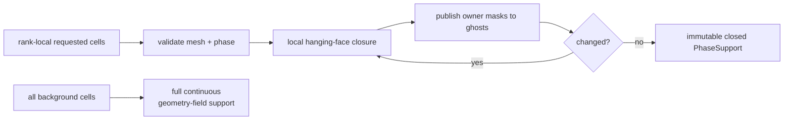

# Milestone 001 / Task 07: Close distributed phase support

| Field | Value |
|---|---|
| Status | Complete |
| Owner | Pair |
| Estimated user effort | About one working day |
| Depends on | Tasks 05 and 06; Task 04's approved MPI test seam |
| Allowed files/modules | `include/rift/phase_support.hpp`, `src/phase_support.cpp`, the `RiftContext` factory declaration, CMake source registration, focused serial `tests/phase_support_test.cpp`, and explicit `tests/mpi/phase_support_agreement_test.cpp` |
| Public behavior | Validated owner-local requests become immutable conforming support masks on `MPI_COMM_WORLD` |
| API/ABI | Pre-release new support-specification and support-view API |

## Goal

Separate requested cells from closed support and compute the least distributed
fixed point required by hanging-face conformity for each phase, while keeping
every primitive continuous geometry field active on the complete background
mesh.

## Context and interaction



## Approved API sketch

```cpp
struct PhaseSupportSpecification {
    PhaseId phase;
    std::vector<dealii::CellId> requested_cells;
};

using PhaseSupportSetId =
    StrongId<detail::PhaseSupportSetIdTag, std::uint64_t>;

class PhaseSupport {
public:
    PhaseSupport(const PhaseSupport&) = delete;
    PhaseSupport& operator=(const PhaseSupport&) = delete;
    PhaseSupport(PhaseSupport&&) noexcept = default;
    PhaseSupport& operator=(PhaseSupport&&) noexcept = default;

    [[nodiscard]] PhaseId phase_id() const noexcept;
    [[nodiscard]] std::span<const dealii::CellId>
    requested_cells() const noexcept;
    [[nodiscard]] std::span<const dealii::CellId>
    closure_added_cells() const noexcept;
    [[nodiscard]] std::span<const dealii::CellId>
    closed_cells() const noexcept;
};

template<int dim>
class PhaseSupportSet {
public:
    PhaseSupportSet(const PhaseSupportSet&) = delete;
    PhaseSupportSet& operator=(const PhaseSupportSet&) = delete;
    PhaseSupportSet(PhaseSupportSet&&) noexcept = default;
    PhaseSupportSet& operator=(PhaseSupportSet&&) noexcept = default;

    [[nodiscard]] PhaseSupportSetId id() const noexcept;
    [[nodiscard]] bool active() const noexcept;
    [[nodiscard]] const MeshSnapshot<dim>&
    mesh_snapshot() const noexcept;
    [[nodiscard]] std::span<const PhaseSupport>
    supports() const noexcept;
    [[nodiscard]] const PhaseSupport& support(PhaseId phase) const;
};

enum class PhaseSupportErrorCode : std::uint8_t {
    phase_graph_unavailable,
    null_mesh,
    dimension_mismatch,
    mesh_snapshot_mismatch,
    unknown_phase,
    missing_phase_specification,
    duplicate_phase_specification,
    duplicate_requested_cell,
    cell_not_locally_present,
    cell_not_active,
    cell_not_locally_owned,
};

struct PhaseSupportError {
    PhaseSupportErrorCode code;
    unsigned int rank;
    std::optional<PhaseId> phase;
    std::optional<dealii::CellId> cell;
    std::string message;
};
using PhaseSupportErrors = std::vector<PhaseSupportError>;

template<int dim>
using PhaseSupportResult =
    std::expected<PhaseSupportSet<dim>, PhaseSupportErrors>;

template<int dim>
[[nodiscard]] PhaseSupportResult<dim>
RiftContext::create_phase_supports(
    std::shared_ptr<const MeshSnapshot<dim>> mesh,
    std::vector<PhaseSupportSpecification> specifications);
```

The public values, errors, and immutable views live in
`include/rift/phase_support.hpp`. Validation, closure, MPI communication, and
template definitions live in `src/phase_support.cpp`, which explicitly
instantiates the supported two- and three-dimensional APIs. `RiftContext`
declares the collective factory, and the root CMake target compiles the source.

`PhaseSupportSpecification` supplies its rank's requested locally owned active
cells as a `std::vector<dealii::CellId>`. Each published `PhaseSupport` stores
every closed owner-local cell exactly once in one partitioned `CellId` vector:
a sorted requested prefix followed by a sorted closure-added suffix. A stored
split index exposes the two provenance spans, while the complete vector exposes
the closed support in deterministic requested-then-added order. The complete
span is not promised to be globally sorted by `CellId`.

This representation uses one `CellId` per closed cell rather than duplicating
the final union in a third vector. Later space construction visits the complete
span to select active finite-element indices, so assembly does not search this
sparse provenance storage in its inner loops. Each `PhaseSupport` is movable
but not copyable, preventing a borrowed per-phase query from being copied into
another large cell allocation accidentally.

The collective result is a mesh-owning `PhaseSupportSet<dim>`. It retains one
`std::shared_ptr<const MeshSnapshot<dim>>` and the canonical collection of
per-phase `PhaseSupport` records rather than storing a shared mesh handle in
every phase record. This keeps the exact mesh alive through later space
construction while avoiding redundant ownership state. The aggregate is
move-constructible and move-assignable but not copyable, preventing accidental
deep copies of every phase's cell storage. Later construction can move it out
of `PhaseSupportResult` and into a `SpaceDraft`; any future shared ownership
must be requested explicitly by placing the aggregate in a shared owner.
`mesh_snapshot()` exposes only a borrowed `const MeshSnapshot<dim>&` valid for
the aggregate's lifetime; it does not expose or copy the internal shared owner.
Callers that intend to create another support set retain the mesh handle they
originally supplied to the factory.

As the Task 08 provenance amendment, each successful support construction also
receives a context-local `PhaseSupportSetId`. The counter advances only after
collective success, so failed calls consume no value. `active()` reports whether
the move-only aggregate still retains its mesh and support data; this lets the
space-draft factory reject moved-from input without dereferencing it.

`supports()` exposes every record in canonical `PhaseId` order. `support(id)`
uses that order for constant-time checked lookup and throws `std::out_of_range`
when the ID is not part of the context-owned graph, matching `PhaseGraph`'s
numeric lookup behavior. Every valid canonical phase is necessarily present,
including a phase with empty owner-local support, so optional lookup would
misrepresent the aggregate's completeness. Name lookup remains the phase
graph's responsibility.

Every rank supplies exactly one `PhaseSupportSpecification` for each canonical
phase, in arbitrary order; an explicit empty requested-cell vector is valid.
Missing, duplicate, and invalid phase IDs are input errors, and successful
output contains one support in canonical `PhaseId` order. The context-owned
phase graph is already collectively agreed and is not exchanged or revalidated
by support creation.

`RiftContext::create_phase_supports(...)` is the public same-order collective
factory. It uses the context-owned canonical phase graph and the supplied
mesh's world communicator, then transfers the shared mesh handle into the
successful aggregate. Calls are reusable: the context neither retains support
sets nor imposes the phase graph's one-attempt rule on them.

Recoverable validation failures return a coherent `PhaseSupportErrors` value on
every rank. Each atomic `PhaseSupportError` contains a machine-readable code,
the offending world rank, optional `PhaseId` and `dealii::CellId` subjects, and
a human-readable message. The successful path uses two fixed-size reductions:
one field-wise minimum and one field-wise maximum over dimension, phase-graph
availability, mesh availability, mesh snapshot identity, and a local-validity
flag. Complete rank-local diagnostics and validation records are gathered only
after those reductions establish that at least one rank must fail. A successful
call therefore communicates no diagnostics and no data proportional to the
number of ranks. Infrastructure failures retain their deal.II/MPI exception or
fatal behavior rather than being translated into configuration errors.

Errors are ordered by world rank, error-code order, phase ID, and then
`CellId`, with an absent optional subject ordered before a present subject.
`cell_not_locally_present` means the supplied snapshot does not store that cell
on the requesting rank; the factory does not communicate merely to distinguish
a globally valid remote cell from a nonexistent ID. When a cell is present,
`cell_not_active` and `cell_not_locally_owned` distinguish the remaining input-
contract violations.

### Approved hanging-face closure

For one phase, let a fine-side group contain every active fine cell whose
subface touches the same active coarse-cell face. A conforming support contains
either none of a group or all of it. Therefore, when any cell in such a group
is supported, closure adds every unsupported cell in that group. It does not
add the coarse cell merely because the fine-side group is supported.

Equivalently, for support set `S` and every fine-side group `G`, the invariant
is `S intersect G` is empty or `G` is a subset of `S`. Applying this rule
repeatedly produces the least conforming superset of the requested owner-local
cells: a newly added cell can participate in another group and propagate the
closure, but no requested or previously added cell is removed. The rule is
evaluated independently for each phase and says nothing about physical phase
occupancy.

The private local closure topology assigns deterministic indices to every
locally owned or ghost active cell and stores each locally visible fine-side
group as one index hyperedge. Support flags use a cell-major array of 64-bit
phase blocks. Local saturation ORs the union of each group's phase blocks into
all its members and repeats sweeps until no bit changes, computing all phases'
local least fixed points together. Artificial cells do not participate. This
topology deliberately covers only ordinary nonperiodic mesh faces. Closure
across periodic face pairs is deferred and must be designed together with the
future periodic-constraint feature.

## Work contract

1. Validate phase references, cell IDs, ownership, and request cardinality.
2. Implement monotone local closure without classifying physical occupancy.
3. Publish packed owner support to relevant ghost cells and iterate to a
   communicator-wide fixed point.
4. Publish immutable requested, closure-added, and closed masks per phase.
5. Keep every configured continuous geometry field active on every background
   cell. Optional discrete geometry metadata does not participate in hanging-
   node support closure.
6. Verify serial and multi-rank adaptive/cascading cases against an independent
   graph fixed-point oracle; document exact commands and stop.

Support creation is nevertheless collective. Ranks synchronize local input
validity and verify that they selected the same mesh snapshot before entering
mesh-specific communication. Requested cell sets intentionally differ by rank.
Owner support is published to ghosts, and a global changed reduction detects
the fixed point.

### MPI scalability policy and collective budget

Support creation is an occasional lifecycle operation, not part of a cell,
phase, field, or nonlinear-iteration inner loop. Its implementation must batch
all phases into one fixed communication schedule rather than invoking a
collective independently for each phase or requested cell. No explicit
`MPI_Barrier` is required.

After successful constant-size input/provenance agreement, each fixed-point
round has this budget:

1. Saturate every currently known owner-local and ghost-local hanging-face
   closure relation for every phase without communication.
2. Perform one packed owner-to-ghost publication of all phase-support flags.
3. Perform one communicator-wide reduction of a single local `changed` flag.
4. Repeat only when the reduction reports a change.

Phase flags should be packed together, for example into fixed-width bit blocks;
the implementation must not issue separate exchanges or reductions per phase.
Requested `CellId` vectors are never gathered globally. Mesh-local information
uses deal.II's owner-to-ghost exchange; a successful validation path exchanges
only bounded metadata rather than diagnostics or data proportional to the
number of ranks. Once a failure is established collectively, a more expensive
diagnostic exchange is acceptable because it is outside the normal execution
path.

Owner-to-ghost publication uses one
`GridTools::exchange_cell_data_to_ghosts` call per closure round. A receiving
rank requests data only for ghost cells that participate in one of its local
fine-side groups, and each requested cell carries all phase blocks together.
The receiver monotonically ORs the authoritative owner flags into its ghost
flags.

No reverse ghost-to-owner activation exchange is required for the approved
fine-side-only relation. deal.II calls p4est partitioning with its
one-level-coarsening preparation enabled, which keeps the active children in a
fine-side sibling group on one owner. That owner also sees the adjacent coarse
cell through the mesh ghost layer and can therefore saturate the same group
locally. Multi-rank 2D and 3D oracle tests confirmed this ownership invariant
at partition boundaries. Removing the redundant reverse leg saves one sparse
point-to-point phase from every closure round.

This synchronous changed reduction is the baseline correctness design. Fully
asynchronous termination detection and cached closure graphs are deferred until
representative-rank timing demonstrates that this construction step is a
material bottleneck.

### Non-goals

- Selecting a geometry representation or inferring physical occupancy from its
  fields or metadata.
- Constructing dynamic cell candidate sets or classifying cells as bulk,
  interface, or junction cells.
- Constructing DoF handlers, finite elements, or constraints.
- Periodic boundary-condition constraints or phase-support closure across
  periodic face pairs.
- General mesh adaptation/transfer or a reusable MPI abstraction.

## Focused tests

| Behavior/property | Independent oracle | Important cases |
|---|---|---|
| Least fixed point | Independent hypergraph/BFS closure over fine-side sibling groups | Empty request, already closed, one-step, cascading closure, coarse cell unchanged |
| Monotonicity/idempotence | Set inclusion and second-closure equality | Repeated closure |
| Distributed agreement | Gather owner/ghost masks and compare with global oracle | Partition boundary and hanging face |
| Geometry-field background | Compare support cardinality with active background-cell count | Every configured continuous geometry field; every rank including no requested phase cells |
| Input failures | Exact approved diagnostic codes | Unknown phase/cell, wrong mesh scope, non-owner request |
| Partitioned storage | Compare all three public spans with independent requested/added sets | Empty segments, interleaved `CellId` ordering, no duplicates, closed span equals requested followed by added |

## Documentation

- Explain requested versus closure-added cells, least-fixed-point semantics,
  owner/ghost responsibilities, and the absence of physical classification.
  Explicitly distinguish `PhaseSupport` from a future dynamic cell phase-
  candidate set.

## Completion evidence

- [x] Requested artifact or behavior exists
- [x] Focused tests pass
- [x] Relevant regression tests pass
- [x] Task-level coverage was measured when useful
- [x] Documentation requested for this task is complete
- [x] Commands and results are recorded below

## Evidence and handoff

- Commands/results: `cmake --build --preset debug --parallel 6` passed.
  `ctest --preset debug -R '^phase_support' --output-on-failure` passed all
  five focused CTest registrations: the serial suite, the one-, two-, and
  three-rank MPI suites, and the no-phase-graph precondition case.
  `./scripts/run_coverage.sh gcc` built and passed all 28 CTest registrations;
  raw first-party coverage was 1081/1092 lines (99.0%), 166/166 functions
  (100%), and 989/1494 branches (66.2%). After the repository's approved gcovr
  policy adjustments, coverage was 1081/1081 lines, 166/166 functions, and
  962/962 branches (all 100%). `./scripts/run_coverage.sh clang` also built and
  passed all 28 registrations; raw coverage was 1190/1197 lines (99.42%),
  134/134 functions (100%), and 414/416 branches (99.52%). Its exact approved
  Task 04/06 exclusions produced policy-adjusted 1190/1190 lines, 134/134
  functions, and 414/414 branches (all 100%). Task 07 required no new coverage
  exclusions. A post-completion `cmake --build --preset debug-tidy --target
  rift --clean-first --parallel 6` pass completed with no clang-tidy warnings
  in Rift's library target under clang-tidy 22.
- Files changed: Added `include/rift/phase_support.hpp` and
  `src/phase_support.cpp`; registered the source in root CMake; declared the
  collective factory on `RiftContext`; added focused serial
  `tests/phase_support_test.cpp` and explicit MPI test
  `tests/mpi/phase_support_agreement_test.cpp`; updated this task and the
  milestone decision record. Serial testing established that deal.II's
  distributed `contains_cell()` assumes an in-range coarse-cell ID, so Rift
  checks that bound before querying local presence. Coverage analysis also
  removed an unnecessary ghost-to-owner return exchange after the p4est sibling
  ownership invariant was established. Task 08 retrospectively amended the
  aggregate with `PhaseSupportSetId`, `id()`, and `active()` and added a serial
  success/failure/success counter test; the complete Debug and coverage suites
  continued to pass their tests.
- Risks/deferred work: Periodic-face support remains explicitly deferred until
  periodic boundary-condition constraints are designed. The closure algorithm
  is verified on adaptive 2D and 3D meshes through three ranks; representative
  large-rank performance remains future evidence rather than a Task 07 gate.
- Next stopping point: Task 08 consumes this support-set identity when creating
  a field-schema draft; Task 07 itself remains complete.
