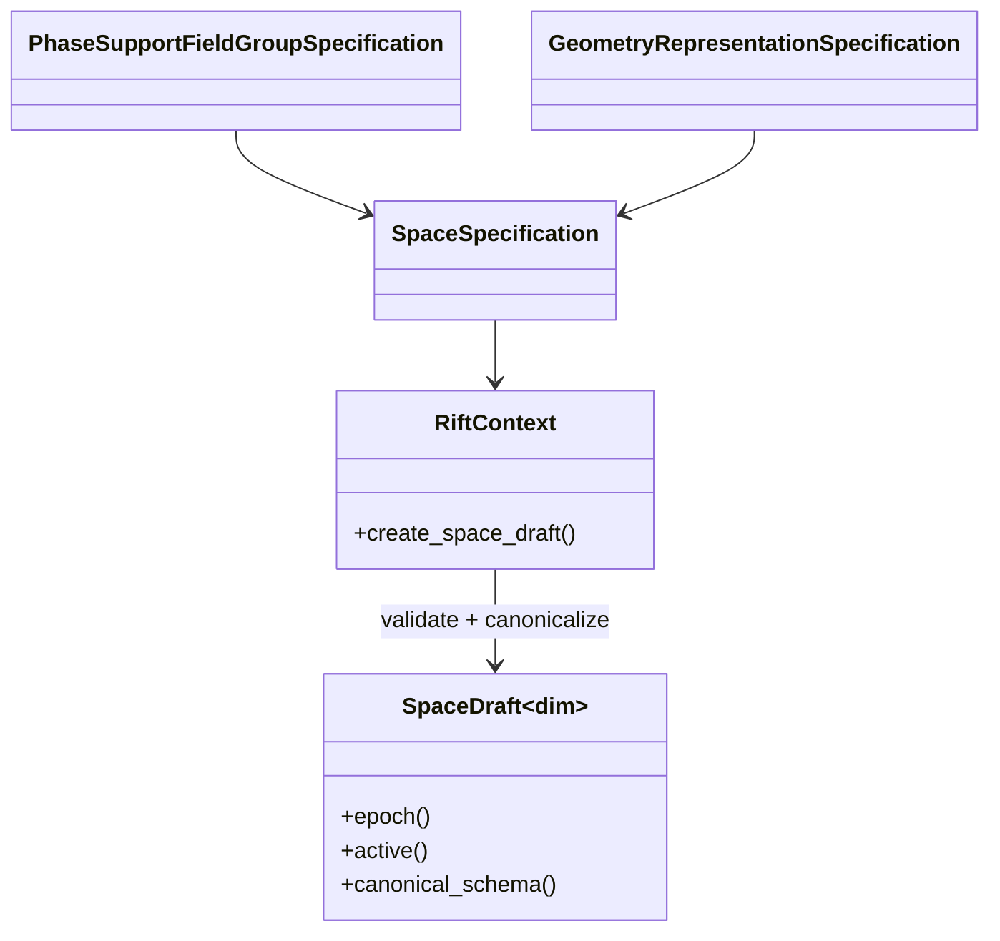

# Milestone 001 / Task 08: Define field schema and space draft

| Field | Value |
|---|---|
| Status | Complete |
| Owner | Codex |
| Estimated user effort | About one working day |
| Depends on | Tasks 05 and 07 |
| Allowed files/modules | `include/rift/space_draft.hpp`, `src/space_draft.cpp`, the factory/counter portion of `include/rift/rift_context.hpp`, the `PhaseSupportSetId` amendment in `include/rift/phase_support.hpp`, `src/phase_support.cpp`, focused support/schema/draft tests, and `tests/mpi/space_draft_agreement_test.cpp` |
| Public behavior | Canonical phase and representation-neutral geometry-state schema plus a validated single-use draft with provisional space identity |
| API/ABI | Pre-release new template API and typed build diagnostics |

## Goal

Define the primitive phase and geometry storage that should exist and validate
that request against the graph and closed supports before allocating DoFs. The
geometry schema can describe one or more continuous field groups and optional
distributed discrete metadata without selecting how occupancy is computed. A
`SpaceDraft` reserves the approved space identity and holds canonical
schema/support decisions without pretending to be a finalized layout.

## Context and interaction



## Approved API sketch

```cpp
using PhaseSupportFieldGroupId =
    StrongId<detail::PhaseSupportFieldGroupIdTag>;
using GeometryFieldGroupId = StrongId<detail::GeometryFieldGroupIdTag>;
using DiscreteGeometryMetadataId =
    StrongId<detail::DiscreteGeometryMetadataIdTag>;

struct PhaseSupportFieldGroupSpecification {
  PhaseId phase;
  std::string name;
  unsigned int component_count;
  unsigned int degree;
};

struct UnboundFieldComponents {
  unsigned int count;
};

struct PhaseBoundFieldComponents {
  std::vector<PhaseId> phases;
};

using GeometryFieldComponents =
    std::variant<UnboundFieldComponents, PhaseBoundFieldComponents>;

struct GeometryFieldGroupSpecification {
  std::string name;
  GeometryFieldComponents components;
  unsigned int degree;
};

enum class DiscreteGeometryMetadataKind : std::uint8_t {
  phase_label
};

struct DiscreteGeometryMetadataSpecification {
  std::string name;
  std::string geometry_field_group;
  unsigned int component;
  DiscreteGeometryMetadataKind kind;
};

struct GeometryRepresentationSpecification {
  std::vector<GeometryFieldGroupSpecification> continuous_fields;
  std::vector<DiscreteGeometryMetadataSpecification> discrete_metadata;
};

struct SpaceSpecification {
  std::vector<PhaseSupportFieldGroupSpecification> phase_support_fields;
  GeometryRepresentationSpecification geometry;
};

using PhaseSupportSetId = StrongId<detail::PhaseSupportSetIdTag, std::uint64_t>;
template<int dim> class SpaceDraft;
// RiftContext::create_space_draft(PhaseSupportSet<dim>, SpaceSpecification)
```

These input aggregates own their strings and vectors and are consumed by value
at the factory boundary. Component counts and `FE_Q` degrees must be positive.
A phase-bound field group contains every canonical phase exactly once and is
reordered by `PhaseId`. Phase-label metadata may reference only an unbound
geometry component; attaching it to a phase-bound potential is rejected.

Errors and space identity are approved before Work mode. The exact schema can
express both a phase-ranked set of potentials and a single continuous field
accompanied by phase metadata, but Task 08 need not implement either evolution
algorithm.

The first concrete geometry configuration is a phase-ranked set of scalar
potentials with every potential explicitly bound to one canonical phase. The
public schema remains representation-neutral and must also express the deferred
regional configuration consisting of one continuous field plus distributed
phase metadata. Task 08 describes and validates these primitive shapes; it does
not implement either representation's evolution or occupancy algorithm.

Geometry phase bindings belong to individual continuous-field components, not
to the field group as a whole. This permits all phase-ranked scalar potentials
to share one multicomponent field group and later one DoF space, while an
unbound scalar component can represent the continuous part of the deferred
regional configuration.

Continuous field groups use `dealii::FE_Q` in this milestone. The schema stores
only the polynomial degree and has no public basis-family selector or basis
template parameter. Additional finite-element families are deferred until a
concrete requirement includes their AMR and solution-transfer behavior.

Geometry field groups encode their component shape as an all-or-nothing
variant. `UnboundFieldComponents` stores a positive component count.
`PhaseBoundFieldComponents` stores phases that must resolve to every canonical
phase exactly once; their canonical `PhaseId` order defines component order.
This prevents partially bound field groups from entering the schema.

Polynomial degree remains runtime schema data. Later matrix-free operator code
may dispatch common degrees and component counts to compile-time-specialized
`FEEvaluation` kernels while retaining `FEEvaluation<dim, -1, 0, ...>` as its
runtime-degree path. All evaluators participating in one coupled cell loop must
use one shared deal.II `MatrixFree` object; this performance boundary does not
template `SpaceDraft` or change canonical schema identity.

Each discrete geometry-metadata specification identifies one continuous
geometry field group and one component within it. The metadata later uses that
scalar component's distributed DoF ownership and ghost layout rather than
creating a separate `DoFHandler`; Task 08 validates and resolves the symbolic
association before any DoFs exist.

Task 08 supports only `DiscreteGeometryMetadataKind::phase_label`. Its logical
value is an optional canonical `PhaseId`, including an explicit unassigned
state so later allocation does not silently initialize every entry to phase
zero. Generic integral, floating-point, flag, and application-defined discrete
metadata kinds are deferred; Task 11 will choose the compact distributed
encoding without changing this logical contract.

Phase-support field-group names are unique within one canonical phase and
ordered by `(PhaseId, name)`, so common names may repeat across phases.
Geometry field-group names and discrete metadata names are each unique within
their own categories and ordered by name. The categories use distinct strong
ID types, and equal text in different categories is permitted. The
`PhaseSupportFieldGroup` vocabulary refers to use of a `PhaseSupport`; it does
not denote a diffuse-interface phase-field method or assert physical occupancy.

`RiftContext::create_space_draft(...)` is the collective creation and
`SpaceEpoch` reservation boundary. The context owns the monotone epoch counter
but does not retain successful drafts. A successful move-only `SpaceDraft`
owns the supplied `PhaseSupportSet`; there is no separate `SpaceRegistry`
object or lifetime layer.

Every successfully created `PhaseSupportSet` receives a context-local 64-bit
`PhaseSupportSetId` in collective creation order. Failed support creation
consumes no ID, IDs are never reused during the execution, and the aggregate
exposes its ID. Draft creation rejects ranks that submit support sets from
different successful calls even when those sets refer to the same mesh
snapshot.

Draft creation uses an exact rank-zero-reference agreement schedule. Every
rank first sorts and validates its local input; rank zero broadcasts its
deterministic schema plus dimension, support-set identity, mesh identity, and
expected epoch. Each rank compares those values exactly, and one fixed-size
all-reduce establishes whether every rank is locally valid and agrees. Only a
failed call all-gathers complete typed diagnostics. No hash or all-rank schema
replication is used, and an epoch is reserved only after collective success.

Successful construction publishes immutable descriptors through `SpaceSchema`.
Support-field descriptors carry a category-local ID, canonical phase, name,
component count, and degree. Geometry-field descriptors carry their distinct
category-local ID, name, canonical component variant, and degree. Metadata
descriptors replace the symbolic field name with a `GeometryFieldGroupId` and
retain the selected component and logical kind. At most one metadata block may
target a given geometry-field component, preventing competing logical values
from claiming the same future distributed storage.

Recoverable failures use `SpaceDraftErrorCode` plus a typed subject variant that
retains the complete offending support-field, geometry-field, or metadata
specification. The implemented vocabulary covers inactive support input,
dimension/support/mesh/schema/epoch disagreement, invalid or duplicate names,
unknown phases, invalid component counts and degrees, incomplete or repeated
phase bindings, and invalid or repeated metadata targets. Errors are ordered by
rank, code, subject category, canonical subject position, phase, and component.
The normal success path performs no all-rank diagnostic exchange.

## Work contract

1. Add `PhaseSupportSetId` assignment, immutable lookup, and focused provenance
   tests to the completed support API.
2. Define phase-support field groups and a representation-neutral primitive
   geometry specification containing continuous field groups and optional
   distributed discrete metadata.
3. Make every phase binding explicit enough to express one potential per phase
   without assuming that geometry always has one scalar per phase.
4. Validate duplicates, zero components, invalid degrees, unknown phases,
   invalid phase bindings, metadata conflicts, and mismatched supports,
   collecting deterministic diagnostics.
5. Canonicalize field-group and metadata order and assign distinct semantic IDs.
6. Reserve a provisional non-reused `SpaceEpoch` only after the approved
   validation point.
7. Publish through `RiftContext::create_space_draft(...)` a single-use
   `SpaceDraft` containing schema/support decisions but no distributed DoF
   layout.
8. Test value validation, permutations, identity consumption, and draft traits;
   document and stop.

### Non-goals

- Creating finite elements, DoF handlers, constraints, regional layout, or
  vectors.
- Choosing or implementing ranking, reconstruction, transport, or physical
  occupancy algorithms.
- Materializing pairwise interface fields or dynamic cell candidate sets.
- Reusing a failed or finalized draft.

## Focused tests

| Behavior/property | Independent oracle | Important cases |
|---|---|---|
| Schema validation | Hand-authored expected diagnostic multiset | Duplicates, unknown phase, zero components, invalid degree/support |
| Geometry-state shape | Hand-authored primitive field/metadata tables | Phase-keyed multicomponent shape; scalar-plus-metadata shape |
| Canonical order | Sort expected phase-support `(phase, field-name)` tuples and category-local geometry/metadata names independently | Input permutations |
| Support-set identity | Small reference counter/model | Failure consumes no ID; distinct successful calls do not reuse; cross-rank draft mismatch |
| Identity reservation | Small reference counter/model | Failure consumes no epoch; successful drafts do not reuse |
| Draft lifetime | Compile-time and runtime active/single-use checks | Move, failed build, later finalization |
| Collective agreement | Independently compare each rank's schema and provenance with rank zero | Permuted equivalent schema; field, dimension, support-set, and mesh mismatch; defensive epoch mismatch is coverage-reviewed because public same-order calls cannot create divergent counters |

## Documentation

- Define field-schema meaning, primitive versus derived geometry data,
  canonical ordering, provisional epoch scope, and the difference between a
  draft and a published space.

## Completion evidence

- [x] Requested artifact or behavior exists
- [x] Focused tests pass
- [x] Relevant regression tests pass
- [x] Task-level coverage was measured when useful
- [x] Documentation requested for this task is complete
- [x] Commands and results are recorded below

## Evidence and handoff

- Commands/results: `cmake --build --preset debug --parallel 6` and the full
  sanitizer-enabled `ctest --preset debug --output-on-failure` passed all 32
  registrations. `cmake --preset release`, a six-job `release` preset build,
  and `ctest --preset release --output-on-failure` also passed all 32
  registrations. A full six-job `debug-tidy` build, including every library,
  serial-test, and MPI-test target, completed without a clang-tidy warning.
  `doxygen Doxyfile` completed under the strict warning policy after documenting
  the five pre-existing private diagnostic fields in `src/phase_graph.cpp`;
  the Sourcey build completed 75 pages successfully.
  `./scripts/run_coverage.sh gcc` and `./scripts/run_coverage.sh clang` each
  built successfully and passed all 32 registrations. GCC raw first-party
  coverage was 1691/1705 lines (99.2%), 265/265 functions (100%), and
  1363/2084 branches (65.4%); approved policy adjustment produced 1691/1691
  lines, 265/265 functions, and 1316/1316 branches (all 100%). Clang raw
  coverage was 1776/1787 lines (99.38%), 198/198 functions (100%), and
  569/572 branches (99.48%); its exact approved allowlist produced 1776/1776
  lines, 198/198 functions, and 569/569 branches (all 100%).
- Files changed: Added `include/rift/space_draft.hpp`,
  `src/space_draft.cpp`, focused serial `tests/space_draft_test.cpp`, and the
  explicit one-/two-/three-rank `tests/mpi/space_draft_agreement_test.cpp`.
  Registered the source, added the `RiftContext` factory/epoch counter, and
  retrospectively added support-set identity and activity to Task 07's API and
  tests.
- Coverage exclusion: The reviewer approved the exact defensive
  `space_epoch_mismatch` branch at `src/space_draft.cpp:687` and its body at
  lines 689--692 on 2026-09-04. Under the public same-order collective
  contract, every successful call advances every rank and every failed call
  advances none, so public inputs cannot make the private epoch counters
  diverge. The retained diagnostic can be reached only after an earlier
  collective-contract violation. The source carries the rationale and narrow
  gcovr markers, and the Clang policy gate uses the same exact locations.
- Risks/deferred work: The compact phase-label encoding, exact matrix-free
  kernel dispatch, and performance evidence remain deferred. Failed draft
  construction consumes no epoch; later layout failure policy belongs to Tasks
  09 and 10.
- Next stopping point: Begin Task 09 separately. No finite element, DoF,
  constraint, layout, or vector was created in Task 08.
