# Milestone 001 / Task 09: Build per-field-group finite-element spaces

| Field | Value |
|---|---|
| Status | Complete |
| Owner | Pair |
| Estimated user effort | About one working day |
| Depends on | Task 08 |
| Allowed files/modules | New `include/rift/field_group_space.hpp` and `src/field_group_space.cpp`, the field-space storage/query and factory portions of `include/rift/space_draft.hpp`, `src/space_draft.cpp`, and `include/rift/rift_context.hpp`, build registration, focused `tests/field_group_space_test.cpp`, and explicit MPI `tests/mpi/field_group_space_agreement_test.cpp` |
| Public behavior | Separate DoF space and constraints for every canonical field group |
| API/ABI | Preserve Task 08 schema; add immutable field-space views |

## Goal

Construct a separate deal.II `DoFHandler` and constraints for each continuous
phase-support or geometry field group, not for each component. Every group uses
an `FESystem` containing `component_count` copies of its configured `FE_Q`.
Consequently, one phase-bound geometry field group containing (N) phase
potentials owns one `DoFHandler` and one constraint set for all (N)
components. Phase-support field groups use the ordinary `FESystem` inside their
`PhaseSupport` and a component-compatible `FESystem` of scalar, non-dominating
`FE_Nothing` elements outside it through an `hp::FECollection`; primitive
continuous geometry field groups
use their plain `FESystem` directly across the background mesh and do not
pretend to be hp-adaptive spaces.

The phase-support `FE_Nothing` is non-dominating. At a face between an
ordinary cell and an inactive cell, deal.II therefore imposes no trace
constraint on the ordinary field; the field representation simply ends at the
support boundary. A dominating `FE_Nothing` would instead force the ordinary
trace to zero and thereby introduce an implicit homogeneous boundary
condition. Any physically required zero trace must be added explicitly by
later boundary or interface constraints.

## Context and interaction

```mermaid
flowchart LR
    CONTEXT["RiftContext"] -->|"build_field_spaces(draft)"| DRAFT["active SpaceDraft + closed supports"]
    DRAFT --> FEC["temporary per-group FE storage"]
    FEC --> ACTIVE["active FE index per cell"]
    ACTIVE --> DOF["DoFHandler::distribute_dofs"]
    DOF --> CONSTRAINTS["hanging-node constraints"]
    CONSTRAINTS --> COMMIT["collective success + atomic commit"]
    COMMIT --> FIELD["immutable field-group-space views in draft"]
```



## Approved API sketch

```cpp
template<int dim> class PhaseSupportFieldGroupSpace;
template<int dim> class GeometryFieldGroupSpace;

enum class DofNumbering : std::uint8_t {
  native,
  component_wise
};

struct FieldSpaceBuildOptions {
  DofNumbering numbering = DofNumbering::native;
};

// PhaseSupportFieldGroupSpace::ordinary_fe_index == 0;
// PhaseSupportFieldGroupSpace::outside_support_fe_index == 1;

// PhaseSupportFieldGroupSpace support provenance:
// PhaseId phase() const noexcept;
// PhaseSupportSetId phase_support_set_id() const noexcept;

// Both field-space types:
// const <category descriptor>& descriptor() const noexcept;
// SpaceEpoch epoch() const noexcept;
// DofNumbering numbering() const noexcept;
// const dealii::IndexSet& locally_owned_dofs() const noexcept;
// const dealii::IndexSet& locally_relevant_dofs() const noexcept;

enum class FieldSpaceBuildErrorCode : std::uint8_t {
  inactive_draft,
  field_spaces_already_built,
  collective_space_epoch_mismatch,
  collective_draft_state_mismatch,
  collective_dof_numbering_mismatch
};

struct FieldSpaceBuildError;
using FieldSpaceBuildErrors = std::vector<FieldSpaceBuildError>;
using FieldSpaceBuildResult = std::expected<void, FieldSpaceBuildErrors>;

// RiftContext::build_field_spaces(SpaceDraft<dim>&,
//                                 FieldSpaceBuildOptions = {})
//     -> FieldSpaceBuildResult

// SpaceDraft<dim> inspection after a successful build:
// bool field_spaces_built() const noexcept;
// std::span<const PhaseSupportFieldGroupSpace<dim>> phase_support_field_spaces() const noexcept;
// std::span<const GeometryFieldGroupSpace<dim>> geometry_field_spaces() const noexcept;
// const PhaseSupportFieldGroupSpace<dim>&
// phase_support_field_space(PhaseSupportFieldGroupId) const;
// const GeometryFieldGroupSpace<dim>&
// geometry_field_space(GeometryFieldGroupId) const;
```

The two public types preserve their distinct strong ID and metadata contracts:
`PhaseSupportFieldGroupSpace` identifies its canonical phase and support set, while
`GeometryFieldGroupSpace` identifies its unbound or phase-bound component
semantics. They may share private construction helpers, but neither public type
uses optional category state or a category-tag variant. Their views expose IDs,
names, components, degree, support provenance, DoF handler, constraints, and
approved space identity; they do not expose mutation.

Both field-space types are move-constructible, non-assignable sole owners with a
private, uniquely owned implementation allocation. The stable implementation
owns its finite-element storage, non-movable deal.II `DoFHandler`, and
constraints in a safe lifetime order. Move construction transfers the
allocation without relocating objects observed by deal.II; assignment is
disabled so an established field-space identity cannot be replaced. Public
accessors return borrowed const references; Task 10 transfers sole ownership
from the draft into the space snapshot.

`RiftContext::build_field_spaces(...)` is the explicit collective construction
boundary. It builds all field-group spaces in temporary storage and commits
them to an active draft only after collective success. Failure leaves the draft
unchanged and eligible for another attempt; success makes field-space building
single-use for that draft. Field spaces are not built eagerly by
`create_space_draft(...)`.

For a phase-support group, Rift sets active FE indices only on locally owned
cells. `DoFHandler::distribute_dofs(...)` performs deal.II's required
owner-to-ghost synchronization as part of distributed enumeration. Rift does
not duplicate that exchange merely to pre-validate deal.II; local
postconditions are checked after distribution, and explicit MPI tests compare
ghost indices with an independent owner-side oracle.

Before entering deal.II's distributed construction, Rift collectively checks
that every supplied draft is active, has not already built field spaces, and
has the same `SpaceEpoch` and build state. Recoverable preflight failures return
the same deterministic `FieldSpaceBuildErrors` on every rank through
`std::expected<void, ...>`. After preflight succeeds, deal.II exceptions
propagate unchanged: they are already informative, and attempting per-rank
translation while other ranks remain inside distributed enumeration could
obscure the cause or deadlock.

The preflight follows Task 08's fixed communication schedule: rank zero
broadcasts `{active, built, epoch, numbering}`, every rank compares it exactly,
and one fixed-size all-reduce establishes global validity and agreement. Only
a failed preflight all-gathers full typed diagnostics. The normal path uses
constant memory per rank, and Rift adds no final global reduction after all
deal.II construction calls return successfully.

`SpaceDraft` reports explicitly whether field spaces have been built. Before a
successful build, both canonical space spans are empty; afterward their order
matches the corresponding canonical schema descriptor order. Checked lookup by
the category's strong ID returns a borrowed const reference. Lookup before
construction throws `std::logic_error`, while an invalid ID after construction
throws `std::out_of_range`, matching the established checked numeric-lookup
style without suggesting that a valid canonical field may ordinarily be
absent.

The application selects either deal.II's native numbering or component-wise
numbering as a `build_field_spaces(...)` option. The default is native.
Component-wise renumbering, when selected, runs immediately after each
`distribute_dofs(...)` call and before locally relevant indices or constraints
are created. On a distributed triangulation, Rift then restores one contiguous
ownership interval per MPI rank while retaining component blocks within that
rank. This is required by deal.II's native distributed-vector partitioner;
deal.II's global component-wise numbering alone gives each rank a
non-contiguous union of component ranges. The resulting policy is therefore
rank-blocked and component-wise within each rank rather than globally
component-blocked. A single policy applies to all groups—where it is the
identity for scalar elements—is collectively agreed across ranks and retained
as space provenance.

The two field-space types live in the dedicated public
`rift/field_group_space.hpp` module, with deal.II-heavy definitions and explicit
2D/3D instantiations in `src/field_group_space.cpp`. `space_draft.hpp` retains
the Task 08 schema and draft API, forward-declares the field-space types, and
hides their owning containers behind private incomplete storage. This avoids
both a circular public include and an unrelated Task 08 schema refactor;
callers that inspect the concrete field-space objects include the dedicated
header.

A phase-support field space stores only its `PhaseSupportSetId` and `PhaseId`
link to support. It neither copies the potentially large cell vector nor keeps
a pointer into a movable sibling member. The owning draft resolves the support
as `draft.phase_supports().support(field_space.phase())`; Task 10 preserves the
same relationship after moving both aggregates into the snapshot.

Every phase-support `hp::FECollection` has one fixed, public ordering: index
zero is the ordinary `FESystem`, and index one is the non-dominating
`FE_Nothing`. `PhaseSupportFieldGroupSpace` exposes these as the named
`ordinary_fe_index` and `outside_support_fe_index` constants so callers and
tests never depend on magic numbers. Plain geometry spaces have no hp index
contract.

Each field-space implementation retains its locally relevant DoF `IndexSet`,
which is already required to initialize its hanging-node constraints, and
publishes it by borrowed const reference. It also publishes the locally owned
set by borrowing the `DoFHandler`'s authoritative set. Tasks 10 and 11 can
therefore construct layouts and owned or ghosted vectors without recomputing
distributed relevance.

Each field space also owns a small immutable copy of its canonical Task 08
descriptor and exposes it through `descriptor()`, together with its
`SpaceEpoch` and selected `DofNumbering`. This makes the space self-describing
after ownership moves into the Task 10 snapshot and avoids pointers into a
sibling `SpaceSchema`. Only descriptor metadata is duplicated; phase-support
cell vectors continue to use identifier-based linkage.

## Work contract

1. Build one `FESystem(FE_Q, component_count)` per field group using the Task
   08 polynomial degree.
2. For each phase-support group, create an `hp::FECollection` containing its
   ordinary `FESystem` and `FESystem(FE_Nothing(1, false), component_count)`;
   the matching system structure is required by deal.II's component-wise
   domination comparison. Select the
   ordinary element on supported cells and the component-compatible,
   non-dominating `FE_Nothing` outside support using the fixed public indices
   zero and one, respectively.
3. For each continuous geometry group, distribute DoFs directly with its plain
   `FESystem`; do not wrap it in a one-entry `hp::FECollection`.
4. Set phase-support active FE indices on locally owned cells only, then rely on
   `DoFHandler::distribute_dofs(...)` to synchronize ghost indices without a
   separate Rift exchange.
5. Return typed collective preflight errors for inactive, already-built, epoch-
   mismatched, state-mismatched, or numbering-mismatched calls; propagate
   deal.II exceptions unchanged after a rank-zero broadcast and one fixed-size
   agreement all-reduce, gathering complete diagnostics only on failure.
6. Apply the requested native or component-wise numbering after distribution
   and before computing locally relevant indices or constraints.
7. Compute and retain each locally relevant DoF set, verify local
   postconditions, and close hanging-node constraints independently per group;
   expose both locally owned and locally relevant sets as const views.
8. Commit all field-group spaces to the draft only after collective success;
   leave it unchanged on failure and reject rebuilding after success.
9. Publish canonical const spans and checked strong-ID lookup inside the draft,
   with explicit pre-build and invalid-ID behavior.
10. Keep each field-space implementation at a stable address while transferring
   its sole ownership from the draft to the later snapshot.
11. Link phase-support spaces to support by `PhaseSupportSetId` and `PhaseId`
    without copying cell storage or retaining a cross-member pointer.
12. Retain a small canonical descriptor copy, `SpaceEpoch`, and numbering
    provenance in each self-describing field space.
13. Test analytic DoF counts, active-FE tables, component counts, constraints,
    and multi-rank ghost agreement; document and stop.

### Non-goals

- Regional scalar entries, optional discrete geometry metadata, complete
  offsets/layout, vector allocation, or state.
- Additional finite-element families, full `hp` degree variation, DG, geometry
  occupancy, or field coupling.
- Sharing one DoFHandler across semantically distinct field groups.

## Focused tests

| Behavior/property | Independent oracle | Important cases |
|---|---|---|
| Active FE selection | Explicit cell-to-index table from known support | Inside, outside, hanging-face closure, full geometry-field background |
| DoF cardinality | Analytic counts on small meshes | Scalar and multicomponent groups; absent support |
| Constraints | Independent hanging-node expectations | Adaptive mesh interface |
| Ghost consistency | Gather active-FE indices and compare owner/ghost copies | Partition boundary |
| FE_Nothing compatibility | Inspect dominance/component properties | Ordinary versus outside-support elements |

## Documentation

- Document why each continuous group—not each component—owns a distinct
  `DoFHandler`, how `FESystem` collects its components, how support selects
  active elements, why `FE_Nothing` is non-dominating and component-compatible,
  and why discrete geometry metadata is not a DoF space.

## Completion evidence

- [x] Requested artifact or behavior exists
- [x] Focused tests pass
- [x] Relevant regression tests pass
- [x] Task-level coverage was measured when useful
- [x] Documentation requested for this task is complete
- [x] Commands and results are recorded below

## Evidence and handoff

- Commands/results:
  - `cmake --preset debug`: configured successfully with deal.II 9.8.0.
  - `cmake --build --preset debug --parallel 6`: built the API skeleton and all
    existing test executables successfully.
  - `ctest --preset debug --output-on-failure`: all 32 existing unit and MPI
    tests passed.
  - `cmake --preset debug-tidy` and
    `cmake --build --preset debug-tidy --parallel 6`: configured and built all
    targets with no clang-tidy warnings after correcting direct includes and
    private provenance initialization policy.
  - `ctest --preset debug-tidy --output-on-failure`: all 32 existing unit and
    MPI tests passed under the tidy build.
  - After the local construction-kernel slice,
    `cmake --build --preset debug-tidy --parallel 6` completed without
    clang-tidy warnings and
    `ctest --preset debug-tidy --output-on-failure` again passed all 32
    existing unit and MPI tests.
  - After the collective factory slice,
    `cmake --build --preset debug-tidy --parallel 6` completed without
    clang-tidy warnings and
    `ctest --preset debug-tidy --output-on-failure` again passed all 32
    existing unit and MPI tests.
  - `./format.sh`: completed successfully after the final implementation and
    test changes.
  - Final `cmake --build --preset debug --parallel 6` and
    `ctest --preset debug --output-on-failure`: built successfully and all 36
    unit and MPI tests passed.
  - Final `cmake --build --preset debug-tidy --parallel 6` completed with no
    clang-tidy warnings; `ctest --preset debug-tidy --output-on-failure`
    passed all 36 tests.
  - `./scripts/run_coverage.sh gcc`: all 36 tests passed; raw coverage was
    99.3% lines (2081/2095), 100.0% functions (350/350), and 64.8% branches
    (1612/2486). After the repository's approved unreachable/non-code/throw
    policy, coverage was 100.0% lines (2081/2081), functions (350/350), and
    branches (1565/1565).
  - `./scripts/run_coverage.sh clang`: all 36 tests passed; raw coverage was
    99.47% lines (2076/2087), 100.0% functions (248/248), and 99.52% branches
    (625/628). After the existing approved exclusions, coverage was 100.0%
    lines (2076/2076), functions (248/248), and branches (625/625). Task 09
    required no new coverage exclusions.
  - `cmake -E make_directory build/doxygen`, `doxygen Doxyfile`,
    `npm ci --prefix docs`, and `npm run --prefix docs build`: Doxygen
    completed without undocumented-public/private warnings and Sourcey built
    all 83 documentation pages successfully.
- Files changed in the first Pair implementation slice:
  - Added `include/rift/field_group_space.hpp` with the approved numbering,
    typed-error, move-constructible non-assignable field-space, provenance,
    deal.II-view, and result declarations.
  - Added `src/field_group_space.cpp` with stable private implementation
    layouts, const accessors, move construction, and 2D/3D instantiations.
  - Extended `SpaceDraft` with incomplete owning storage, pre-build empty
    spans, checked lookup declarations/behavior, and move-safe ownership.
  - Declared `RiftContext::build_field_spaces(...)` and registered the new
    implementation unit in CMake.
- Files changed in the second Pair implementation slice:
  - Implemented the private post-preflight constructors for support-restricted
    and background-mesh geometry field spaces.
  - Support spaces now create the fixed ordinary `FESystem` and
    non-dominating `FE_Nothing`, choose active FE indices on locally owned
    cells from the two sorted support partitions, and call deal.II's hp DoF
    distribution.
  - Both categories now apply the requested numbering, retain locally relevant
    DoFs, and close hanging-node-only constraints.
  - Corrected `SpaceDraft` move-assignment destruction order so existing DoF
    handlers are released before their observed mesh snapshot is replaced.
- Files changed in the third Pair implementation slice:
  - Defined `RiftContext::build_field_spaces(...)` for 2D and 3D and made the
    approved public construction path operational.
  - Added the fixed success-path preflight schedule: rank-zero broadcast of
    `{active, built, epoch, numbering}` followed by one fixed-size agreement
    reduction, with a failure-only `all_gather` for deterministic typed
    diagnostics.
  - Constructed every canonical support and geometry field space under one
    temporary owner and committed it to the draft only after all construction
    completed. No Rift collective follows successful deal.II construction.
- Files changed in the final Codex-owned verification slice:
  - Added focused unit tests for analytic DoF counts, component layouts,
    support-restricted active FE indices, empty supports, adaptive constraints,
    native and component-wise numbering, typed errors, provenance, stable
    ownership, and the 2D/3D public contract.
  - Added explicit 1-, 2-, and 3-rank tests for owner/ghost active-FE
    agreement, 2D/3D construction, collective state, epoch, and numbering
    diagnostics, and rebuild rejection.
  - Made the public field-space owners move-constructible but non-assignable,
    preserving stable immutable identity while retaining ownership transfer at
    construction boundaries.
  - Kept the mesh-snapshot triangulation accessor out of line to avoid a GCC
    inline-template coverage artifact, and represented collective draft state
    as a tuple comparison to avoid compiler-specific short-circuit coverage.
  - Updated the Clang coverage script's exact line locations for previously
    approved Task 04, Task 06, and Task 08 unreachable paths; no exclusion
    scope changed.
- Risks/deferred work: only `FE_Q` is supported in this milestone. Additional
  finite-element families, full hp degree variation, solution transfer, and
  vector/state allocation remain explicitly deferred to later tasks or
  milestones.
- Ownership and stopping point: Task 09 was completed collaboratively under
  Pair ownership, with the final test/coverage/tidy slice executed by Codex.
  Stop here; Task 10 has not been started.
