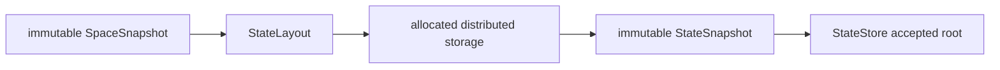

# Milestone 001 / Task 11: Allocate immutable state

| Field | Value |
|---|---|
| Status | Implementation complete; coverage exclusions awaiting reviewer approval |
| Owner | Codex |
| Estimated user effort | About one working day |
| Depends on | Task 10 |
| Allowed files/modules | `state_snapshot.hpp/.cpp`, `state_store.hpp/.cpp`, private shared state storage, narrow `SpaceSnapshot`/`RiftContext` extensions, and focused local/MPI state tests |
| Public behavior | Allocate state from one finalized layout and expose immutable accepted snapshots |
| API/ABI | Pre-release new state-layout, snapshot, and store API |

## Goal

Allocate continuous field, optional discrete geometry-metadata, and regional-
scalar storage from a finalized `SpaceSnapshot`, publish it only through
immutable snapshot views, and reject storage or snapshots associated with a
different space.

## Context and interaction



## Approved API sketch

```cpp
struct StateSnapshotStamp;
template<int dim> class StateSnapshot;
template<int dim> class StateStore;

// Collective construction through the process-wide runtime boundary.
// RiftContext::create_state_store(std::shared_ptr<const SpaceSnapshot<dim>>)
//     -> StateStoreResult<dim>;
```

The exact construction result and lookup types are recorded below.

## Accepted decisions

| Decision | Choice | Rationale | Date/user note |
|---|---|---|---|
| State-store ownership | `RiftContext::create_state_store(...)` collectively returns an expected-style result containing `std::unique_ptr<StateStore<dim>>`; the context allocates but does not retain the dimension-dependent mutable store | Gives the store one unmistakable mutable publication owner without making `RiftContext` own simulation state | 2026-09-04; explicit user approval of Option A |
| Snapshot and transaction lifetime | The store retains its finalized space and immutable snapshots through shared const handles; later transactions retain their base snapshot directly and hold only a weak reference to a private store control block | Preserves immutable data lifetimes while making sealing or publication fail safely after destruction of the uniquely owned store | 2026-09-04; explicit user approval of Option A |
| State identity scope | Allocate a context-local 64-bit `StateStoreId`, then allocate 64-bit `StateSnapshotId` and `GeometryRevision` sequences within that store; the composite `(StateStoreId, StateSnapshotId)` identifies one snapshot | Keeps high-frequency state-transition counters with their natural authority without involving `RiftContext` in every seal | 2026-09-04; explicit user approval of composite lineage Option A |
| Immutable snapshot stamp | Store `{SpaceEpoch, StateStoreId, StateSnapshotId, optional base StateSnapshotId, GeometryRevision}`; the initial root uses snapshot/revision zero and no base | Captures interpretation, authority, identity, lineage, and geometry invalidation without duplicating mesh or graph provenance reachable through the retained space | 2026-09-04; explicit user approval |
| Publication status | Keep accepted, previous, transient, and pinned status in `StateStore`, not in the immutable snapshot stamp | Allows a sealed candidate to become accepted without replacing or mutating its immutable snapshot | 2026-09-04; explicit user approval |
| Continuous-field storage | Allocate one `dealii::LinearAlgebra::distributed::Vector<double>` per independently numbered field group using that space's locally owned and locally relevant DoF sets; retain synchronized ghost entries in every immutable snapshot | Matches deal.II's typical `locally_relevant_solution` representation and makes snapshots directly usable in cell-local evaluation without duplicating authoritative owned storage | 2026-09-04; explicit user approval of Option A |
| Continuous-field authority | Treat locally owned entries as authoritative; ghost entries are synchronized before immutable publication and never vote independently in validation or revision decisions | Preserves one owner per DoF while providing complete local read access | 2026-09-04; explicit user approval |
| Space-bound state references | Introduce category-specific reference values containing `{SpaceEpoch, typed category ID}` and require them for continuous-field, discrete-metadata, and regional state access; `SpaceSnapshot` creates references through checked methods while existing `find_*()` discovery continues to return IDs | Detects an ID originating from another finalized space without replacing efficient category-local IDs or introducing context-wide field counters | 2026-09-04; explicit user approval of Option A |
| Local state-access failures | Throw `std::invalid_argument` for a reference from another space and `std::out_of_range` for an invalid category ID within the correct space | Continues the established distinction between local checked misuse and recoverable collective configuration failures | 2026-09-04; explicit user approval |
| Discrete phase-label storage | Provide an owning `PhaseLabelMetadata` with compact, separate locally owned and ghost arrays over only the referenced scalar-component DoFs; retain component-filtered native-DoF `IndexSet`s and use `dealii::Utilities::MPI::NoncontiguousPartitioner` for ghost exchange | Preserves the geometry field's native numbering and stores one label per locally relevant target-component DoF without padding other components or inventing a second global numbering | 2026-09-04; explicit user approval of Option A |
| Phase-label encoding | Hide a 32-bit code behind optional-`PhaseId` accessors, reserve one code for `unassigned`, and return a typed allocation error if a metadata-bearing graph needs the reserved phase value | Provides an unambiguous compact representation while keeping encoding details out of public scientific state access | 2026-09-04; explicit user approval |
| Phase-label access | Resolve labels by native geometry-field DoF index through const snapshot views; later transaction views permit writes only to locally owned target-component indices | Fits cell-local deal.II iteration while preserving owner-only mutation and immutable ghosted reads | 2026-09-04; explicit user approval |
| Initial root values | Publish continuous fields and regional scalars as exact `+0.0` and phase-label metadata as `unassigned`; perform no model-specific physical initialization in store creation | Gives the store a deterministic safe storage state while leaving physical initialization to a later transaction | 2026-09-04; explicit user approval of Option A |
| Zero-initialization implementation | Rely on deal.II's owned/ghost vector construction contract and value initialization of regional `double` storage; do not redundantly assign zero, never request omitted zeroing for the root, and explicitly fill only the nonzero phase-label sentinel | Avoids an unnecessary memory pass while preserving the public deterministic initialization contract | 2026-09-04; explicit user refinement and approval |
| Store-creation error boundary | Return typed errors only for `null_space`, `foreign_space`, `collective_space_mismatch`, `phase_label_encoding_overflow`, and `state_store_id_exhausted`; add a private nonowning creator-context stamp to `SpaceSnapshot` without exposing public context identity | Limits recoverable collective diagnostics to caller-actionable defects while preserving exact space provenance | 2026-09-04; explicit user approval of narrow Option A |
| Internal and dependency failures | Treat missing canonical blocks or incompatible internally derived partitioning as invariant failures, and allow deal.II, MPI, and allocation failures after preflight to follow their existing exception/fatal contracts | Callers cannot supply the internally allocated storage, so public recovery codes would misrepresent implementation defects as configuration inputs | 2026-09-04; explicit user approval |
| Regional snapshot storage | Store every canonical regional scalar once in one replicated, canonically ordered `std::vector<double>` on every rank; `RegionalEntry::owner_rank` denotes update authority rather than exclusive physical storage | Gives owner-independent noncollective reads without duplicating an owner backend and replica cache | 2026-09-04; explicit user approval of Option A |
| Regional snapshot access | Return one regional scalar locally by value from `StateSnapshot::regional(RegionalEntryReference)`; an empty regional schema produces an empty array | Preserves exact immutable bits and keeps regional state unrelated to distributed FE vector indexing | 2026-09-04; explicit user approval |
| Public state modules | Put space-bound reference values in `space_snapshot.hpp`, immutable identities/stamps/storage views in `state_snapshot.hpp`, mutable authority and construction results in `state_store.hpp`, and later transaction lifecycle in `state_transaction.hpp`; add no monolithic `state.hpp` or `discrete_state.hpp` | Follows Rift's one-coherent-concept module pattern and avoids variant-bearing generic state bundles | 2026-09-04; explicit user approval of modular Option A |
| Immutable snapshot access | Expose `stamp()`, `space()`, category-specific const continuous-vector and metadata accessors, and local `regional()` by value; require the approved space-bound reference type for each category and expose no raw storage bundle | Keeps semantic categories compile-time distinct while supporting direct deal.II field reads | 2026-09-04; explicit user approval |
| Initial store access | Expose `id()`, `space()`, and shared immutable `accepted()`, `previous()`, and `transient()` handles; accepted is nonnull after construction and the other two are empty until later lifecycle tasks populate them | Establishes stable observation signatures before Task 13 adds retention transitions | 2026-09-04; explicit user approval |

## Work contract

1. Allocate every state block from the canonical `StateLayout`, including
   distributed continuous-field vectors, optional discrete geometry metadata
   using its referenced scalar component's ownership and ghost layout, and
   regional scalar values.
2. Represent phase-label metadata with an exact compact encoding of its
   logical optional `PhaseId`, preserving a distinct unassigned state.
3. Bind the snapshot stamp to the publishing space and initial state identity.
4. Expose const-only continuous-field, geometry-metadata, and regional-scalar
   views from a snapshot.
5. Initialize a store with one accepted root and no previous or transient
   snapshots.
6. Collectively reject null, foreign, or rank-inconsistent spaces and
   unrepresentable state/store identities before allocation. Treat missing
   canonical blocks or incompatible internally derived partitioning as
   invariant failures rather than recoverable caller input.
7. Test exact sizes, offsets, initial values, lookup failure, type-level
   immutability, and initial-store state; add Doxygen and stop.

### Non-goals

- Mutable transactions, sealing, publication transitions, or rollback.
- Retention, pinning, regional-scalar synchronization, or geometry revision
  changes.
- Geometry reconstruction, physical occupancy, or derived cell-classification
  caches.
- Physical initialization, checkpoint input, or interpolation between spaces.

## Focused tests

| Behavior/property | Independent oracle | Important cases |
|---|---|---|
| Storage cardinality | Hand-computed layout sizes and locally owned ranges | Empty regional block, multiple fields/components |
| Canonical lookup | Expected field/phase/region-to-block table | Present, missing, wrong-space identity |
| Immutability | Compile-time const/reference traits plus unchanged values | Continuous fields, geometry metadata, and regional-scalar views |
| Initial store state | Small reference state tuple | Accepted present; previous/transient absent |
| Store preflight | Independently selected null, foreign, or different finalized spaces | Local defect, one-rank mismatch, ID/encoding exhaustion seam |

## Documentation

- Define storage ownership, initialization, snapshot immutability, stamp scope,
  vector partitioning, and the initial accepted-root state.

## Completion evidence

- [x] Requested artifact or behavior exists
- [x] Focused tests pass
- [x] Relevant regression tests pass
- [x] Task-level coverage was measured when useful
- [x] Documentation requested for this task is complete
- [x] Commands and results are recorded below

## Evidence and handoff

- Commands/results:
  - `cmake --build --preset debug --parallel 6` and
    `ctest --preset debug --output-on-failure`: passed, 64/64 tests.
  - `cmake --build --preset release --parallel 6` and
    `ctest --preset release --output-on-failure`: passed, 64/64 tests.
  - `./scripts/run_coverage.sh clang`: all 428 functions covered; the complete
    run passed 62/62 tests and exposed only the previously approved exact
    allowlist plus the resource/provenance guards proposed below.
  - `./scripts/run_coverage.sh gcc`: all 620 functions covered; the complete
    run passed 62/62 tests. Raw coverage was 99.1% lines (4105/4143) and 63.9%
    branches (3184/4982); existing policy filters/exclusions produced 99.5%
    lines (4105/4124) and 97.4% branches (3093/3175) before review of the new
    exact exclusions.
  - `cmake --build --preset debug-tidy --parallel 6`: passed with no Rift
    clang-tidy warnings.
- Files changed: `include/rift/state_snapshot.hpp`,
  `include/rift/state_store.hpp`, `src/state_internal.hpp`,
  `src/state_snapshot.cpp`, `src/state_store.cpp`, the narrow finalized-space
  reference/context APIs, and consolidated local/MPI state tests.
- Coverage review required: the following retained typed guards are not
  constructible through the public API and are proposed as exact exclusions:
  `src/state_store.cpp:527-543` covers a space from another simultaneously live
  `RiftContext`, more than `UINT32_MAX` materialized canonical phases, and
  exhaustion after `UINT64_MAX` successful store allocations. GCC also emits
  cleanup edges at direct private-constructor ownership transfers; those edges
  have no additional application behavior. No exclusion has been applied
  without reviewer approval.
- Risks/deferred work: state remains in-memory and tied to one finalized space;
  checkpoint input and transfer between spaces remain later work.
- Next stopping point: Reviewer approval or rejection of the exact coverage
  exclusions is the only remaining Task 11 gate.
