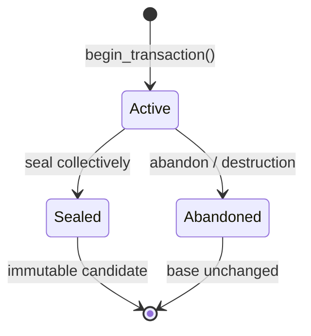

# Milestone 001 / Task 12: Implement state transactions

| Field | Value |
|---|---|
| Status | Implementation complete; coverage exclusions awaiting reviewer approval |
| Owner | Codex |
| Estimated user effort | About one working day |
| Depends on | Task 11 |
| Allowed files/modules | State-transaction/store header and implementation, private shared state storage, and consolidated local/MPI state tests |
| Public behavior | Isolated move-only mutation that can be sealed or abandoned without changing its base |
| API/ABI | Pre-release new transaction lifecycle and mutable-access API |

## Goal

Create a move-only transaction from an immutable base snapshot, give that
transaction exclusive ownership of candidate storage, and seal or abandon it
without ever mutating the base.

## Context and interaction



## Approved API sketch

```cpp
template<int dim> class StateTransaction;

// StateStore<dim>::begin_transaction() -> StateTransactionResult<dim>
// transaction.seal() -> StateSealResult<dim>
```

The ownership wrappers, mutable access, and failure types are approved for
implementation.

## Accepted decisions

| Decision | Choice | Rationale | Date/user note |
|---|---|---|---|
| Candidate continuous storage | Clone one ghost-capable deal.II distributed vector per field group; allow mutation only of locally owned entries and synchronize ghosts before publishing the sealed immutable candidate | Preserves base isolation and produces the approved `locally_relevant_solution` form without separate owned and ghost-cache vectors | 2026-09-04; explicit user approval during Task 11 design |
| Candidate phase-label storage | Clone the compact `PhaseLabelMetadata` owner/ghost arrays; expose a mutable native-DoF-indexed view only for locally owned target-component entries and synchronize ghost labels before sealing | Preserves exact base isolation and the approved compact metadata layout | 2026-09-04; explicit user approval during Task 11 design |
| Transaction creation | Use collective `StateStore::begin_transaction()` with no base argument; capture and clone the store's current accepted snapshot | Makes the only permitted base structural and removes redundant stale/foreign base inputs | 2026-09-04; explicit user approval of Option A |
| Transaction identity and siblings | Assign each successful begin a store-local 64-bit `StateTransactionId` and permit multiple isolated active transactions from the same accepted root | Lets collective operations distinguish trials and supports the stale-sibling publication case without shared mutable candidate storage | 2026-09-04; explicit user approval |
| Move semantics | Permit move construction, delete move assignment, and make the source inactive after a move | Transfers sole mutable authority without allowing assignment to silently discard an active candidate | 2026-09-04; explicit user approval of Option A |
| Abandonment | Provide local idempotent `void abandon() noexcept`; destruction performs equivalent local cleanup and no destructor or move operation communicates | Makes rollback safe during unwinding and avoids deadlock-prone MPI activity in destructors | 2026-09-04; explicit user approval |
| Inactive local access | Expose `active()` and throw `std::logic_error` from mutable access on abandoned or moved-from transactions | Continues the approved local programming-error convention | 2026-09-04; explicit user approval |
| Seal result | Use collective `StateTransaction::seal() -> std::expected<std::shared_ptr<const StateSnapshot<dim>>, StateErrors>`; success makes the transaction inactive and returns an immutable unpublished candidate | Matches immutable snapshot ownership and keeps sealing distinct from acceptance | 2026-09-04; explicit user approval of Option A |
| Recoverable seal failure | Return coherent typed errors on every rank while leaving the transaction active, editable, and retryable; reserve no snapshot identity on failure | Preserves expensive candidate edits and follows the established retryable draft-finalization pattern | 2026-09-04; explicit user approval |
| Inactive collective seal | When all ranks participate, return `inactive_transaction` rather than throwing; local access remains exception-based | Allows collective state agreement before rejection and prevents one rank from unwinding ahead of peers | 2026-09-04; explicit user approval |
| Mutable continuous access | Expose category-specific mutable `dealii::LinearAlgebra::distributed::Vector<double> &` accessors while active; locally owned entries are authoritative, callers may refresh ghosts during an algorithm, and sealing replaces ghost contents from their owners | Raw deal.II vectors are required for practical solver and matrix-free interoperability, while the ownership rule preserves one authoritative value per DoF | 2026-09-04; explicit user approval of Option A |
| Mutable phase-label access | Expose a `MutablePhaseLabelMetadataView` that accepts native DoF indices and permits writes only to locally owned target-component entries | Enforces the compact metadata representation's ownership boundary without exposing its encoded arrays | 2026-09-04; explicit user approval |
| Regional mutation boundary | Expose no raw mutable regional value or array in Task 12; Task 14 adds the owner-aware `set_regional(...)` operation | Regional values require authority checks and collective replication that a plain mutable reference cannot preserve | 2026-09-04; explicit user approval |

## Work contract

1. Collectively begin from the store's current accepted immutable snapshot and
   clone candidate-owned storage; accept no caller-selected base.
2. Make transactions non-copyable and move-only, with one active owner.
3. While active, expose category-specific mutable deal.II vectors for
   continuous fields and an owned-only compact phase-label view. Document
   locally owned continuous entries as authoritative, and defer mutable
   regional access to Task 14.
4. Seal collectively into an immutable candidate only after every rank reports
   local success and compatible storage.
5. Abandon safely on explicit request or destruction. Recoverable validation
   or injected rank-local sealing failure leaves the transaction active for a
   corrected retry; the base remains byte-for-byte unchanged.
6. Test ownership traits, isolation, moves, sealing, abandonment, inactive
   access, and collective failure; add Doxygen and stop.

### Non-goals

- Publishing the sealed candidate as accepted or managing retained snapshots.
- Regional-scalar owner/replica synchronization or exact geometry-revision
  logic.
- Mutation of derived pairwise geometry fields, cell candidate sets, or
  bulk/interface/junction classifications.
- Concurrent writers, nested transactions, or in-place mutation optimization.

## Focused tests

| Behavior/property | Independent oracle | Important cases |
|---|---|---|
| Move-only ownership | Compile-time traits and one-owner lifecycle model | Move construction; deleted move assignment; moved-from access |
| Base isolation | Saved bit patterns for every base block | Successful edits, abandonment, failed seal |
| Lifecycle validity | Reference finite-state machine | Active, sealed, abandoned, destruction |
| Collective seal | Per-rank success vector gathered independently | All succeed; one rank fails; incompatible layout |
| Immutable candidate | Const traits and expected edited values | Continuous-field and geometry-metadata edits; unchanged cloned regional values |

## Documentation

- Define transaction ownership, lifecycle, collective participation, failure
  behavior, isolation, and the distinction between sealing and publication.

## Completion evidence

- [x] Requested artifact or behavior exists
- [x] Focused tests pass
- [x] Relevant regression tests pass
- [x] Task-level coverage was measured when useful
- [x] Documentation requested for this task is complete
- [x] Commands and results are recorded below

## Evidence and handoff

- Commands/results: The Debug, Release, and clang-tidy suites each passed
  64/64 tests; the GCC and Clang coverage suites each passed 62/62 tests; all
  functions were covered under both compilers; and the full clang-tidy build
  passed. The state suites exercise 2D and 3D move construction, isolation, abandonment,
  successful and retryable sealing, preservation of identity counters after a
  failed seal, inactive/expired access, ghost refresh, and rank-divergent
  transaction descriptors.
- Files changed: `include/rift/state_transaction.hpp`,
  `src/state_transaction.cpp`, `src/state_internal.hpp`,
  `tests/state_store_test.cpp`, and `tests/mpi/state_agreement_test.cpp`.
- Coverage review required: the retained 64-bit counter terminal transition
  (`src/state_transaction.cpp:110-112`), transaction/snapshot identity
  exhaustion, and the begin-transaction descriptor-mismatch return
  (`src/state_transaction.cpp:421-442`) cannot be reached through public inputs
  without performing an infeasible number of successful collective operations
  or first violating the same-order collective contract. Exact Clang
  exclusions and GCC compiler-cleanup edges are proposed but not yet applied.
- Risks/deferred work: collective transaction operations remain externally
  serialized; concurrent writers and arbitrary-base transactions require a
  later design.
- Next stopping point: Reviewer approval or rejection of the exact coverage
  exclusions is the only remaining Task 12 gate.
