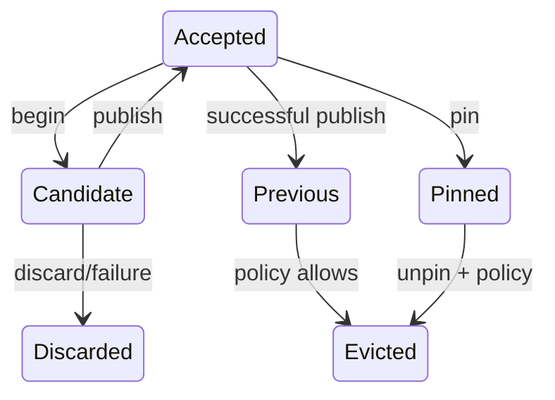

# Milestone 001 / Task 13: Enforce retention and lineage

| Field | Value |
|---|---|
| Status | Complete |
| Owner | Codex |
| Estimated user effort | About one working day |
| Depends on | Task 12 |
| Allowed files/modules | State-store/retention header and implementation, focused serial and MPI `tests/state_store_test.cpp` files |
| Public behavior | Collective candidate publication, accepted-root lineage, previous-state access, and bounded retention |
| API/ABI | Pre-release new publication, pinning, discard, and lookup API |

## Goal

Publish sealed candidates through an explicit state machine, reject stale
siblings after the accepted root advances, and retain only the accepted,
previous, one transient, and approved bounded pinned snapshots.

## Context and interaction



## Approved API sketch

```cpp
struct RetentionPolicy;
struct StateSnapshotReference;

// store.publish(reference) -> expected<shared_ptr<const StateSnapshot<dim>>, StateErrors>
// store.pin(reference) -> expected<void, StateErrors>
// store.unpin(reference) -> expected<void, StateErrors>
// store.discard(reference) -> expected<void, StateErrors>
// store.lookup(reference) -> expected<shared_ptr<const StateSnapshot<dim>>, StateError>
```

The publication state machine and retention API are approved for implementation.

## Accepted decisions

| Decision | Choice | Rationale | Date/user note |
|---|---|---|---|
| Candidate roots | Every transaction begins implicitly from the store's then-current accepted snapshot; multiple transactions may share that accepted root as isolated siblings | Makes stale-sibling publication meaningful without supporting arbitrary-base mutation or hidden rollback | 2026-09-04; explicit user approval during Task 12 design |
| Transaction identity | Use a store-local 64-bit `StateTransactionId` to distinguish collective operations on sibling trials | Prevents ranks from accidentally sealing different transactions derived from the same root as one mixed operation | 2026-09-04; explicit user approval during Task 12 design |
| Sealed candidate handle | Preserve Task 12's `std::shared_ptr<const StateSnapshot<dim>>` result; Task 13 may index a successful candidate as transient or pinned without changing the immutable handle or seal signature | Keeps sealing, retention, and publication separate while allowing candidate data to outlive a store index | 2026-09-04; explicit user approval during Task 12 design |
| Default retention bound | Use `RetentionPolicy{.max_pinned_snapshots = 0}` by default and allow applications to opt into a positive bounded pin capacity when creating the store | Makes archival memory an explicit application choice while preserving the ordinary seal-then-publish path | 2026-09-04; explicit user approval |
| Deterministic retention replacement | A new seal replaces the indexed unpinned transient; unpinning a snapshot with no accepted or previous role moves it into the transient slot and replaces its former occupant; publishing replaces `previous` with the old `accepted`; pinned snapshots are never automatically evicted | Gives the store a deterministic bound and never silently discards an explicitly protected identity | 2026-09-04; explicit user approval |
| External snapshot lifetime | Removing an identity from the store index does not invalidate a `std::shared_ptr<const StateSnapshot<dim>>` already held by a caller, but the unindexed snapshot is no longer eligible for store operations | Separates immutable object lifetime from bounded store authority and lookup retention | 2026-09-04; explicit user approval |
| Pin lifecycle | Use explicit collective `pin(...)` and `unpin(...)` expected-style operations and no RAII pin object or destructor communication | Collective retention state cannot be released safely from a C++ destructor, while explicit transitions keep rank participation auditable | 2026-09-04; explicit user approval |
| Pin role | Treat pinning as orthogonal to accepted, previous, and transient roles: any indexed snapshot may be pinned, pinning consumes capacity and is idempotent, and unpinning retains a snapshot that still has an accepted or previous role | Supports bounded preservation of selected published history as well as sealed trials without duplicating snapshot storage | 2026-09-04; explicit user approval |
| Snapshot operation identity | Add `StateSnapshotReference{StateStoreId, StateSnapshotId}` and expose `StateSnapshot::reference()`; use the reference for publish, pin, unpin, discard, and lookup | Detects cross-store references and distinguishes immutable object lifetime from continued eligibility for store operations | 2026-09-04; explicit user approval |
| Retention operation results | Make publish, pin, unpin, and discard collective expected-style operations with `StateErrors`; publish returns the now-accepted shared snapshot, while the other transitions return `void`; make lookup local and return either a shared snapshot or one typed `StateError` | Matches the collective versus local error conventions and gives publication and lookup stable immutable ownership | 2026-09-04; explicit user approval |

## Work contract

1. Track accepted, previous, at most one transient candidate, and a bounded set
   of explicitly pinned snapshots.
2. Permit publication only for a sealed candidate whose base is the current
   accepted root on every rank.
3. Move the old accepted snapshot to previous atomically and invalidate stale
   sibling candidates without mutating their immutable data.
4. Implement explicit discard, collective pin/unpin, deterministic eviction, and
   lookup failure for evicted identities.
5. Keep all ranks in the same store state when publication validation fails.
6. Test the transition graph against an independent reference model, including
   bounds and rank-local failure; add Doxygen and stop.

### Non-goals

- Regional-scalar owner/replica synchronization or geometry-revision
  allocation.
- Persistence to disk, restart recovery, branching histories, or unbounded
  archival state.
- A memory-pressure heuristic that changes retention nondeterministically.

## Focused tests

| Behavior/property | Independent oracle | Important cases |
|---|---|---|
| Publication transitions | Small reference state machine | First publish, repeated publish, discard |
| Accepted-root lineage | Explicit root/candidate graph | Sibling before/after root advance; foreign store |
| Previous semantics | Expected accepted/previous pair after each publish | Zero, one, and several publications |
| Pin/eviction bound | Hand-run deterministic role/set model | At bound, idempotent pin, pinned accepted/previous, unpin with and without another role, missing ID |
| Collective atomicity | Gathered per-rank transition/result tuple | One-rank validation failure |

## Documentation

- Define the state machine, accepted-root rule, retention cardinality, pin
  lifetime, eviction ordering, collective behavior, and lookup failures.

## Completion evidence

- [x] Requested artifact or behavior exists
- [x] Focused tests pass
- [x] Relevant regression tests pass
- [x] Task-level coverage was measured when useful
- [x] Documentation requested for this task is complete
- [x] Commands and results are recorded below

## Evidence and handoff

- Commands/results: The Debug, Release, and clang-tidy suites each passed
  64/64 tests; the GCC and Clang coverage suites each passed 62/62 tests; all
  functions were covered under both compilers; and the full clang-tidy build passed. A
  hand-authored transition oracle covers publication, stale siblings, previous
  replacement, transient replacement, pin capacity/idempotence, unpinning,
  discard, eviction, foreign references, external shared-handle lifetime, and
  unchanged accepted/retained roles after rank-divergent publication fails.
- Files changed: `include/rift/state_snapshot.hpp`,
  `include/rift/state_store.hpp`, `src/state_store.cpp`,
  `src/state_transaction.cpp`, `tests/state_store_test.cpp`, and
  `tests/mpi/state_agreement_test.cpp`.
- Risks/deferred work: Store transitions remain externally serialized; support
  for concurrent writers, branching histories, persistence, or pressure-based
  eviction requires a later design.
- Next stopping point: Task complete; no retention work remains in this
  milestone.
