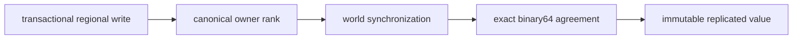

# Milestone 001 / Task 14: Synchronize regional values

| Field | Value |
|---|---|
| Status | Complete |
| Owner | Codex |
| Estimated user effort | About one working day |
| Depends on | Tasks 12 and 13 |
| Allowed files/modules | Regional-state/store header and implementation, focused serial and MPI `tests/regional_state_test.cpp` files |
| Public behavior | Transactional regional scalar writes with one owner and bitwise-identical replicas |
| API/ABI | Pre-release regional lookup, ownership, write, and read API |

## Goal

Represent each regional scalar with a canonical owner, stage changes inside a
state transaction, and seal or publish only values whose replicas agree exactly
across `MPI_COMM_WORLD`. A regional scalar is a nonspatial unknown associated
with a connected-region constraint; it is unrelated to the phase-label
metadata of a regional level-set geometry representation.

## Context and interaction



## Approved API sketch

```cpp
using RegionalEntryId = /* strong value type */;

// transaction.set_regional(reference, double) -> expected<void, StateError>
// snapshot.regional(reference) -> double
```

The regional write and exact-value policies are approved for implementation.

## Accepted decisions

| Decision | Choice | Rationale | Date/user note |
|---|---|---|---|
| Immutable regional storage | Store one complete canonically ordered `std::vector<double>` in every snapshot on every rank; do not create a separate owner-only backend | Makes every snapshot read local and prevents two physical copies on the owner rank from diverging | 2026-09-04; explicit user approval of replicated-array Option A |
| Regional ownership meaning | Interpret `RegionalEntry::owner_rank` as authority to supply the next transactional value, not exclusive permission to retain the immutable value | Separates update responsibility from the replicated read representation needed during distributed cell assembly | 2026-09-04; explicit user approval |
| Regional read API | Use local noncollective `StateSnapshot::regional(RegionalEntryReference) -> double` with the approved space-bound reference checks | Gives identical owner-independent access without exposing storage or requiring communication during reads | 2026-09-04; explicit user approval |
| Synchronization granularity | Exchange all changed regional owner values in one batched sealing operation and copy exact binary64 bits into the complete array on every rank | Obeys the milestone MPI-latency policy and avoids floating-point reductions or one collective per entry | 2026-09-04; explicit user approval |
| Mutable regional boundary | Add an authority-aware transaction `set_regional(...)` operation in this task; expose no raw mutable regional scalar reference or backing array | Allows owner and space-reference validation before the collective bit-preserving exchange | 2026-09-04; explicit user approval during Task 12 design |
| Write authority and communication | Permit only the canonical owner rank to call local noncommunicating `set_regional(...)`; return `not_regional_owner` on another rank, and defer all communication to the batched collective seal | Preserves the approved owner-authority model without introducing a collective per update | 2026-09-04; explicit user approval |
| Repeated and absent writes | Make repeated owner writes last-write-wins, while an entry not written in the transaction retains its cloned base value | Supports iterative algorithms and avoids treating ordinary replacement as a duplicate schema defect | 2026-09-04; explicit user approval |
| Binary64 value policy | Accept and reproduce every binary64 object representation exactly, including signed zero, infinities, and distinct NaN sign/payload bits; perform no physical-admissibility validation or canonicalization | Regional state transport must not silently change values, while model validity belongs to a later physics layer | 2026-09-04; explicit user approval |

## Work contract

1. Derive one deterministic owner rank for every canonical regional entry from
   the finalized layout.
2. Permit regional writes only through an active transaction on the canonical
   owner rank; reject missing, foreign, or unauthorized references and let a
   repeated owner write replace its earlier staged value.
3. Synchronize the owner value collectively without changing the base snapshot
   before successful seal/publication.
4. Require every resulting replica to have the same binary64 representation;
   preserve signed zero, infinities, and every NaN sign/payload representation.
5. Fail collectively and preserve the base if any rank reports incompatible
   schema, ownership, or value state.
6. Test ownership, permutations, exact bits, failures, and transaction
   isolation; add Doxygen and stop.

### Non-goals

- Solving regional constraints or deciding whether a value is physically valid.
- Tolerance-based equality, floating-point reductions, units conversion, or
  geometry-revision changes.
- Direct mutation of accepted or previous snapshots.

## Focused tests

| Behavior/property | Independent oracle | Important cases |
|---|---|---|
| Owner assignment | Independent canonical-entry-to-rank mapping | Fewer/equal/more entries than ranks |
| Exact replication | `std::bit_cast<std::uint64_t>` comparison | Finite values, `+0.0/-0.0`, infinities |
| NaN policy | Constructed payload bit patterns | Same and different sign/payload representations preserved exactly |
| Transaction isolation | Saved base and candidate bit tables | Success, abandon, rank-local failure |
| Schema/lookup failure | Expected typed result | Missing, foreign, duplicate, wrong owner |

## Documentation

- Define canonical ownership, exact-replica semantics, NaN behavior,
  transaction interaction, collective participation, failure guarantees, and
  the distinction from regional geometry-representation metadata.

## Completion evidence

- [x] Requested artifact or behavior exists
- [x] Focused tests pass
- [x] Relevant regression tests pass
- [x] Task-level coverage was measured when useful
- [x] Documentation requested for this task is complete
- [x] Commands and results are recorded below

## Evidence and handoff

- Commands/results: The Debug, Release, and clang-tidy suites each passed
  64/64 tests; the GCC and Clang coverage suites each passed 62/62 tests; all
  functions were covered under both compilers; and the full clang-tidy build passed. MPI tests
  independently compare the `uint64_t` representations of owner-published
  signed zero, infinities, and distinct signed NaN payloads on every rank;
  local tests cover finite values and ownership errors, while MPI tests also
  prove last-write-wins staging and independently check the round-robin owner
  formula with fewer, equal, and more regional entries than ranks.
- Files changed: `include/rift/state_transaction.hpp`,
  `src/state_transaction.cpp`, `tests/state_store_test.cpp`, and
  `tests/mpi/state_agreement_test.cpp`.
- Risks/deferred work: The implementation deliberately transports binary64
  bits rather than applying an MPI floating-point reduction. Physical
  admissibility and units remain model-layer responsibilities.
- Next stopping point: Task complete; no regional-value work remains in this
  milestone.
