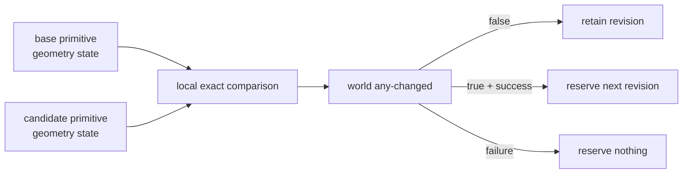

# Milestone 001 / Task 15: Track geometry revisions

| Field | Value |
|---|---|
| Status | Implementation complete; coverage exclusion awaiting reviewer approval |
| Owner | Codex |
| Estimated user effort | About one working day |
| Depends on | Tasks 12 and 13 |
| Allowed files/modules | State-stamp/revision header and implementation, focused serial and MPI `tests/geometry_revision_test.cpp` files |
| Public behavior | Reserve a new geometry revision exactly when distributed owned primitive geometry state changes |
| API/ABI | Pre-release revision value and snapshot-stamp API |

## Goal

Compare transaction and base primitive geometry state exactly over locally
owned entries, agree on the result across the world communicator, and reserve a
never-reused revision only for a successful changed candidate. Continuous
binary64 fields are compared bit-for-bit; optional phase-label metadata is
compared exactly, including its unassigned state.

## Context and interaction



## Approved API sketch

```cpp
struct GeometryRevision;
struct StateSnapshotStamp;

// stamp contains space identity, state identity, base identity, and revision
```

The revision voting, reservation, and exhaustion behavior are approved for
implementation.

## Accepted decisions

| Decision | Choice | Rationale | Date/user note |
|---|---|---|---|
| Identity scope | Use a store-local 64-bit `GeometryRevision` sequence whose meaning is paired with the context-local `StateStoreId` carried by every snapshot stamp | Keeps revision allocation inside the store that owns sealing while preserving unambiguous composite provenance | 2026-09-04; explicit user approval of composite lineage Option A |
| Snapshot stamp | Use `{SpaceEpoch, StateStoreId, StateSnapshotId, optional base StateSnapshotId, GeometryRevision}`; root snapshot/revision values are zero and the root has no base | Records immutable state lineage and geometry invalidation without duplicating mesh/graph identities reachable through the space | 2026-09-04; explicit user approval |
| Publication status | Do not add mutable accepted/private status or a publication epoch to the snapshot stamp; the store owns those roles | A sealed immutable candidate can be published without changing its identity or replacing its stamp | 2026-09-04; explicit user approval |
| Distributed comparison domain | Compare only authoritative locally owned primitive-geometry entries; synchronized ghost entries in the approved `locally_relevant_solution` vectors never cast separate change votes | Prevents duplicated ghost copies from changing the global revision decision | 2026-09-04; explicit user approval during Task 11 design |
| Discrete comparison storage | Compare the hidden 32-bit codes of only locally owned entries in each compact `PhaseLabelMetadata` block; ghost codes do not vote | Gives exact assigned/unassigned and phase-label identity without decoding ambiguity or duplicated votes | 2026-09-04; explicit user approval during Task 11 design |
| Revision voting boundary | Compare the candidate with its transaction base; all locally owned continuous geometry-field components and compact phase-label metadata entries vote, while phase-support fields and regional scalars do not | Advances geometry identity only when primitive geometry representation state changes | 2026-09-04; explicit user approval |
| Collective schedule | Fold each rank's local `geometry_changed` flag into the existing fixed-size seal agreement instead of adding a standalone collective | Preserves the approved batched MPI-latency policy | 2026-09-04; explicit user approval |
| Reservation and reuse | An unchanged candidate inherits its base revision; after every seal check succeeds, a changed candidate reserves one new revision that is never reused even if the candidate is later discarded or stale | Makes every successfully created changed geometry state uniquely identifiable without coupling identity to later publication | 2026-09-04; explicit user approval |
| Exhaustion atomicity | A changed seal at revision exhaustion fails collectively and advances neither `GeometryRevision` nor `StateSnapshotId`; an unchanged candidate may still seal with its inherited revision | Prevents partial identity reservation and permits nongeometry state evolution after the finite geometry sequence is exhausted | 2026-09-04; explicit user approval |

## Work contract

1. Compare only canonical locally owned primitive geometry entries: continuous
   binary64 fields by exact bit representation and optional discrete metadata
   by exact value; ghost values do not independently vote.
2. Include the local change flag in the fixed-size collective seal agreement
   so every rank chooses the same revision outcome without another collective.
3. Retain the base revision for unchanged candidates and reserve one new,
   never-reused revision only after all sealing checks succeed.
4. Record the revision in the immutable candidate and published snapshot stamp.
5. Preserve deterministic failure behavior for mismatched partitioning,
   exhausted identity space, or rank-local sealing failure.
6. Test exact bits, distributed changes, failed candidates, and stamp lineage;
   add Doxygen and stop.

### Non-goals

- Tolerance, norm, convergence, finiteness, signed-distance, or physical
  equivalence checks.
- Selecting a geometry representation, or implementing reinitialization,
  advection, reconstruction, or geometry caches.
- Independently revising derived pairwise functions, cell candidate sets, or
  bulk/interface/junction classifications.
- Hash-only comparison without an exact collision-free confirmation.

## Focused tests

| Behavior/property | Independent oracle | Important cases |
|---|---|---|
| Local exact change | `std::bit_cast<std::uint64_t>` arrays plus direct discrete-value comparison | Equal, one value, `+0.0/-0.0`, infinities, metadata-only change |
| NaN identity | Explicit payload patterns under approved policy | Stable payload, changed payload |
| Distributed agreement | Independently gathered local change booleans | No rank changes; one/non-root/all ranks change |
| Reservation timing | Reference monotone counter model | Abandon, failed seal, unchanged, changed |
| Stamp lineage | Expected base/state/space/revision tuple | Several successful publications; stale sibling |

## Documentation

- Define the primitive-versus-derived geometry boundary, exact comparison
  domain, ghost treatment, binary64 and discrete-metadata semantics, collective
  agreement, reservation timing, exhaustion, and stamp lineage.

## Completion evidence

- [x] Requested artifact or behavior exists
- [x] Focused tests pass
- [x] Relevant regression tests pass
- [x] Task-level coverage was measured when useful
- [x] Documentation requested for this task is complete
- [x] Commands and results are recorded below

## Evidence and handoff

- Commands/results: The Debug, Release, and clang-tidy suites each passed
  64/64 tests; the GCC and Clang coverage suites each passed 62/62 tests; all
  functions were covered under both compilers; and the full clang-tidy build passed. The local
  and MPI state suites cover unchanged candidates, one-rank changes, signed
  zero, infinities, stable and changed NaN payloads, metadata-only changes,
  abandoned/failed candidates, nonconsumption after failed sealing, and stamp
  lineage in 2D and 3D.
- Files changed: `include/rift/state_snapshot.hpp`,
  `src/state_transaction.cpp`, `tests/state_store_test.cpp`, and
  `tests/mpi/state_agreement_test.cpp`.
- Coverage review required: the changed-candidate revision-exhaustion block at
  `src/state_transaction.cpp:335-338` requires more than `UINT64_MAX`
  successfully sealed, geometrically changed candidates and is proposed as an
  exact exclusion. The diagnostic and atomic failure behavior remain in the
  implementation; no exclusion has been applied without reviewer approval.
- Risks/deferred work: NaN payload behavior can vary if arithmetic occurs
  before comparison; revision identity covers stored bits, not expressions or
  numerical equivalence.
- Next stopping point: Reviewer approval or rejection of the exact exhaustion
  exclusion is the only remaining Task 15 gate.
