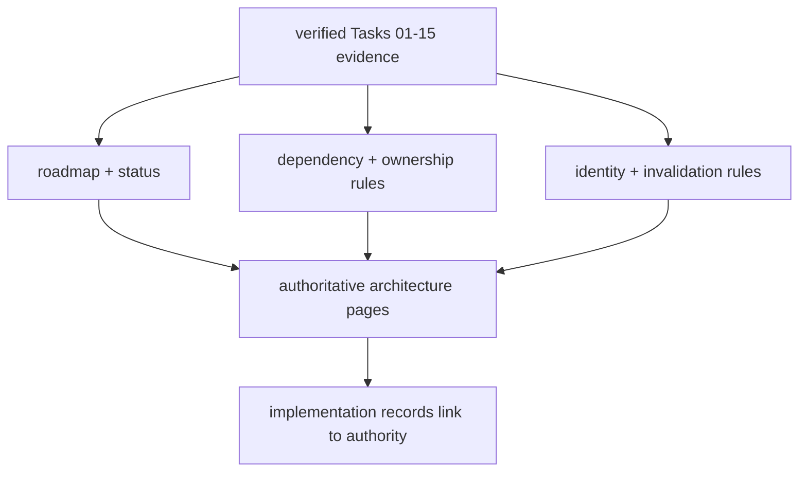

# Milestone 001 / Task 16: Reconcile foundation governance

| Field | Value |
|---|---|
| Status | Complete; ready for user architecture review |
| Owner | Codex |
| Estimated user effort | About one working day |
| Depends on | Tasks 05, 10, 13, 14, and 15 |
| Allowed files/modules | `docs/architecture/implementation/01-foundations/`, the implementation guide, and user-authorized authoritative architecture pages only |
| Public behavior | Documentation-only reconciliation of implemented foundation authority, dependencies, ownership, identity, and scope |
| API/ABI | No production API or ABI change |

## Goal

Reconcile the foundation roadmap and governance records with verified milestone
evidence, eliminate stale claims about historical behavior, and establish one
clear source of authority for phase-graph, representation-neutral geometry
state, and discrete-state contracts. Produce the explicit junction decision
gate that must be addressed when Milestone 002 is planned.

## Context and interaction

## Documentation contract

1. Inventory every remaining foundation claim and classify it as implemented,
   planned, superseded, or intentionally deferred using Tasks 01-15 evidence.
2. Consolidate roadmap/status, shared dependency/ownership, and
   identity/invalidation/scope rules without duplicating normative contracts.
3. Replace the removed run-scoped identity proposal with the approved
   world-only `RiftContext` lifetime model and later object identities only where
   stale-reference safety requires them.
4. Treat the exact `02cf4ec^` pages restored at the user's request as the
   historical source, then approve which reconciled pages hold current
   authority.
5. Update implementation records to link to the chosen authority and to report
   actual verification rather than inherited “Implemented foundation” labels.
6. Reconcile historical `level-set`-specific foundation language with the
   approved primitive geometry-field/metadata and `GeometryRevision` boundary,
   without claiming that an occupancy algorithm has been selected.
7. Add a Milestone 002 planning handoff that requires an explicit decision on
   junction representation, static configuration/identity, classification,
   state, and physics. The recorded outcome may be another explicit deferral.
8. Check links, terminology, dependency direction, ownership tables, and task
   evidence; return for user architecture review and stop.

## Accepted decisions

| Decision | Choice | Rationale | Date/user note |
|---|---|---|---|
| Authority hierarchy | Keep numbered architecture pages `00`-`24` as normative design authority; use `00-index.md`, `01-phase-graph.md`, `02-discrete-state.md`, and `24-decision-status.md` as the primary foundation reconciliation targets; keep `25-implementation-guide.md` as navigation/process guidance | Preserves the repository's established architecture hierarchy without creating a competing contract in implementation plans | 2026-09-04; explicit user approval |
| Evidence and implementation records | Treat completed records under `docs/development/foundations/` as the evidence and approved-decision source for correcting historical claims; keep `docs/architecture/implementation/01-foundations/` as linked roadmap material rather than duplicated normative rules | Makes reconciliation follow what was actually approved and verified in this re-foundation milestone | 2026-09-04; explicit user direction |
| Preservation constraint | Delete no documentation files during reconciliation; update, relabel, and cross-link existing material so all retained files are mutually consistent | Preserves historical and planning context while removing contradictory current claims | 2026-09-04; explicit user direction |
| Junction handoff | Keep junction support deferred and require Milestone 002 planning to explicitly reconsider implementation or record another deferral | Prevents the triple-junction extension from disappearing from future planning without expanding Milestone 001 | 2026-09-04; explicit user approval |

### Non-goals

- Production code, tests, API changes, or new architecture outside foundations.
- Deleting historical, architecture, implementation-plan, or development-task
  files.
- Selecting a multiphase geometry algorithm or designing junction behavior as
  part of Milestone 001.
- Claiming geometry, physics, solver, performance, or model-validation evidence.
- Recovering historical documents verbatim merely because they existed in an
  earlier commit.

## Focused review checks

| Behavior/property | Independent oracle | Important cases |
|---|---|---|
| Status accuracy | Tasks 01-15 completion/evidence sections | Implemented, deferred, superseded claims |
| Authority uniqueness | One-link inventory of each normative contract | Phase graph, mesh/space, state, identity |
| Dependency direction | DAG reconstructed from ownership tables | No physics-to-foundation or state-to-mesh inversion |
| Identity/invalidation | Object/event/consumer matrix | Graph, mesh, space, state, revision |
| Geometry terminology | Primitive/derived-state inventory | No hidden single-level-set assumption; regional scalars distinguished from regional level-set metadata |
| Milestone 002 junction gate | Explicit handoff checklist | Implement now, scope later, or defer again—all recorded rather than omitted |
| Link integrity | Repository-local link checker plus manual anchors | Moved, absent, and renamed pages |

## Documentation

- This task is documentation. Record the chosen authority, supersession map,
  exact evidence links, remaining readiness gaps, and the user's review outcome.

## Completion evidence

- [x] Requested artifact or behavior exists
- [x] Focused review checks pass
- [x] Relevant documentation build passes
- [x] No unsupported implemented or validation claims remain
- [x] Documentation requested for this task is complete
- [x] Commands and results are recorded below

## Evidence and handoff

- Commands/results:
  - `doxygen Doxyfile`: passed with no reported warnings.
  - `npm run --prefix docs build`: passed; Sourcey built 135 pages.
  - A first-party Markdown audit resolved and checked 654 repository-local
    links; none were missing.
  - Targeted terminology/status searches confirmed that pages `00`–`02` and
    `24` describe implemented foundation behavior, pages `03`–`23` remain
    planned, and retained historical foundation plans carry explicit
    reconciliation/supersession notes and evidence links.
- Files changed: reconciled `docs/architecture/00-index.md`,
  `01-phase-graph.md`, `02-discrete-state.md`, `24-decision-status.md`,
  `25-implementation-guide.md`, the implementation index and retained
  foundation planning records, plus the complete development milestone record.
  No documentation file was deleted.
- Risks/deferred work: The planned architecture still uses level-set-specific
  language where those future pages intentionally describe that candidate
  method. It is not an implemented representation choice. Junctions remain
  deliberately unimplemented, and Milestone 002 planning may not omit the
  explicit implement-or-defer decision.
- Next stopping point: Task complete and ready for the user's architecture
  review.
