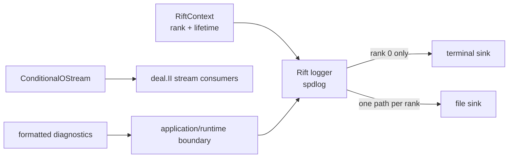

# Milestone 001 / Task 17: Configure rank-aware logging

| Field | Value |
|---|---|
| Status | Implementation complete; GCC branch exclusions awaiting reviewer approval |
| Owner | Codex |
| Estimated user effort | About one working day |
| Depends on | Tasks 01, 04, and 16 |
| Allowed files/modules | `include/rift/logging.hpp`, `include/rift/rift_context.hpp`, `src/logging.cpp`, `CMakeLists.txt`, `scripts/install_dependencies.sh`, `tests/CMakeLists.txt`, focused local/MPI logging tests, and logging guidance |
| Public behavior | Configurable rank-aware terminal and per-rank file logging |
| API/ABI | Pre-release new logging configuration API; spdlog remains an implementation dependency unless explicitly exposed |

## Goal

Give one process-wide `RiftContext` a synchronous Rift logger that can write to
the rank-zero terminal, optional per-rank files, or both without making
scientific value-producing functions print as a side effect.

## Context and interaction



## Approved direction

- Use spdlog as the logging backend.
- Let the process-wide `RiftContext` own the rank-aware logger.
- Default terminal output to rank zero and permit terminal output to be
  disabled.
- Permit optional files with a distinct deterministic filename for every rank;
  do not have ordinary spdlog file sinks share one file across MPI processes.
- Begin with synchronous logging.
- Retain `dealii::ConditionalOStream` for deal.II APIs that specifically use
  stream-style conditional output; it is not the spdlog sink abstraction.
- Keep Tasks 04 and 05 side-effect free: they return and format diagnostics,
  while the application/runtime boundary chooses whether to log them.

The relevant upstream interfaces are deal.II's
[`ConditionalOStream`](https://dealii.org/current/doxygen/deal.II/classConditionalOStream.html)
and spdlog's configurable
[`logger` and sinks](https://github.com/gabime/spdlog).

## API sketch

```cpp
enum class LogLevel;

class Logger {
public:
    void log(LogLevel level, std::string_view message);
    // std::format-based trace/debug/info/warning/error/critical conveniences
    void flush();
};

struct LoggingOptions {
    bool terminal_enabled = true;
    LogLevel terminal_level = LogLevel::info;
    std::optional<std::filesystem::path> file_base_path;
    LogLevel file_level = LogLevel::debug;
    LogFileMode file_mode = LogFileMode::append;
};

class RiftContext {
public:
    RiftContext(int &argc,
               char **&argv,
               unsigned int max_threads = 1,
               LoggingOptions logging = {});

    Logger &logger() noexcept;
    const Logger &logger() const noexcept;
    const dealii::ConditionalOStream &pcout() const noexcept;
};
```

The public logging and deal.II stream-integration APIs are approved for
implementation.

## Accepted decisions

| Decision | Choice | Rationale | Date/user note |
|---|---|---|---|
| Public logging surface | Expose a noncopyable `rift::Logger` owned by `RiftContext`, with `log(LogLevel, std::string_view)`, `std::format`-based level conveniences, `flush()`, and context accessors; keep spdlog types and headers private | Gives applications an ergonomic explicit logger without making spdlog part of Rift's public API or global logger state | 2026-09-04; explicit user approval |
| Explicit side-effect boundary | Do not register or replace spdlog's global/default logger; scientific functions continue returning structured diagnostics that callers may submit to the context logger | Allows Rift to embed cleanly and preserves deterministic value-producing APIs | 2026-09-04; explicit user approval |
| Levels and sink defaults | Define Rift levels `trace`, `debug`, `info`, `warning`, `error`, `critical`, and `off`; enable the rank-zero terminal at `info`, disable files unless configured, use `debug` for configured files, and permit independent sink thresholds | Gives conventional severity control while keeping default output concise and file logging opt-in | 2026-09-04; user approved recommendation |
| File destination and mode | Accept an optional `std::filesystem::path file_base_path` plus `LogFileMode::{append, truncate}`, defaulting to non-destructive append | Keeps file configuration native to C++ and makes destructive truncation explicit | 2026-09-04; user approved recommendation |
| Deterministic rank filenames | Insert `.rank-<rank>` before the base extension, padding rank to the decimal width implied by world size; for example `rift.log` becomes `rift.rank-00003.log` in a 10,000-rank run | Produces distinct, naturally sorted files without multiple MPI processes sharing an ordinary sink | 2026-09-04; user approved recommendation |
| Directory creation | When file logging is configured, world rank zero calls `std::filesystem::create_directories` for the parent path, then distributes its outcome through the required collective logging-configuration agreement before any rank opens its sink; add no separate barrier | Makes file logging convenient while combining synchronization with necessary startup validation rather than adding an isolated barrier | 2026-09-04; explicit user refinement |
| Initialization failure | Validate options, agree rank-zero directory creation, open rank-local sinks, and gather sink failures before completing construction; either every rank succeeds or every rank throws the same `LoggingInitializationError` containing ordered typed issues | Prevents partially configured logging and rank-divergent constructor outcomes without silently disabling a requested destination | 2026-09-04; explicit user approval |
| Failure boundary | Capture recoverable filesystem and spdlog failures as logging issues; retain existing fatal/dependency behavior for MPI failure and unrecoverable allocation failure | Keeps configuration defects diagnosable without claiming recovery from failures that may prevent coherent collective progress | 2026-09-04; explicit user approval |
| deal.II stream bridge | Expose `const dealii::ConditionalOStream &RiftContext::pcout() const noexcept`, wrapping `std::cout` and active only when terminal output is enabled on world rank zero; do not route it to files or apply spdlog levels | Follows deal.II's conventional parallel stream interface without confusing it with the severity-aware logger or permitting callers to change its condition | 2026-09-04; explicit user approval |

## Work contract

1. Pin and install an approved spdlog release through Rift's existing
   dependency path and link it without leaking unnecessary headers publicly.
2. Define logging options for terminal enablement, terminal/file levels, an
   optional file destination, and append/truncate mode; collectively agree the
   options and rank-zero directory-creation result.
3. Construct the logger after MPI initialization and destroy/flush it before
   `RiftContext` finalizes MPI.
4. Configure a terminal sink only on the selected rank and one deterministic
   file sink per participating rank when file output is enabled.
5. Provide the const `pcout()` `ConditionalOStream` bridge needed by deal.II
   components; disabling terminal output disables both this bridge and the
   spdlog terminal sink, while file logging remains independent.
6. Keep phase-graph, mesh, space, and state operations free of automatic error
   printing; callers explicitly submit formatted messages to the logger.
7. Test sink selection, levels, rank metadata, deterministic filenames,
   shutdown flushing, collective configuration/directory/sink failures, and
   identical ordered exception issues; document and stop.

### Non-goals

- MPI collection or reordering of log records.
- Multiple ranks writing to one ordinary file.
- Asynchronous logging, network sinks, telemetry, or distributed tracing.
- Replacing structured errors or diagnostic JSON with log messages.
- Forcing host applications to use Rift's logger as their global spdlog logger.

## Focused tests

| Behavior/property | Independent oracle | Important cases |
|---|---|---|
| Terminal rank policy | Captured sink output by rank | Rank zero emits; other ranks do not; disabled terminal |
| File routing | Temporary-directory file inventory and exact contents | Rank-zero nested-directory creation; one, two, and three ranks; deterministic rank suffixes |
| Sink combinations | Expected terminal/file message matrix | Terminal only, files only, both |
| Levels | Hand-authored accepted-level table | Different terminal and file thresholds |
| Lifetime and flush | Read files after `RiftContext` destruction | Normal return and explicit flush |
| Failure behavior | Invalid/unwritable destination and mismatched-option oracle | No MPI deadlock; identical ordered `LoggingInitializationError` issues on every rank |

## Documentation

- Document defaults, ownership, rank routing, filename rules, log levels,
  flushing, failure behavior, and the boundary between diagnostics and logs.
- Record the pinned spdlog version and exact local/MPI test commands.

## Completion evidence

- [x] Requested artifact or behavior exists
- [x] Focused tests pass
- [x] Relevant regression tests pass
- [x] Task-level coverage was measured when useful
- [x] Documentation requested for this task is complete
- [x] Commands and results are recorded below

## Evidence and handoff

- Commands/results:
  - spdlog 1.17.0 was installed through the pinned local dependency path for
    both configured compiler stacks.
  - The Debug, Release, and clang-tidy suites each passed 64/64 tests,
    including the narrative tutorial at one and two ranks. The GCC and Clang
    coverage suites each passed 62/62 tests with tutorials intentionally
    outside the library coverage build. All logging functions and all Clang
    source branches were covered.
  - The full clang-tidy build passed with no Rift warnings.
  - Local and MPI tests cover terminal/file/both routing, independent levels,
    append/truncate behavior, naturally sorted rank paths, rank-zero directory
    creation, every option-field mismatch, invalid values and paths,
    rank-local sink failure, identical rank-ordered collective issues,
    explicit/destructor flush, and `pcout()`.
- Files changed: `include/rift/logging.hpp`, `src/logging.cpp`, the
  `RiftContext` ownership surface, build/dependency scripts, local/MPI logging
  tests, README/AGENTS guidance, and Tutorial 01.
- Coverage review required: GCC emits uncovered exception-cleanup or standard-
  library expansion edges at `src/logging.cpp:153`, `161`, `164`, `251`, `265`,
  `292`, `329`, and `334`. The corresponding Clang source branches are all
  covered and every semantic outcome has a focused test. Exact GCC
  `GCOVR_EXCL_BR_LINE` markers are proposed; none has been applied without
  reviewer approval.
- Risks/deferred work: Synchronous per-rank files can become expensive at very
  large rank counts; aggregation and asynchronous logging remain explicit
  non-goals for this milestone.
- Next stopping point: Reviewer approval or rejection of the exact GCC-only
  exclusions is the only remaining Task 17 gate.
