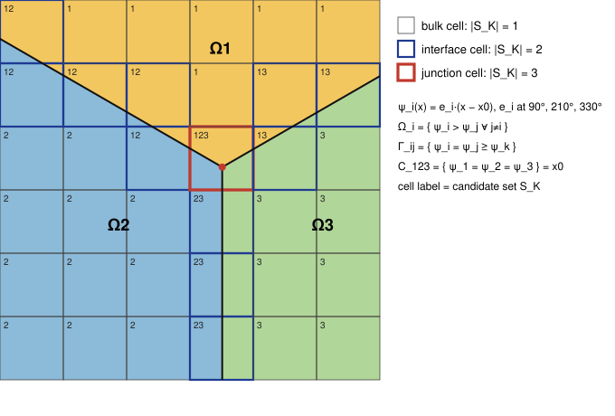

# Implicit representation of N phases, interfaces and junctions for a high-order CutFEM solver in deal.II

Scope: how to *represent and transport* an arbitrary partition of $\Omega$ into phases $\Omega_1,\dots,\Omega_N$, with interfaces $\Gamma_{ij}$ (codim 1) and junction lines/points $C_{ijk}$ (codim 2), such that (a) per-cell classification is cheap, (b) Saye-type quadrature applies cell by cell, (c) the representation itself does not cap the order of accuracy. Physics on the interfaces is out of scope here except where it constrains the representation (extension velocities, junction kinematics, curvature).

Design decisions this document is written against (settled, Sept 2026):

* **Mesh:** hexahedra/quadrilaterals only (Saye's hyperrectangle setting; deal.II's `NonMatching` module assumes this). Simplices are a possible later extension via Saye (2022), which supports simplex constraint cells, but not via deal.II's built-in generator.
* **Geometry fields:** continuous, `FE_Q(p)` on the background mesh, so that on every cell each field *is* a polynomial and Saye's algorithms apply without further approximation. (`FE_DGQ` was considered and dropped: it would make the zero set discontinuous across faces, which complicates ghost-penalty consistency; `FE_Q` is what deal.II's classifier and quadrature generator expect.)
* **Representation:** the $N$-potential (argmax) representation of §1, with no reinitialization initially (§1.7 option 1); pairwise redistancing (§1.7 option 2) is added only if a distance-like $\varphi_{ij}$ turns out to be needed. The code should keep the representation behind an interface so that option 2 can be slotted in.
* **Solids:** solids that participate in the flow (melt, deform, move) are ordinary phases. Complex rigid boundaries are represented as *frozen* potentials on a simple box mesh (fictitious domain), so that every fluid–wall contact line is an ordinary junction (§1.5, §1.6).
* **Physics:** materials are multicomponent; a phase-change model is prescribed per interface and per junction; the interface velocity is an *output* of the interface conditions, not an input. The geometry is solved coupled (monolithically) to the bulk physics (§1.6).
* **Time stepping:** high order (Radau IIA); the transport of the geometry is part of the same implicit system.
* **$N$:** small for the foreseeable future, so the simple `FESystem` variant of §1.5 is used; the band-restricted variant and the regional level set (§2) are the escalation path if $N$ grows.

---

## 1. Recommended: potential ("argmax") representation — $N$ fields, exact partition

### Idea

Carry one scalar potential per phase, $\psi_1,\dots,\psi_N$, and *define*

$$
\Omega_i=\{x:\ \psi_i(x)>\psi_j(x)\ \ \forall j\neq i\},\qquad
\Gamma_{ij}=\{\psi_i=\psi_j\ \ge\ \psi_k\ \forall k\},\qquad
C_{ijk}=\{\psi_i=\psi_j=\psi_k\ \ge\ \psi_l\ \forall l\}.
$$

The pairwise level sets of the Starinshak–Karni–Roe (ILS) paper are then *derived*, not stored:

$$
\varphi_{ij}:=\psi_i-\psi_j,\qquad \varphi_{ij}+\varphi_{jk}=\varphi_{ik}\ \text{(cocycle, exact)} .
$$

Why this is the right primitive for your constraints:

| Requirement | What the argmax representation gives |
|---|---|
| Arbitrary $N$, no $N(N-1)/2$ blow-up | $N$ fields (or $N-1$ after fixing the gauge $\sum_i\psi_i=0$). Each field only needs to be accurate in a band around $\partial\Omega_i$ (see §1.5). |
| Interfaces + junctions | Vacuum/overlap are impossible by construction (a strict argmax is a partition; ties are measure-zero sets — exactly the interfaces and junctions). The ILS "three zero curves miss" failure cannot occur. |
| High order | If the $\psi_i$ are smooth, every $\Gamma_{ij}$ is a smooth surface and every $C_{ijk}$ is a transversal intersection of two smooth surfaces. The *geometry* is representable to $O(h^{p+1})$ with degree-$p$ fields; the kink of $\partial\Omega_i$ at $C_{ijk}$ is not a kink of any stored field. |
| Saye quadrature | On a cell with candidate phases $S_K$, all pieces are sign-pattern components of the polynomials $\{\varphi_{ij}: i<j\in S_K\}$ — precisely the multi-polynomial setting of Saye (2022). |

Relation to the literature (so you can cite it and know what has been tried):

* It is the ILS model with the cocycle enforced: choosing a spanning tree of the phase-adjacency graph and storing $\varphi$ only on tree edges is equivalent to storing potentials with one $\psi$ fixed to zero. The ILS paper's manual "merge redundant functions" step is the hand-made version of this.
* It is the Merriman–Bence–Osher (1994) "max projection" applied continuously rather than as a repair step, and the *lower-envelope* / argmin representation analysed in [arXiv:2112.02401](https://arxiv.org/pdf/2112.02401) (there with $\min$; sign flip).
* It is what the Voronoi Implicit Interface Method ([Saye & Sethian, PNAS 2011](https://www.pnas.org/doi/10.1073/pnas.1111557108); [JCP 2012 analysis](https://math.lbl.gov/~saye/1-s2.0-S0021999112001751-main.pdf)) and the multi-region level set of [Pan, Hu & Adams (CPC 2018)](https://www.sciencedirect.com/science/article/abs/pii/S001046551830002X), [JCP 2018](https://www.sciencedirect.com/science/article/abs/pii/S0021999118300834) compute *implicitly* via distance-to-network plus reconstruction; here the reconstruction is replaced by evaluating $\max_i\psi_i$.
* Caveat inherited from the whole family: junction *angle conditions* are not automatic. [Zaitzeff, Esedoglu & Garikipati (SISC 2020)](https://arxiv.org/abs/1810.10920) show VIIM does not converge to the correct Herring/Neumann angles for unequal surface tensions unless the scheme is modified. In a CutFEM formulation the angle condition comes from the weak form (§6), not from the representation, which is the right place for it.

### Diagram



Three linear potentials $\psi_i(x)=e_i\cdot(x-x_0)$ with $e_i$ at $90^\circ,210^\circ,330^\circ$ produce the symmetric Y-junction at $x_0$. Cell labels are the candidate sets $S_K$ (§1.3): black = bulk, blue = interface cell, red = junction cell.

### 1.1 Worked example A — symmetric junction

With the $e_i$ above, $\varphi_{12}=\psi_1-\psi_2=(e_1-e_2)\cdot(x-x_0)$, so $\Gamma_{12}$ is the ray through $x_0$ perpendicular to $e_1-e_2$, i.e. the bisector between $e_1$ and $e_2$ (direction $150^\circ$); $\Gamma_{13}$ is at $30^\circ$, $\Gamma_{23}$ at $270^\circ$. The angle between interfaces is $120^\circ$, as it should be for equal potentials' "surface tensions". Unequal angles are obtained by non-unit $e_i$ or by curved $\psi_i$; nothing in the representation forces $120^\circ$.

### 1.2 Worked example B — curvature from a difference of potentials

A circular phase 2 of radius $R$ inside phase 1, in the gauge $\psi_1+\psi_2=0$:

$$
\psi_2=R-r,\qquad \psi_1=r-R,\qquad \varphi_{21}=\psi_2-\psi_1=2(R-r).
$$

Note $|\nabla\varphi_{21}|=2$, not 1: $\varphi_{ij}$ is *not* a distance function, and nothing downstream should assume it is. The unit normal is $n_{21}=\nabla\varphi_{21}/|\nabla\varphi_{21}|=-e_r$ and the weak-form curvature (§6) gives, with $P=I-n\otimes n$ and $v=e_r$ on the circle,

$$
-\int_{\Gamma}\sigma\,P:\nabla v\,ds=-\int_0^{2\pi}\sigma\,\frac1R\,R\,d\theta=-2\pi\sigma
\quad\Longleftrightarrow\quad \kappa=1/R .
$$

Only $\nabla\psi$ was used.

### 1.3 Cell classification (the fast per-step check)

Per cell $K$ store a small candidate set $S_K\subset\{1,\dots,N\}$ and a kind:

```
S_K = { i : phase i can occupy a nonempty part of K }
|S_K| = 1  -> bulk(i)
|S_K| = 2  -> interface(i,j)        (phi_ij changes sign in K)
|S_K| >= 3 -> junction candidate     (verify presence of C_ijk in K, see §1.4)
```

Algorithm, cost $O(\#\text{cells}\cdot|S_K|^2)$ with $|S_K|\le 3$–4 in practice:

1. **Propagate candidates.** Under a CFL-type restriction a phase can only enter $K$ from a neighbour, so
   $S_K^{n+1}\subseteq\bigcup_{K'\in\mathcal N(K)} S_{K'}^{n}$ (vertex neighbours). This is what avoids any $O(N)$ or $O(N^2)$ scan.
2. **Certify each candidate pair with Bernstein bounds.** For $i,j$ in the candidate union, convert the cell-local coefficients of $\varphi_{ij}=\psi_i-\psi_j$ (Lagrange → tensor Bernstein, a fixed $(p+1)^d\times(p+1)^d$ matrix) and test the coefficient signs. All positive ⇒ $\varphi_{ij}>0$ on $K$ (phase $j$ cannot be in $K$ *via this pair*); all negative ⇒ symmetric; mixed ⇒ possibly cut. Phase $i$ stays in $S_K$ iff no pair certifies it out. deal.II's `NonMatching::MeshClassifier` does exactly this test for a single level set; feed it the difference vector per pair, or lift its Bernstein routine.
3. **False positives are harmless.** A "possibly cut" that isn't will produce an empty quadrature in step 4 of §1.4; the only cost is a wasted quadrature construction on a few cells.

The update is embarrassingly parallel; in `parallel::distributed` you exchange $S_K$ for ghost cells with `GridTools::exchange_cell_data_to_ghosts`. Storage: `std::array<uint8_t,4>` + count per active cell, indexed by `active_cell_index()`.

Occupancy of bulk cells (needed to select the EOS/material model) is simply $\arg\max_i\psi_i$ at the cell centre — no history needed.

### 1.4 Quadrature per cell kind

* **Bulk:** standard `FEValues`.
* **Interface cell $(i,j)$:** single level set $\varphi_{ij}$. Use deal.II's `NonMatching::QuadratureGenerator` / `NonMatching::FEValues` (Saye 2015, already in deal.II), giving the inside/outside/surface rules; `NonMatching::FEImmersedSurfaceValues` for the surface terms; `NonMatching::FEInterfaceValues` for ghost-penalty faces.
* **Junction cell $\{i,j,k\}$:** pass the polynomials $\{\varphi_{ij},\varphi_{ik}\}$ (the third is their difference) to the multi-polynomial algorithm of [Saye, JCP 448 (2022) 110720](https://www.sciencedirect.com/science/article/pii/S002199912100615X) ([arXiv:2105.08857](https://arxiv.org/abs/2105.08857)), implemented in Algoim (`quadrature_multipoly`). It returns volume rules per sign-pattern component (= per phase) and surface rules per zero set; restrict the $\varphi_{ij}=0$ rule to the true $\Gamma_{ij}$ by the mask $\varphi_{ik}\ge0\wedge\varphi_{jk}\ge0$ (both $i$ and $j$ beat $k$). Saye reports handling multi-component domains, junctions from multiple polynomial level sets, and even cusps/self-intersections, with order $2q$ in $h$-refinement. deal.II's built-in generator handles only one level set, so this is the one external piece; it is header-only C++ and junction cells are few (codim 2), so the coupling cost is small.
* **Junction line integral (3D, codim 2)** — not part of deal.II, but trivial to derive in Saye's height-function style:
  1. In the junction cell, pick the coordinate axis $a$ along which the curve $C=\{\varphi_{ij}=0,\varphi_{ik}=0\}$ is a graph, i.e. maximise $\left|\det\partial(\varphi_{ij},\varphi_{ik})/\partial(x_b,x_c)\right|$ at a sample point.
  2. Locate the parameter interval: roots of the two constraints on the cell faces, plus interior split points where the $2\times2$ determinant vanishes (the curve turns "vertical") — 1D root finds.
  3. Gauss points $x_a^q$ on each sub-interval; for each, Newton-solve the $2\times2$ system for $(x_b,x_c)$; weight
     $w_q\sqrt{1+(x_b')^2+(x_c')^2}$ with $(x_b',x_c')^T=-J^{-1}\partial_a(\varphi_{ij},\varphi_{ik})^T$ (implicit function theorem).
  4. Discard points where some $l\notin\{i,j,k\}$ has $\psi_l>\psi_i$ (rare; only in quadruple-point cells).

  Order $2q$, like the rest. In 2D the "line" is a point: step 3 alone (one Newton solve) gives it.
* **Quadruple points (3D, codim 3):** Newton solve for $\{\varphi_{ij}=\varphi_{ik}=\varphi_{il}=0\}$; point evaluation. Whether you need physics there at all is a modelling question.

### 1.5 Transport, extension velocity, band restriction

Equations tracked: $N$ Hamilton–Jacobi transport equations

$$
\partial_t\psi_i+w\cdot\nabla\psi_i=0,
$$

with **one** extension velocity field $w$, not $N$. This is a requirement, not a convenience: $\varphi_{ij}$ moves with the velocity used for $\psi_i$ and $\psi_j$ only if both use the same $w$ where $\varphi_{ij}=0$. So $w$ must equal the interface velocity $u_{\Gamma_{ij}}$ (fluid velocity plus phase-change correction $\dot m/\rho\,n$) on each $\Gamma_{ij}$, equal the line velocity $u_C$ (§1.6) on each junction, and is arbitrary elsewhere. Build $w$ once per step in the union of interface bands (closest-point extension, or the PDE extension $\nabla\varphi\cdot\nabla w=0$ solved with a few pseudo-time steps), then transport all $\psi_i$ with it.

Storage in deal.II. With $N$ small: a single `FESystem(FE_Q(p), N)` and transport everything everywhere. Simplest, `MatrixFree`-friendly, and the wasted work is bounded. If $N$ grows: $\psi_i$ is only needed where $i\in S_K$ or in the one-cell halo, so switch to one `DoFHandler` per phase with `hp::FECollection{FE_Q(p), FE_Nothing}` and `FE_Nothing` outside the band, re-assigning `active_fe_index` when $S_K$ changes (cheap, local). Beyond that, the regional level set of §2.

The gauge $\sum_i\psi_i=0$ is optional: adding any common function to all $\psi_i$ changes nothing, so drift is harmless; it only matters if you want $\psi_i$ bounded for conditioning.

**Frozen potentials for rigid boundaries.** A rigid wall inside the box mesh is a phase $S$ whose potential $\psi_S$ is set once and never transported. Consequences, none of which require special cases in the classification or quadrature code:

* $\psi_S$ = signed distance to the wall is a good choice; its kinks lie inside the solid, where nothing is integrated. Several rigid solids that never touch each other can share one $\psi_S$ (the ILS paper's manual "merge" step, here for free).
* Bulk cells of $S$ are inactive (fictitious domain); wall cut cells get ghost penalty like any other cut cell; their cut-cell quadratures depend only on $\psi_S$ and can be cached for the whole run. Junction cells $\{i,j,S\}$ cannot be cached, since $\psi_i,\psi_j$ move.
* Only the transport loop needs to know that $\psi_S$ is frozen: it is excluded from the unknowns, and the extension velocity $w$ must be tangential to the wall ($w\cdot n_S=0$) along any contact line $C_{ijS}$ so that transporting $\psi_i,\psi_j$ cannot push $\Gamma_{ij}$ into the wall. This is automatic if $w$ is built from the line velocity $u_C$ of §1.6 with $V_S=0$.
* Solids that participate in the flow (melting, deforming) are *not* frozen; they are ordinary phases and their interfaces with fluids carry phase-change conditions like any other.

### 1.6 Junction kinematics (contact lines) — emergent interface velocities

Because the cocycle is exact, the three zero sets *always* meet; the risk moves from "gap opens" to "line moves at the wrong speed". Whether that risk materialises depends on how the interface velocity is obtained.

**Continuum picture (the one adopted).** The normal speed $V_{ij}$ of $\Gamma_{ij}$ is not prescribed; it is determined by the interface conditions — mass jump $\rho_i(u_i\cdot n-V_{ij})=\rho_j(u_j\cdot n-V_{ij})=\dot m$, energy and momentum jumps, the kinetic relation for $\dot m$ (a function of the temperatures and compositions on both sides), and the multicomponent conditions (per-species mass jumps, chemical-potential conditions). At a junction three such interfaces meet, and the bulk states they read are shared, so the three $V_{ij}$ are outputs of one coupled bulk–interface–line problem. The junction contributes the *closure*: the geometric balance (Neumann triangle / Young, §6) plus a line kinetic relation. Nothing is overdetermined in the continuum problem.

**Monolithic discretisation (the design choice).** The $\psi_i$ are unknowns in the same Newton system as the bulk state. Rows of the residual:

* interface kinematics on $\Gamma_{ij}$: $\partial_t\varphi_{ij}+w\cdot\nabla\varphi_{ij}=0$ with $w\cdot n_{ij}=V_{ij}$ read off the jump conditions (i.e. $V_{ij}$ is eliminated, never evaluated as a stand-alone number);
* the interface conditions themselves, imposed weakly (Nitsche) on the Saye surface rules;
* on $C_{ijk}$: the line balance $\sum\sigma m$ (natural, §6) plus a line kinetic term $\beta\,(u_C\cdot m)(v\cdot m)$ on the codim-2 rule of §1.4, where $u_C$ is *defined* from the transported geometry ($u_C\cdot n_{ij}=w\cdot n_{ij}$ on $C$).

With Enzyme providing the Jacobian, the compatibility of the three interface motions at the line is enforced by the solve, and the bulk fields near the line adjust (this is where the corner singularity of §5 comes from). Code structure that follows from this:

* *interface module*: inputs = bulk traces on both sides, $n_{ij}$, surface gradient of test functions; outputs = fluxes across $\Gamma_{ij}$ and the kinematic residual;
* *line module*: inputs = the three interface traces at $C$, the two conormal angles, $u_C$; outputs = the line residual. This is the hook for line-excess thermodynamics (line tension, line friction, line-excess entropy production).

**Segregated fallback (only if you ever split geometry from physics).** If the $V_{ij}$ are first computed from local traces and the $\psi_i$ then advected, the three numbers are generically incompatible at $C$ and must be projected. The natural projection: at a point of $C$ with normals $n_1,n_2$ (two of the three, $c=n_1\cdot n_2$) and speeds $V_1,V_2$,

$$
u_C=a\,n_1+b\,n_2,\qquad
a=\frac{V_1-cV_2}{1-c^2},\quad b=\frac{V_2-cV_1}{1-c^2},
$$

plus any tangential component (a gauge); the third speed is then implied and the discrepancy with its own model is what the line kinetic relation should have absorbed. Example, contact line with a frozen wall, $V_2=0$: $u_C=V_1(n_1-c\,n_2)/(1-c^2)$, whose component along the wall is $V_1/\sin\theta$ — "line speed = interface normal speed / sin(contact angle)". The $1/(1-c^2)$ blow-up as $\theta\to0,\pi$ is real (the junction degenerates) and is where to expect trouble regardless of method, monolithic or not.

**Multicomponent note.** At the line the species chemical potentials must be consistent around all three interfaces at once (a line-excess Gibbs–Duhem relation), and if species adsorb at the line the line tension becomes composition-dependent. Both are modelling choices, not numerical obstacles, but a segregated scheme would produce inconsistent compositions at $C$ without warning; the monolithic residual makes any inconsistency a non-converging Newton step, which is the failure mode you want.

### 1.7 Reinitialization — the weak spot

$\varphi_{ij}$ are not distance functions and $|\nabla\varphi_{ij}|$ drifts under strain. Decision: start with option 1; keep the representation behind an interface so option 2 can be added if the physics ever needs a distance-like $\varphi_{ij}$ off the interface (e.g. a Gibbs–Thomson term evaluated away from $\Gamma$, or a wall-distance model). None of the physics listed in the design decisions needs one today.

1. **None**, relying on high-order transport and AMR. Smooth $\psi_i$ stay smooth under a smooth flow map; the only things that degrade are conditioning of the sign test and the normal computation where $|\nabla\varphi_{ij}|\to0$. Monitor $\min|\nabla\varphi_{ij}|$ on interface cells.
2. **Pairwise local redistancing with gauge fixing.** On interface cells $S_K=\{i,j\}$: redistance $\varphi_{ij}$ (Saye's high-order closest-point routine, or a few Sussman–Fatemi pseudo-steps), then set $\psi_i\leftarrow m+\tfrac12\tilde\varphi_{ij}$, $\psi_j\leftarrow m-\tfrac12\tilde\varphi_{ij}$ with $m=\tfrac12(\psi_i+\psi_j)$ unchanged. Zero set preserved exactly; other $\psi_k$ untouched. Skip junction cells (no consistent pairwise distance exists there) — accept mild drift in the codim-2 band.
3. **Full reconstruction**: $\psi_i\leftarrow$ signed distance to $\partial\Omega_i$ (what VIIM and the regional level set effectively do). Exactly consistent, but $\partial\Omega_i$ has corners at junctions, so $\psi_i$ acquires kinks along the medial axis emanating from $C_{ijk}$ — inside $\Omega_i$, i.e. in bulk cells, where they are harmless for quadrature but cost one order locally in the transport. Use rarely.

---

## 2. Alternative: regional level set — 1 scalar + 1 label

**Idea.** Store an unsigned distance-to-network $d(x)\ge0$ and an integer phase label $\chi(x)$; locally reconstruct $\varphi_{ij}=\pm d$ by sign from $\chi$ ([Zheng et al. 2009; Kim, ACM TOG 2010]; high-resolution transport and compressible multi-material coupling by [Pan, Hu & Adams, CPC 2018](https://arxiv.org/pdf/1702.02880) and [JCP 2018](https://arxiv.org/pdf/1704.00519), who construct local level sets from the global regional field, transport them with high-order schemes and reconstruct the global field).

**Equations tracked:** 1 scalar transport (+ local reconstructions per cell). Memory-optimal; the natural choice for $N\sim10^3$ (grains, foams).

**Why it is second:** the label field is discontinuous, so a high-order FE representation of the geometry is only $C^0$ across $\Gamma$ (the distance has a kink there) and is not a polynomial per cell without the reconstruction step; Saye's quadrature then applies to the *reconstructed* local $\varphi_{ij}$, adding a reconstruction error and a first-order kink at junctions. Classification is trivial ($S_K$ = labels present at cell DoFs). Reasonable if you later need very large $N$; otherwise §1 gives the same partition guarantee with a smoother representation.

---

## 3. Alternative: sparse pairwise ILS (the paper's method, with graph bookkeeping)

**Idea.** Store $\varphi_{ij}$ only for edges of the phase-adjacency graph $G$, with the paper's voting rule; merge coincident functions by hand.

**Equations tracked:** $|E(G)|$, worst case $N(N-1)/2$.

**Why not, given your constraints:** (i) without the cocycle, the three zero sets in a junction cell are independent polynomials and generically miss — you get codim-2 "tie" regions and need a repair rule, which is where accuracy is lost; (ii) the merge step is manual; (iii) adjacency changes in time (a phase that touches a new phase after a topology change) require adding functions on the fly. Everything it does well (smooth extensions, no reinitialization) is retained by §1, which is the same model plus one linear constraint. Keep it only as a *diagnostic*: the independent ILS advection of $\varphi_{ij}$ versus the potential-derived $\varphi_{ij}$ measures how much the cocycle constraint is "doing".

---

## 4. Considered and set aside

* **VIIM proper** (unsigned distance + $\epsilon$-Voronoi reconstruction): the reconstruction is a mesh-based geometric step that fits a finite-difference narrow-band code better than an FE polynomial field; it is first-order at junctions by the authors' own statement and has the angle-condition issue (Zaitzeff et al.). Its *algorithms* (closest point, curvature) are useful; its representation is not needed once §1 is adopted.
* **N-phase phase field / conservative level set** (Dong 2017; Howard & Tartakovsky 2021): diffuse; contradicts "sharp interface conditions from detailed thermodynamics".
* **Multi-material VOF / MOF**: sharp and conservative but only $C^0$ reconstruction, first order at junctions, no polynomial geometry for Saye quadrature.
* **Hybrid front tracking of the junction line only** (markers on $C_{ijk}$, level sets elsewhere): a legitimate accuracy patch for §1 if the line physics turns out to dominate; keep in reserve (§5).

---

## 5. Planning for reduced accuracy near interfaces and junctions

Sources of error, and what to do about each:

| Source | Where | Remedy |
|---|---|---|
| Geometry approximation | $\Gamma_{ij}$: $O(h^{p+1})$ position, $O(h^p)$ normal, for smooth $\psi$ | Choose $p_\psi\ge p_u$; isoparametric-style treatment is unnecessary since Saye integrates the exact polynomial zero set. |
| Junction geometry | none extra — $C_{ijk}$ is a transversal intersection of two polynomial surfaces | Only degenerate junctions (tangential interfaces, $c\to\pm1$ in §1.6) lose accuracy; detect via $\|n_1\times n_2\|$ and refine or regularise the line physics. |
| Solution singularity | corner singularities of the *PDE solution* at $C_{ijk}$ (elliptic operators on wedges; contact-line stress singularity) | Local $h$-refinement on junction cells (deal.II AMR keyed on the `junction` flag, 1–2 extra levels), or accept a local drop to first order and keep it out of global norms via graded meshes. This is the dominant error and is independent of the representation. |
| Small cuts | any cut cell | Ghost penalty (`NonMatching::FEInterfaceValues`) — mandatory for high order; extend it to *all* pairwise cut faces in junction cells. |
| Extension velocity | $w$ in the band | Build $w$ by closest-point extension from $\Gamma$ and $C$ (high order), not by a first-order Hamilton–Jacobi extension; extend from $C$ first, then from $\Gamma$ with $C$ as boundary data. |
| Frozen-wall junctions $C_{ijS}$ | wall cut cells | $w\cdot n_S=0$ along $C_{ijS}$ (§1.5); a violation shows up as $\Gamma_{ij}$ penetrating the wall — add it to the diagnostics. |
| Monolithic coupling | Newton on bulk + $\psi$ | Non-convergence localised at junction cells usually means an inconsistent line closure (§1.6), not a geometry bug; check the line residual first. |
| Time integration of geometry | transport of $\psi$ with a fixed classification per step | With the geometry inside the Radau IIA system, classification is frozen within a step (the Jacobian sparsity depends on it). Reclassify after each step; if a junction cell would change kind mid-step, reject and shrink $\Delta t$, or run the step with the union of old and new candidate sets (the extra cut quadratures are cheap and empty pieces are harmless). |
| Reinitialization | §1.7 | Option 2 preserves the zero set exactly; measure the induced motion of $\Gamma$ (should be zero up to round-off). |

Diagnostics worth building early: area/volume of each phase (Saye volume rules — exact bookkeeping), junction position versus an analytic solution (the symmetric Y-junction under translation and under solid-body rotation), and $\min|\nabla\varphi_{ij}|$ over interface cells.

---

## 6. Curvature without second derivatives

Surface-tension force as the surface divergence of the surface stress $\sigma P$, $P=I-n\otimes n$:

$$
\int_{\Gamma_{ij}}(\sigma\kappa n+\nabla_\Gamma\sigma)\cdot v\,dS
=-\int_{\Gamma_{ij}}\sigma\,P:\nabla v\,dS\;+\;\int_{\partial\Gamma_{ij}}\sigma\,m_{ij}\cdot v\,dl ,
$$

with $m_{ij}$ the outward conormal of $\Gamma_{ij}$ along its boundary. Requirements: $n=\nabla\varphi_{ij}/|\nabla\varphi_{ij}|$ (first derivatives of $\psi$ only; degree-$p$ fields give $O(h^p)$ in $n$ and hence in the Laplace–Beltrami term); the Marangoni term $\nabla_\Gamma\sigma$ comes for free. This is the standard Dziuk/Bänsch/Gross–Reusken discretisation (Gross & Reusken, *Numerical Methods for Two-Phase Incompressible Flows*, Springer 2011, ch. 7); with Saye's surface rules it is integrated to high order, and no curvature field is ever formed.

The boundary term is the junction physics. Summing over the three interfaces meeting at $C_{ijk}$:

$$
\int_{C_{ijk}}\big(\sigma_{ij}m_{ij}+\sigma_{jk}m_{jk}+\sigma_{ik}m_{ik}\big)\cdot v\,dl .
$$

* Three fluids: leaving this term in the weak form makes the Neumann triangle the *natural* condition; no angle is imposed.
* Frozen wall $S$ (§1.5): test functions have $v\cdot n_S=0$, so only the tangential residual $\sigma_{LG}\cos\theta+\sigma_{LS}-\sigma_{GS}$ survives — the uncompensated Young stress. Add a line-dissipation term $\int_C\beta\,(u_C\cdot m)(v\cdot m)\,dl$ and/or a Nitsche-type term for a prescribed dynamic angle; this is the construction of [Reusken et al., IJNMF 2017](https://arxiv.org/abs/1510.03160) generalised to $N$ phases, and $\beta$ is where a line-excess kinetic coefficient enters.
* Conormals from the representation: $\tau=\nabla\varphi_{ij}\times\nabla\varphi_{ik}/|\cdot|$ along $C$, $m_{ij}=\pm\tau\times n_{ij}$ with sign chosen to point out of $\Gamma_{ij}$ (i.e. into the region where $\varphi_{ik}<0$ or $\varphi_{jk}<0$). First derivatives only.
* All line integrals use the codim-2 rule of §1.4.

A useful check: the total capillary force on a closed configuration (drop with an internal junction ring) must vanish; the volume terms and line terms cancel only if $m_{ij}$ signs are right.

---

## 7. Summary

| Method | Fields tracked | Partition exact? | Cell classification | Quadrature | Junction accuracy (geometry) |
|---|---|---|---|---|---|
| **1. Potentials / argmax** | $N$ (or $N-1$) HJ transports, band-restricted; 1 extension velocity | yes | $O(\lvert S_K\rvert^2)$ Bernstein tests, candidate propagation | Saye 2015 (in deal.II) on interface cells; Saye 2022 / Algoim on junction cells; codim-2 rule derived in §1.4 | intersection of smooth surfaces: high order |
| 2. Regional level set | 1 scalar + 1 label | yes | trivial (labels at DoFs) | Saye on locally reconstructed $\varphi_{ij}$ | first-order kink at $C$ |
| 3. Sparse pairwise ILS | $\lvert E(G)\rvert\le N(N-1)/2$ | no (ties at junctions) | pairwise sign tests | Saye 2022 | tie regions need repair |
| 4. VIIM | 1 unsigned + label | after reconstruction | via reconstruction | Saye | first order (by construction) |

Decision: build **1** with `FE_Q` fields, no reinitialization, frozen potentials for rigid walls, and the geometry inside the monolithic Radau IIA/Newton system; **2** is the fallback representation if $N$ becomes very large; the junction-marker hybrid of §4 is the reserve accuracy patch.

---

## 8. Remaining open items

The representation questions are settled (see the design decisions at the top). What is still open is on the physics/algorithm side:

1. **Line closure.** With emergent $V_{ij}$ and a monolithic solve, the junction needs one closure per line type: the geometric balance is natural (§6), but the line kinetic coefficient $\beta$ (line friction / line-excess entropy production) and any composition dependence of line tension are modelling inputs. Decide per line type whether $\beta=0$ (angle condition only), constant, or derived from a line-excess model.
2. **Classification inside a step.** Whether to freeze $S_K$ per step with rejection, or run with the union of candidate sets (§5). Cheap to try both once the cut-cell assembly exists.
3. **Jacobian structure at junction cells.** The residual at $C_{ijk}$ couples three phases' bulk DoFs and three potentials in one cell; check that the sparsity pattern built from $S_K$ (not from the mesh alone) is what the preconditioner sees, otherwise junction rows become dense surprises.
4. **When to add §1.7 option 2.** Trigger: a physics term that needs $\varphi_{ij}$ off the interface, or $\min|\nabla\varphi_{ij}|$ over interface cells dropping below a tolerance in production runs.
